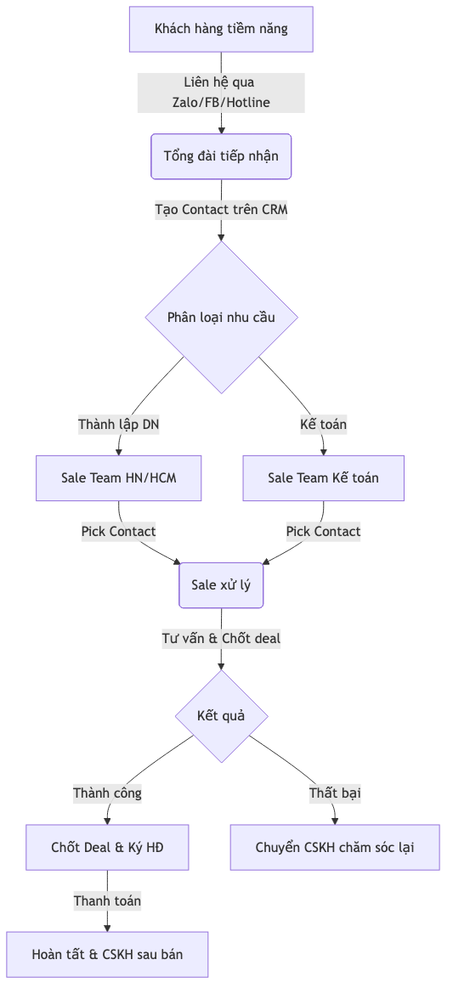
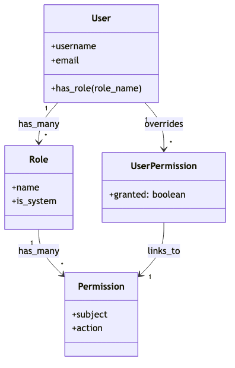
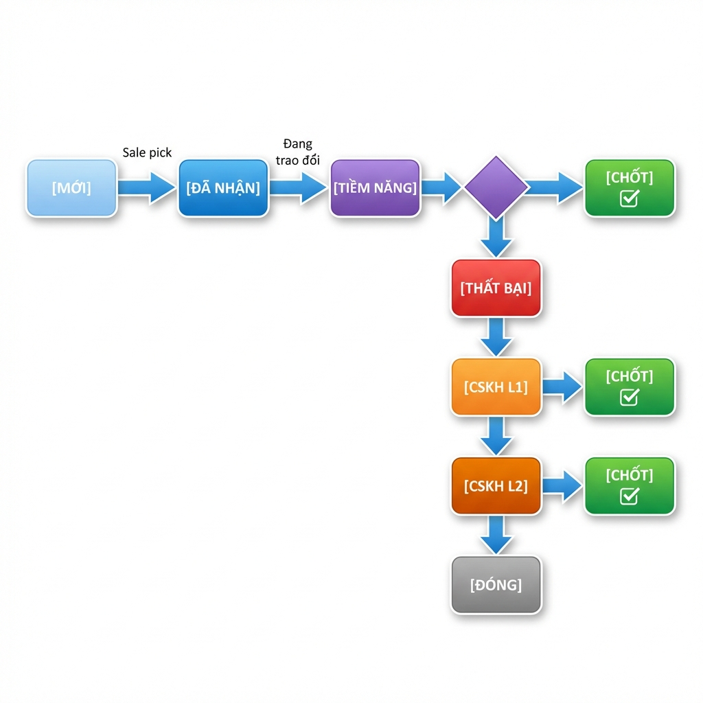
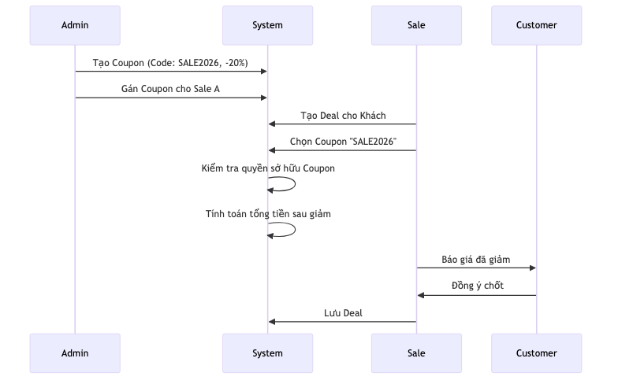

# TÀI LIỆU ĐẶC TẢ YÊU CẦU PHẦN MỀM
## Hệ thống Quản lý Khách hàng - AnKhangCRM

---

<table border="1" style="width: 100%; border-collapse: collapse;">
  <thead>
    <tr>
      <th style="padding: 8px; border: 1px solid; ">Thông tin</th>
      <th style="padding: 8px; border: 1px solid; ">Chi tiết</th>
    </tr>
  </thead>
  <tbody>
    <tr>
      <td style="padding: 8px; border: 1px solid;"><strong>Tên dự án</strong></td>
      <td style="padding: 8px; border: 1px solid;">AnKhangCRM - Hệ thống Quản lý Khách hàng</td>
    </tr>
    <tr>
      <td style="padding: 8px; border: 1px solid;"><strong>Khách hàng</strong></td>
      <td style="padding: 8px; border: 1px solid;">Luật An Khang</td>
    </tr>
    <tr>
      <td style="padding: 8px; border: 1px solid;"><strong>Phiên bản</strong></td>
      <td style="padding: 8px; border: 1px solid;">1.1</td>
    </tr>
    <tr>
      <td style="padding: 8px; border: 1px solid;"><strong>Ngày lập</strong></td>
      <td style="padding: 8px; border: 1px solid;">23/01/2026</td>
    </tr>
    <tr>
      <td style="padding: 8px; border: 1px solid;"><strong>Người lập</strong></td>
      <td style="padding: 8px; border: 1px solid;">Hybro Technology</td>
    </tr>
    <tr>
      <td style="padding: 8px; border: 1px solid;"><strong>Trạng thái</strong></td>
      <td style="padding: 8px; border: 1px solid;">Chờ xác nhận khách hàng</td>
    </tr>
  </tbody>
</table>

---

## MỤC LỤC

1. [Giới thiệu](#1-giới-thiệu)
2. [Mô tả tổng quan](#2-mô-tả-tổng-quan)
3. [Đối tượng sử dụng](#3-đối-tượng-sử-dụng)
4. [Yêu cầu chức năng](#4-yêu-cầu-chức-năng)
5. [Yêu cầu phi chức năng](#5-yêu-cầu-phi-chức-năng)
6. [Phạm vi dự án](#6-phạm-vi-dự-án)
7. [Các vấn đề cần xác nhận](#7-các-vấn-đề-cần-xác-nhận)
8. [Phụ lục](#8-phụ-lục)

---

## 1. GIỚI THIỆU

### 1.1 Mục đích tài liệu

Tài liệu này mô tả chi tiết các yêu cầu chức năng và phi chức năng của Hệ thống Quản lý Khách hàng AnKhangCRM. Mục đích là để khách hàng xem xét và xác nhận trước khi tiến hành phát triển.

### 1.2 Phạm vi hệ thống

**AnKhangCRM** là hệ thống quản lý khách hàng (CRM) được thiết kế riêng cho doanh nghiệp cung cấp dịch vụ pháp lý, nhằm chuyển đổi số quy trình làm việc từ Google Sheets sang nền tảng phần mềm chuyên nghiệp.

### 1.3 Vấn đề cần giải quyết

<table border="1" style="width: 100%; border-collapse: collapse;">
  <thead>
    <tr>
      <th style="padding: 8px; border: 1px solid; ">#</th>
      <th style="padding: 8px; border: 1px solid; ">Vấn đề hiện tại</th>
      <th style="padding: 8px; border: 1px solid; ">Giải pháp đề xuất</th>
    </tr>
  </thead>
  <tbody>
    <tr>
      <td style="padding: 8px; border: 1px solid;">1</td>
      <td style="padding: 8px; border: 1px solid;">Dữ liệu phân tán trên nhiều Google Sheets</td>
      <td style="padding: 8px; border: 1px solid;">Tập trung trên 1 hệ thống duy nhất</td>
    </tr>
    <tr>
      <td style="padding: 8px; border: 1px solid;">2</td>
      <td style="padding: 8px; border: 1px solid;">Khó theo dõi và tìm kiếm thông tin liên hệ</td>
      <td style="padding: 8px; border: 1px solid;">Tìm kiếm nâng cao, filter đa tiêu chí</td>
    </tr>
    <tr>
      <td style="padding: 8px; border: 1px solid;">3</td>
      <td style="padding: 8px; border: 1px solid;">Không có thông báo tự động khi có lead mới</td>
      <td style="padding: 8px; border: 1px solid;">Hệ thống thông báo đa kênh</td>
    </tr>
    <tr>
      <td style="padding: 8px; border: 1px solid;">4</td>
      <td style="padding: 8px; border: 1px solid;">Không có lịch sử hoạt động</td>
      <td style="padding: 8px; border: 1px solid;">Audit trail đầy đủ</td>
    </tr>
    <tr>
      <td style="padding: 8px; border: 1px solid;">5</td>
      <td style="padding: 8px; border: 1px solid;">Phân quyền thủ công</td>
      <td style="padding: 8px; border: 1px solid;">Phân quyền động theo vai trò</td>
    </tr>
    <tr>
      <td style="padding: 8px; border: 1px solid;">6</td>
      <td style="padding: 8px; border: 1px solid;">Không có cơ chế cạnh tranh cho Sales</td>
      <td style="padding: 8px; border: 1px solid;">Cơ chế pick contact công bằng</td>
    </tr>
  </tbody>
</table>

### 1.4 Thuật ngữ và Viết tắt

<table border="1" style="width: 100%; border-collapse: collapse;">
  <thead>
    <tr>
      <th style="padding: 8px; border: 1px solid; ">Thuật ngữ</th>
      <th style="padding: 8px; border: 1px solid; ">Định nghĩa</th>
    </tr>
  </thead>
  <tbody>
    <tr>
      <td style="padding: 8px; border: 1px solid;"><strong>CRM</strong></td>
      <td style="padding: 8px; border: 1px solid;">Customer Relationship Management - Quản lý quan hệ khách hàng</td>
    </tr>
    <tr>
      <td style="padding: 8px; border: 1px solid;"><strong>Lead</strong></td>
      <td style="padding: 8px; border: 1px solid;">Khách hàng tiềm năng, chưa phát sinh giao dịch</td>
    </tr>
    <tr>
      <td style="padding: 8px; border: 1px solid;"><strong>Contact</strong></td>
      <td style="padding: 8px; border: 1px solid;">Thông tin liên hệ của khách hàng trong hệ thống</td>
    </tr>
    <tr>
      <td style="padding: 8px; border: 1px solid;"><strong>Deal</strong></td>
      <td style="padding: 8px; border: 1px solid;">Cơ hội bán hàng/Giao dịch cụ thể gắn với một Contact</td>
    </tr>
    <tr>
      <td style="padding: 8px; border: 1px solid;"><strong>Pick</strong></td>
      <td style="padding: 8px; border: 1px solid;">Hành động Sale chủ động nhận Contact về xử lý</td>
    </tr>
    <tr>
      <td style="padding: 8px; border: 1px solid;"><strong>ZNS</strong></td>
      <td style="padding: 8px; border: 1px solid;">Zalo Notification Service - Dịch vụ gửi tin nhắn thông báo qua Zalo</td>
    </tr>
    <tr>
      <td style="padding: 8px; border: 1px solid;"><strong>Zalo OA</strong></td>
      <td style="padding: 8px; border: 1px solid;">Zalo Official Account - Tài khoản doanh nghiệp trên Zalo</td>
    </tr>
    <tr>
      <td style="padding: 8px; border: 1px solid;"><strong>Audit Trail</strong></td>
      <td style="padding: 8px; border: 1px solid;">Nhật ký ghi nhận toàn bộ lịch sử thay đổi dữ liệu</td>
    </tr>
    <tr>
      <td style="padding: 8px; border: 1px solid;"><strong>MVP</strong></td>
      <td style="padding: 8px; border: 1px solid;">Minimum Viable Product - Sản phẩm khả dụng tối thiểu</td>
    </tr>
    <tr>
      <td style="padding: 8px; border: 1px solid;"><strong>Role</strong></td>
      <td style="padding: 8px; border: 1px solid;">Vai trò người dùng, xác định tập hợp các quyền hạn</td>
    </tr>
    <tr>
      <td style="padding: 8px; border: 1px solid;"><strong>Permission</strong></td>
      <td style="padding: 8px; border: 1px solid;">Quyền hạn cụ thể để thực hiện một hành động (VD: xem, sửa, xóa)</td>
    </tr>
  </tbody>
</table>

### 1.5 Giả định và Phụ thuộc

1.  **Phụ thuộc bên thứ 3 (Zalo):**
    *   Hệ thống phụ thuộc vào tính ổn định và chính sách API của Zalo OA.
    *   Giả định rằng Zalo API duy trì backward compatibility cho các tính năng gửi tin nhắn.
2.  **Hạ tầng:**
    *   Hệ thống được vận hành trên hạ tầng đảm bảo uptime 99.9%.
    *   Kết nối Internet tại phía người dùng cuối (End-user) ổn định.
3.  **Quy trình nghiệp vụ:**
    *   Quy trình phân chia contact (Pick) được chấp thuận bởi ban giám đốc và Sale team trước khi triển khai.

---

## 2. MÔ TẢ TỔNG QUAN

### 2.1 Mục tiêu dự án

<table border="1" style="width: 100%; border-collapse: collapse;">
  <thead>
    <tr>
      <th style="padding: 8px; border: 1px solid; ">#</th>
      <th style="padding: 8px; border: 1px solid; ">Mục tiêu</th>
      <th style="padding: 8px; border: 1px solid; ">Tiêu chí đo lường</th>
    </tr>
  </thead>
  <tbody>
    <tr>
      <td style="padding: 8px; border: 1px solid;">1</td>
      <td style="padding: 8px; border: 1px solid;">Chuyển đổi số hoàn toàn</td>
      <td style="padding: 8px; border: 1px solid;">100% dữ liệu được quản lý trên hệ thống mới</td>
    </tr>
    <tr>
      <td style="padding: 8px; border: 1px solid;">2</td>
      <td style="padding: 8px; border: 1px solid;">Thông báo real-time</td>
      <td style="padding: 8px; border: 1px solid;">Thời gian thông báo < 5 giây cho 100-200 users</td>
    </tr>
    <tr>
      <td style="padding: 8px; border: 1px solid;">3</td>
      <td style="padding: 8px; border: 1px solid;">Dễ sử dụng</td>
      <td style="padding: 8px; border: 1px solid;">Thời gian đào tạo < 1 ngày</td>
    </tr>
    <tr>
      <td style="padding: 8px; border: 1px solid;">4</td>
      <td style="padding: 8px; border: 1px solid;">Bảo mật</td>
      <td style="padding: 8px; border: 1px solid;">100% hành động được ghi log</td>
    </tr>
    <tr>
      <td style="padding: 8px; border: 1px solid;">5</td>
      <td style="padding: 8px; border: 1px solid;">Tăng hiệu suất Sales</td>
      <td style="padding: 8px; border: 1px solid;">Cơ chế pick contact công bằng, minh bạch</td>
    </tr>
  </tbody>
</table>

### 2.2 Luồng nghiệp vụ chính

---

## 3. ĐỐI TƯỢNG SỬ DỤNG

### 3.1 Vai trò và số lượng dự kiến

<table border="1" style="width: 100%; border-collapse: collapse;">
  <thead>
    <tr>
      <th style="padding: 8px; border: 1px solid; ">Vai trò</th>
      <th style="padding: 8px; border: 1px solid; ">Mô tả công việc</th>
      <th style="padding: 8px; border: 1px solid; ">Số lượng</th>
    </tr>
  </thead>
  <tbody>
    <tr>
      <td style="padding: 8px; border: 1px solid;"><strong>Super Admin</strong></td>
      <td style="padding: 8px; border: 1px solid;">Quản trị toàn bộ hệ thống, phân quyền, cấu hình</td>
      <td style="padding: 8px; border: 1px solid;">2-3 người</td>
    </tr>
    <tr>
      <td style="padding: 8px; border: 1px solid;"><strong>Tổng Đài</strong></td>
      <td style="padding: 8px; border: 1px solid;">Nhận cuộc gọi, tạo thông tin khách hàng mới</td>
      <td style="padding: 8px; border: 1px solid;">5-10 người</td>
    </tr>
    <tr>
      <td style="padding: 8px; border: 1px solid;"><strong>Sale</strong></td>
      <td style="padding: 8px; border: 1px solid;">Nhận phân bổ, tư vấn, chốt hợp đồng</td>
      <td style="padding: 8px; border: 1px solid;">50-80 người</td>
    </tr>
    <tr>
      <td style="padding: 8px; border: 1px solid;"><strong>CSKH</strong></td>
      <td style="padding: 8px; border: 1px solid;">Chăm sóc lại khách hàng chưa chốt</td>
      <td style="padding: 8px; border: 1px solid;">5-10 người</td>
    </tr>
    <tr>
      <td style="padding: 8px; border: 1px solid;"><strong>Tổng cộng</strong></td>
      <td style="padding: 8px; border: 1px solid;"></td>
      <td style="padding: 8px; border: 1px solid;">~100 người</td>
    </tr>
  </tbody>
</table>

### 3.2 Bảng quyền hạn chi tiết

<table border="1" style="width: 100%; border-collapse: collapse;">
  <thead>
    <tr>
      <th style="padding: 8px; border: 1px solid; ">Quyền</th>
      <th style="padding: 8px; border: 1px solid; ">Super Admin</th>
      <th style="padding: 8px; border: 1px solid; ">Tổng Đài</th>
      <th style="padding: 8px; border: 1px solid; ">Sale</th>
      <th style="padding: 8px; border: 1px solid; ">CSKH</th>
    </tr>
  </thead>
  <tbody>
    <tr>
      <td style="padding: 8px; border: 1px solid;">Quản lý người dùng</td>
      <td style="padding: 8px; border: 1px solid;">&#9989;</td>
      <td style="padding: 8px; border: 1px solid;">&#10060;</td>
      <td style="padding: 8px; border: 1px solid;">&#10060;</td>
      <td style="padding: 8px; border: 1px solid;">&#10060;</td>
    </tr>
    <tr>
      <td style="padding: 8px; border: 1px solid;">Quản lý đội nhóm</td>
      <td style="padding: 8px; border: 1px solid;">&#9989;</td>
      <td style="padding: 8px; border: 1px solid;">&#10060;</td>
      <td style="padding: 8px; border: 1px solid;">&#10060;</td>
      <td style="padding: 8px; border: 1px solid;">&#10060;</td>
    </tr>
    <tr>
      <td style="padding: 8px; border: 1px solid;">Phân quyền động</td>
      <td style="padding: 8px; border: 1px solid;">&#9989;</td>
      <td style="padding: 8px; border: 1px solid;">&#10060;</td>
      <td style="padding: 8px; border: 1px solid;">&#10060;</td>
      <td style="padding: 8px; border: 1px solid;">&#10060;</td>
    </tr>
    <tr>
      <td style="padding: 8px; border: 1px solid;">Re-assign (Chuyển khách)</td>
      <td style="padding: 8px; border: 1px solid;">&#9989;</td>
      <td style="padding: 8px; border: 1px solid;">&#10060;</td>
      <td style="padding: 8px; border: 1px solid;">&#10060;</td>
      <td style="padding: 8px; border: 1px solid;">&#10060;</td>
    </tr>
    <tr>
      <td style="padding: 8px; border: 1px solid;">Quản lý sản phẩm</td>
      <td style="padding: 8px; border: 1px solid;">&#9989;</td>
      <td style="padding: 8px; border: 1px solid;">&#10060;</td>
      <td style="padding: 8px; border: 1px solid;">&#10060;</td>
      <td style="padding: 8px; border: 1px solid;">&#10060;</td>
    </tr>
    <tr>
      <td style="padding: 8px; border: 1px solid;">Quản lý khuyến mãi</td>
      <td style="padding: 8px; border: 1px solid;">&#9989;</td>
      <td style="padding: 8px; border: 1px solid;">&#10060;</td>
      <td style="padding: 8px; border: 1px solid;">&#10060;</td>
      <td style="padding: 8px; border: 1px solid;">&#10060;</td>
    </tr>
    <tr>
      <td style="padding: 8px; border: 1px solid;">Xem Dashboard/Báo cáo</td>
      <td style="padding: 8px; border: 1px solid;">&#9989;</td>
      <td style="padding: 8px; border: 1px solid;">&#10060;</td>
      <td style="padding: 8px; border: 1px solid;">&#10060;</td>
      <td style="padding: 8px; border: 1px solid;">&#10060;</td>
    </tr>
    <tr>
      <td style="padding: 8px; border: 1px solid;">Xem tất cả logs</td>
      <td style="padding: 8px; border: 1px solid;">&#9989;</td>
      <td style="padding: 8px; border: 1px solid;">&#10060;</td>
      <td style="padding: 8px; border: 1px solid;">&#10060;</td>
      <td style="padding: 8px; border: 1px solid;">&#10060;</td>
    </tr>
    <tr>
      <td style="padding: 8px; border: 1px solid;">Tạo khách hàng mới</td>
      <td style="padding: 8px; border: 1px solid;">&#9989;</td>
      <td style="padding: 8px; border: 1px solid;">&#9989;</td>
      <td style="padding: 8px; border: 1px solid;">&#10060;</td>
      <td style="padding: 8px; border: 1px solid;">&#10060;</td>
    </tr>
    <tr>
      <td style="padding: 8px; border: 1px solid;">Phân loại nguồn liên hệ</td>
      <td style="padding: 8px; border: 1px solid;">&#9989;</td>
      <td style="padding: 8px; border: 1px solid;">&#9989;</td>
      <td style="padding: 8px; border: 1px solid;">&#10060;</td>
      <td style="padding: 8px; border: 1px solid;">&#10060;</td>
    </tr>
    <tr>
      <td style="padding: 8px; border: 1px solid;">Xem danh sách khách hàng</td>
      <td style="padding: 8px; border: 1px solid;">&#9989;</td>
      <td style="padding: 8px; border: 1px solid;">&#9989;</td>
      <td style="padding: 8px; border: 1px solid;">&#9989;</td>
      <td style="padding: 8px; border: 1px solid;">&#9989;</td>
    </tr>
    <tr>
      <td style="padding: 8px; border: 1px solid;">Pick khách hàng</td>
      <td style="padding: 8px; border: 1px solid;">&#10060;</td>
      <td style="padding: 8px; border: 1px solid;">&#10060;</td>
      <td style="padding: 8px; border: 1px solid;">&#9989;</td>
      <td style="padding: 8px; border: 1px solid;">&#10060;</td>
    </tr>
    <tr>
      <td style="padding: 8px; border: 1px solid;">Cập nhật trạng thái KH</td>
      <td style="padding: 8px; border: 1px solid;">&#9989;</td>
      <td style="padding: 8px; border: 1px solid;">&#10060;</td>
      <td style="padding: 8px; border: 1px solid;">&#9989;</td>
      <td style="padding: 8px; border: 1px solid;">&#9989;</td>
    </tr>
    <tr>
      <td style="padding: 8px; border: 1px solid;">Chọn SP/Coupon khi chốt</td>
      <td style="padding: 8px; border: 1px solid;">&#9989;</td>
      <td style="padding: 8px; border: 1px solid;">&#10060;</td>
      <td style="padding: 8px; border: 1px solid;">&#9989;</td>
      <td style="padding: 8px; border: 1px solid;">&#10060;</td>
    </tr>
    <tr>
      <td style="padding: 8px; border: 1px solid;">Xem KH thất bại</td>
      <td style="padding: 8px; border: 1px solid;">&#9989;</td>
      <td style="padding: 8px; border: 1px solid;">&#10060;</td>
      <td style="padding: 8px; border: 1px solid;">&#10060;</td>
      <td style="padding: 8px; border: 1px solid;">&#9989;</td>
    </tr>
    <tr>
      <td style="padding: 8px; border: 1px solid;">Gửi tin Zalo OA</td>
      <td style="padding: 8px; border: 1px solid;">&#10060;</td>
      <td style="padding: 8px; border: 1px solid;">&#10060;</td>
      <td style="padding: 8px; border: 1px solid;">&#10060;</td>
      <td style="padding: 8px; border: 1px solid;">&#9989;</td>
    </tr>
    <tr>
      <td style="padding: 8px; border: 1px solid;">Nhận thông báo</td>
      <td style="padding: 8px; border: 1px solid;">&#9989;</td>
      <td style="padding: 8px; border: 1px solid;">&#9989;</td>
      <td style="padding: 8px; border: 1px solid;">&#9989;</td>
      <td style="padding: 8px; border: 1px solid;">&#9989;</td>
    </tr>
  </tbody>
</table>

---

## 4. YÊU CẦU CHỨC NĂNG

### 4.1 Module: Xác thực (Authentication)

<table border="1" style="width: 100%; border-collapse: collapse;">
  <thead>
    <tr>
      <th style="padding: 8px; border: 1px solid; ">ID</th>
      <th style="padding: 8px; border: 1px solid; ">Yêu cầu</th>
      <th style="padding: 8px; border: 1px solid; ">Ưu tiên</th>
      <th style="padding: 8px; border: 1px solid; ">Mô tả</th>
    </tr>
  </thead>
  <tbody>
    <tr>
      <td style="padding: 8px; border: 1px solid;">AUTH-001</td>
      <td style="padding: 8px; border: 1px solid;">Đăng nhập</td>
      <td style="padding: 8px; border: 1px solid;">Cao</td>
      <td style="padding: 8px; border: 1px solid;">Bằng username/password</td>
    </tr>
    <tr>
      <td style="padding: 8px; border: 1px solid;">AUTH-002</td>
      <td style="padding: 8px; border: 1px solid;">Remember me</td>
      <td style="padding: 8px; border: 1px solid;">Cao</td>
      <td style="padding: 8px; border: 1px solid;">Session kéo dài 30 ngày</td>
    </tr>
    <tr>
      <td style="padding: 8px; border: 1px solid;">AUTH-003</td>
      <td style="padding: 8px; border: 1px solid;">Quên mật khẩu</td>
      <td style="padding: 8px; border: 1px solid;">Cao</td>
      <td style="padding: 8px; border: 1px solid;">Gửi link reset qua email (hết hạn sau 1 giờ)</td>
    </tr>
    <tr>
      <td style="padding: 8px; border: 1px solid;">AUTH-004</td>
      <td style="padding: 8px; border: 1px solid;">Đổi mật khẩu</td>
      <td style="padding: 8px; border: 1px solid;">Cao</td>
      <td style="padding: 8px; border: 1px solid;">Trong settings cá nhân</td>
    </tr>
    <tr>
      <td style="padding: 8px; border: 1px solid;">AUTH-005</td>
      <td style="padding: 8px; border: 1px solid;">Đăng xuất</td>
      <td style="padding: 8px; border: 1px solid;">Cao</td>
      <td style="padding: 8px; border: 1px solid;">Xóa session</td>
    </tr>
    <tr>
      <td style="padding: 8px; border: 1px solid;">AUTH-006</td>
      <td style="padding: 8px; border: 1px solid;">Session timeout</td>
      <td style="padding: 8px; border: 1px solid;">Trung</td>
      <td style="padding: 8px; border: 1px solid;">Tự động logout sau <strong>3 ngày</strong> không hoạt động</td>
    </tr>
    <tr>
      <td style="padding: 8px; border: 1px solid;">AUTH-007</td>
      <td style="padding: 8px; border: 1px solid;">2FA (Phase 2)</td>
      <td style="padding: 8px; border: 1px solid;">Trung</td>
      <td style="padding: 8px; border: 1px solid;">Xác thực 2 lớp</td>
    </tr>
  </tbody>
</table>

**Yêu cầu bảo mật:**
- Password hash: bcrypt (cost 12)
- Độ dài password tối thiểu: 8 ký tự
- Chống brute force: Rate limiting (5 lần/phút)

---

### 4.2 Module: Phân quyền động (Dynamic Permissions)

**Mô hình:**

<table border="1" style="width: 100%; border-collapse: collapse;">
  <thead>
    <tr>
      <th style="padding: 8px; border: 1px solid; ">ID</th>
      <th style="padding: 8px; border: 1px solid; ">Yêu cầu</th>
      <th style="padding: 8px; border: 1px solid; ">Ưu tiên</th>
      <th style="padding: 8px; border: 1px solid; ">Mô tả</th>
    </tr>
  </thead>
  <tbody>
    <tr>
      <td style="padding: 8px; border: 1px solid;">PERM-001</td>
      <td style="padding: 8px; border: 1px solid;">Tạo/sửa/xóa Roles</td>
      <td style="padding: 8px; border: 1px solid;">Cao</td>
      <td style="padding: 8px; border: 1px solid;">Admin tùy chỉnh roles</td>
    </tr>
    <tr>
      <td style="padding: 8px; border: 1px solid;">PERM-002</td>
      <td style="padding: 8px; border: 1px solid;">Mỗi Role có tập Permissions</td>
      <td style="padding: 8px; border: 1px solid;">Cao</td>
      <td style="padding: 8px; border: 1px solid;">Checkbox chọn permissions</td>
    </tr>
    <tr>
      <td style="padding: 8px; border: 1px solid;">PERM-003</td>
      <td style="padding: 8px; border: 1px solid;">Gán nhiều Roles cho User</td>
      <td style="padding: 8px; border: 1px solid;">Cao</td>
      <td style="padding: 8px; border: 1px solid;">1 user có thể có nhiều roles</td>
    </tr>
    <tr>
      <td style="padding: 8px; border: 1px solid;">PERM-004</td>
      <td style="padding: 8px; border: 1px solid;">Override permission cho User</td>
      <td style="padding: 8px; border: 1px solid;">Cao</td>
      <td style="padding: 8px; border: 1px solid;">Grant/Deny cụ thể cho 1 user</td>
    </tr>
    <tr>
      <td style="padding: 8px; border: 1px solid;">PERM-005</td>
      <td style="padding: 8px; border: 1px solid;">UI quản lý trực quan</td>
      <td style="padding: 8px; border: 1px solid;">Cao</td>
      <td style="padding: 8px; border: 1px solid;">Ma trận permissions</td>
    </tr>
    <tr>
      <td style="padding: 8px; border: 1px solid;">PERM-006</td>
      <td style="padding: 8px; border: 1px solid;">Bảo vệ system roles</td>
      <td style="padding: 8px; border: 1px solid;">Cao</td>
      <td style="padding: 8px; border: 1px solid;">Không cho xóa role Admin</td>
    </tr>
    <tr>
      <td style="padding: 8px; border: 1px solid;">PERM-007</td>
      <td style="padding: 8px; border: 1px solid;">Clone role</td>
      <td style="padding: 8px; border: 1px solid;">Trung</td>
      <td style="padding: 8px; border: 1px solid;">Tạo role mới từ role có sẵn</td>
    </tr>
  </tbody>
</table>

**4 Roles mặc định:**
<table border="1" style="width: 100%; border-collapse: collapse;">
  <thead>
    <tr>
      <th style="padding: 8px; border: 1px solid; ">Role</th>
      <th style="padding: 8px; border: 1px solid; ">Permissions</th>
    </tr>
  </thead>
  <tbody>
    <tr>
      <td style="padding: 8px; border: 1px solid;">Super Admin</td>
      <td style="padding: 8px; border: 1px solid;">Tất cả</td>
    </tr>
    <tr>
      <td style="padding: 8px; border: 1px solid;">Tổng Đài</td>
      <td style="padding: 8px; border: 1px solid;">contacts.create, contacts.view, notifications.receive</td>
    </tr>
    <tr>
      <td style="padding: 8px; border: 1px solid;">Sale</td>
      <td style="padding: 8px; border: 1px solid;">contacts.view/pick/edit/update_status, deals.*, notifications.receive</td>
    </tr>
    <tr>
      <td style="padding: 8px; border: 1px solid;">CSKH</td>
      <td style="padding: 8px; border: 1px solid;">contacts.view_failed/edit/update_status, zalo.send, notifications.receive</td>
    </tr>
  </tbody>
</table>

---

### 4.3 Module: Khách hàng (Contacts)

#### 4.3.1 Thông tin khách hàng

<table border="1" style="width: 100%; border-collapse: collapse;">
  <thead>
    <tr>
      <th style="padding: 8px; border: 1px solid; ">Trường</th>
      <th style="padding: 8px; border: 1px solid; ">Bắt buộc</th>
      <th style="padding: 8px; border: 1px solid; ">Mô tả</th>
    </tr>
  </thead>
  <tbody>
    <tr>
      <td style="padding: 8px; border: 1px solid;">Mã liên hệ</td>
      <td style="padding: 8px; border: 1px solid;">Tự động</td>
      <td style="padding: 8px; border: 1px solid;">Hệ thống tự sinh (VD: KH2026-001)</td>
    </tr>
    <tr>
      <td style="padding: 8px; border: 1px solid;">Tên khách hàng</td>
      <td style="padding: 8px; border: 1px solid;">&#9989;</td>
      <td style="padding: 8px; border: 1px solid;">Thường là tên Zalo</td>
    </tr>
    <tr>
      <td style="padding: 8px; border: 1px solid;">Số điện thoại</td>
      <td style="padding: 8px; border: 1px solid;">&#9989;</td>
      <td style="padding: 8px; border: 1px solid;">Số Zalo/điện thoại</td>
    </tr>
    <tr>
      <td style="padding: 8px; border: 1px solid;">Email</td>
      <td style="padding: 8px; border: 1px solid;"></td>
      <td style="padding: 8px; border: 1px solid;">Email liên hệ</td>
    </tr>
    <tr>
      <td style="padding: 8px; border: 1px solid;">Loại nhu cầu</td>
      <td style="padding: 8px; border: 1px solid;">&#9989;</td>
      <td style="padding: 8px; border: 1px solid;">Xem bảng bên dưới</td>
    </tr>
    <tr>
      <td style="padding: 8px; border: 1px solid;">Nguồn liên hệ</td>
      <td style="padding: 8px; border: 1px solid;">&#9989;</td>
      <td style="padding: 8px; border: 1px solid;">Xem bảng bên dưới</td>
    </tr>
    <tr>
      <td style="padding: 8px; border: 1px solid;">Team tư vấn</td>
      <td style="padding: 8px; border: 1px solid;"></td>
      <td style="padding: 8px; border: 1px solid;">Team được gán</td>
    </tr>
    <tr>
      <td style="padding: 8px; border: 1px solid;">Ghi chú</td>
      <td style="padding: 8px; border: 1px solid;"></td>
      <td style="padding: 8px; border: 1px solid;">Thông tin bổ sung</td>
    </tr>
    <tr>
      <td style="padding: 8px; border: 1px solid;">Trạng thái</td>
      <td style="padding: 8px; border: 1px solid;">Tự động</td>
      <td style="padding: 8px; border: 1px solid;">Mới khi tạo</td>
    </tr>
    <tr>
      <td style="padding: 8px; border: 1px solid;">Người tư vấn</td>
      <td style="padding: 8px; border: 1px solid;"></td>
      <td style="padding: 8px; border: 1px solid;">Sale đã pick</td>
    </tr>
    <tr>
      <td style="padding: 8px; border: 1px solid;">Người tạo</td>
      <td style="padding: 8px; border: 1px solid;">Tự động</td>
      <td style="padding: 8px; border: 1px solid;">Tổng đài tạo</td>
    </tr>
  </tbody>
</table>

#### 4.3.2 Loại nhu cầu (Quản lý động)

**Yêu cầu:** Admin có thể cấu hình danh sách "Loại nhu cầu" (Service Types) thay vì cố định trong code.

<table border="1" style="width: 100%; border-collapse: collapse;">
  <thead>
    <tr>
      <th style="padding: 8px; border: 1px solid; ">Trường</th>
      <th style="padding: 8px; border: 1px solid; ">Mô tả</th>
    </tr>
  </thead>
  <tbody>
    <tr>
      <td style="padding: 8px; border: 1px solid;">Mã (Code)</td>
      <td style="padding: 8px; border: 1px solid;">Mã định danh (VD: TLDN, KTDN...)</td>
    </tr>
    <tr>
      <td style="padding: 8px; border: 1px solid;">Tên hiển thị</td>
      <td style="padding: 8px; border: 1px solid;">Tên loại nhu cầu (VD: Thành lập doanh nghiệp)</td>
    </tr>
    <tr>
      <td style="padding: 8px; border: 1px solid;">Mô tả</td>
      <td style="padding: 8px; border: 1px solid;">Ghi chú chi tiết</td>
    </tr>
    <tr>
      <td style="padding: 8px; border: 1px solid;">Trạng thái</td>
      <td style="padding: 8px; border: 1px solid;">Kích hoạt / Ẩn</td>
    </tr>
    <tr>
      <td style="padding: 8px; border: 1px solid;">Giới hạn Pick/Ngày</td>
      <td style="padding: 8px; border: 1px solid;">Số lượng tối đa Sale được pick loại này trong 1 ngày (VD: 2, 5...)</td>
    </tr>
    <tr>
      <td style="padding: 8px; border: 1px solid;">Thứ tự</td>
      <td style="padding: 8px; border: 1px solid;">Thứ tự hiển thị trên dropdown</td>
    </tr>
  </tbody>
</table>

#### 4.3.3 Nguồn liên hệ

<table border="1" style="width: 100%; border-collapse: collapse;">
  <thead>
    <tr>
      <th style="padding: 8px; border: 1px solid; ">Mã</th>
      <th style="padding: 8px; border: 1px solid; ">Hiển thị</th>
    </tr>
  </thead>
  <tbody>
    <tr>
      <td style="padding: 8px; border: 1px solid;">ladi_zalo</td>
      <td style="padding: 8px; border: 1px solid;">Ladi Zalo</td>
    </tr>
    <tr>
      <td style="padding: 8px; border: 1px solid;">ladi_hotline</td>
      <td style="padding: 8px; border: 1px solid;">Ladi Hotline</td>
    </tr>
    <tr>
      <td style="padding: 8px; border: 1px solid;">fb_mess</td>
      <td style="padding: 8px; border: 1px solid;">Facebook Messenger</td>
    </tr>
    <tr>
      <td style="padding: 8px; border: 1px solid;">fb_hotline</td>
      <td style="padding: 8px; border: 1px solid;">Facebook Hotline</td>
    </tr>
    <tr>
      <td style="padding: 8px; border: 1px solid;">google</td>
      <td style="padding: 8px; border: 1px solid;">Google Ads</td>
    </tr>
    <tr>
      <td style="padding: 8px; border: 1px solid;">referral</td>
      <td style="padding: 8px; border: 1px solid;">Giới thiệu</td>
    </tr>
    <tr>
      <td style="padding: 8px; border: 1px solid;">other</td>
      <td style="padding: 8px; border: 1px solid;">Khác</td>
    </tr>
  </tbody>
</table>

#### 4.3.4 Luồng trạng thái

> [!WARNING]
> **Lưu ý:** Sơ đồ trong ảnh đang hiển thị luồng cũ (bao gồm trạng thái "Tiềm năng"). Hệ thống thực tế hoạt động theo logic **gộp trạng thái** như mô tả trong văn bản dưới đây.

> **Cập nhật v1.1:** Gộp trạng thái "Đã nhận" và "Tiềm năng" thành **"Đang tư vấn"** để tối ưu thao tác Sales. Người dùng chỉ cần Pick -> hệ thống tự chuyển sang "Đang tư vấn".

<table border="1" style="width: 100%; border-collapse: collapse;">
  <thead>
    <tr>
      <th style="padding: 8px; border: 1px solid; ">Trạng thái</th>
      <th style="padding: 8px; border: 1px solid; ">Mô tả</th>
      <th style="padding: 8px; border: 1px solid; ">Người thay đổi</th>
    </tr>
  </thead>
  <tbody>
    <tr>
      <td style="padding: 8px; border: 1px solid;">Mới</td>
      <td style="padding: 8px; border: 1px solid;">Vừa tạo, chờ pick</td>
      <td style="padding: 8px; border: 1px solid;">Tự động</td>
    </tr>
    <tr>
      <td style="padding: 8px; border: 1px solid;">Đang tư vấn</td>
      <td style="padding: 8px; border: 1px solid;">Sale đã pick và đang chăm sóc</td>
      <td style="padding: 8px; border: 1px solid;">Hệ thống (sau khi Pick)</td>
    </tr>
    <tr>
      <td style="padding: 8px; border: 1px solid;">Chốt</td>
      <td style="padding: 8px; border: 1px solid;">Ký hợp đồng thành công (Tạo Deal)</td>
      <td style="padding: 8px; border: 1px solid;">Sale</td>
    </tr>
    <tr>
      <td style="padding: 8px; border: 1px solid;">Thất bại</td>
      <td style="padding: 8px; border: 1px solid;">Không chốt được, chuyển qua CSKH</td>
      <td style="padding: 8px; border: 1px solid;">Sale</td>
    </tr>
    <tr>
      <td style="padding: 8px; border: 1px solid;">CSKH L1</td>
      <td style="padding: 8px; border: 1px solid;">Chăm sóc lần 1 (Sau khi Fail)</td>
      <td style="padding: 8px; border: 1px solid;">Hệ thống/CSKH</td>
    </tr>
    <tr>
      <td style="padding: 8px; border: 1px solid;">CSKH L2</td>
      <td style="padding: 8px; border: 1px solid;">Chăm sóc lần 2</td>
      <td style="padding: 8px; border: 1px solid;">CSKH</td>
    </tr>
    <tr>
      <td style="padding: 8px; border: 1px solid;">Đóng</td>
      <td style="padding: 8px; border: 1px solid;">Kết thúc, không còn tiềm năng</td>
      <td style="padding: 8px; border: 1px solid;">CSKH</td>
    </tr>
  </tbody>
</table>

#### 4.3.5 Cơ chế Pick (Chi tiết Use Case)

Đây là tính năng quan trọng nhất, yêu cầu xử lý đồng thời (concurrency) cao để đảm bảo công bằng.

**Quy tắc nghiệp vụ:**

1.  **Quyền ưu tiên:** Ai bấm trước được trước (First-Come, First-Served).
2.  **Locking:** Khi 1 Sale bấm Pick, hệ thống phải lock record đó ngay lập tức để Sale khác không pick được.
3.  **Cooldown:** Sau khi pick thành công, Sale phải đợi **5 phút** mới được pick tiếp (trừ khi được Admin override).
4.  **Auto Assign:** Contact sau khi pick sẽ tự động gán `Team` theo Team của Sale đó.
5.  **Dynamic Limits:** Kiểm tra giới hạn số lượng contact được pick trong ngày dựa trên "Loại nhu cầu" (VD: Kế toán max 2, Thành lập max 5).

**Kịch bản chi tiết:**

*   **Pre-conditions (Điều kiện tiên quyết):**
    *   Contact có trạng thái `MỚI`.
    *   Sale đang có trạng thái `Active`.
    *   Sale không trong thời gian Cooldown.
    *   Sale chưa vượt quá hạn mức handling (Check: Tổng số contact loại X đã pick hôm nay < Max limit của loại X).

*   **Flow (Luồng xử lý):**
    1.  Sale nhận thông báo hoặc thấy Contact mới trên Dashboard.
    2.  Sale bấm nút "Nhận khách" (Pick).
    3.  Hệ thống kiểm tra Pre-conditions.
    4.  Hệ thống sử dụng Database Transaction (Row Lock) để lock Contact.
    5.  Cập nhật Contact: `Status` = `ĐANG TƯ VẤN`, `Assignee` = `Sale ID`, `Picked At` = `Time.now`.
    6.  Hệ thống trả về Success Message cho Sale.
    7.  Hệ thống broadcast sự kiện `contact.picked` để ẩn nút Pick đối với các Sale khác (Real-time update UI).

*   **Exception Handling (Xử lý ngoại lệ):**
    *   *E1: Đã bị người khác pick:* Hiển thị thông báo "Khách hàng này đã được nhận bởi [Tên Sale khác]". Cập nhật lại danh sách.
    *   *E2: Đang cooldown:* Hiển thị thông báo đếm ngược thời gian còn lại.
    *   *E3: Lỗi mạng/Server:* Giữ nguyên trạng thái nút, thông báo lỗi kết nối.

*   **Admin Override Flow (Re-assign):**
    1.  Admin vào chi tiết Contact đang được Sale A giữ.
    2.  Bấm nút "Chuyển khách" (Re-assign).
    3.  Chọn Sale B (hoặc trả về Pool chung).
    4.  Hệ thống cập nhật `Assignee` và ghi log: "Admin transferred contact from Sale A to Sale B".
    5.  Thông báo cho cả Sale A và Sale B.

#### 4.3.6 Lịch sử trao đổi (Interaction History)

Mỗi lần Sale/CSKH trao đổi với khách cần ghi log:
- Nội dung trao đổi
- Loại: Gọi điện / Zalo / Email / Gặp mặt / Khác
- Thời điểm
- Người trao đổi

---

### 4.4 Module: Cơ hội bán hàng (Deals)

Khi khách hàng chuyển sang "Chốt", tạo Deal:

<table border="1" style="width: 100%; border-collapse: collapse;">
  <thead>
    <tr>
      <th style="padding: 8px; border: 1px solid; ">Trường</th>
      <th style="padding: 8px; border: 1px solid; ">Bắt buộc</th>
      <th style="padding: 8px; border: 1px solid; ">Mô tả</th>
    </tr>
  </thead>
  <tbody>
    <tr>
      <td style="padding: 8px; border: 1px solid;">Khách hàng</td>
      <td style="padding: 8px; border: 1px solid;">&#9989;</td>
      <td style="padding: 8px; border: 1px solid;">Liên kết Contact</td>
    </tr>
    <tr>
      <td style="padding: 8px; border: 1px solid;">Tổng giá trị</td>
      <td style="padding: 8px; border: 1px solid;">Tự động</td>
      <td style="padding: 8px; border: 1px solid;">Tổng từ các SP</td>
    </tr>
    <tr>
      <td style="padding: 8px; border: 1px solid;">Trạng thái thanh toán</td>
      <td style="padding: 8px; border: 1px solid;">&#9989;</td>
      <td style="padding: 8px; border: 1px solid;">Xem bảng bên dưới</td>
    </tr>
    <tr>
      <td style="padding: 8px; border: 1px solid;">Người chốt</td>
      <td style="padding: 8px; border: 1px solid;">Tự động</td>
      <td style="padding: 8px; border: 1px solid;">Sale đang xử lý</td>
    </tr>
    <tr>
      <td style="padding: 8px; border: 1px solid;">Ngày chốt</td>
      <td style="padding: 8px; border: 1px solid;">&#9989;</td>
      <td style="padding: 8px; border: 1px solid;">Ngày ký HĐ</td>
    </tr>
    <tr>
      <td style="padding: 8px; border: 1px solid;">Ghi chú</td>
      <td style="padding: 8px; border: 1px solid;"></td>
      <td style="padding: 8px; border: 1px solid;">Thông tin bổ sung</td>
    </tr>
  </tbody>
</table>

**Sản phẩm trong Deal:**
- 1 Deal có thể có **nhiều sản phẩm**
- Mỗi SP có: Số lượng, Đơn giá, Thời điểm chốt

**Trạng thái thanh toán:**
<table border="1" style="width: 100%; border-collapse: collapse;">
  <thead>
    <tr>
      <th style="padding: 8px; border: 1px solid; ">Mã</th>
      <th style="padding: 8px; border: 1px solid; ">Hiển thị</th>
    </tr>
  </thead>
  <tbody>
    <tr>
      <td style="padding: 8px; border: 1px solid;">pending</td>
      <td style="padding: 8px; border: 1px solid;">Chưa thanh toán</td>
    </tr>
    <tr>
      <td style="padding: 8px; border: 1px solid;">partial</td>
      <td style="padding: 8px; border: 1px solid;">Thanh toán một phần</td>
    </tr>
    <tr>
      <td style="padding: 8px; border: 1px solid;">paid</td>
      <td style="padding: 8px; border: 1px solid;">Đã thanh toán đủ</td>
    </tr>
    <tr>
      <td style="padding: 8px; border: 1px solid;">refunded</td>
      <td style="padding: 8px; border: 1px solid;">Hoàn tiền</td>
    </tr>
  </tbody>
</table>

---

### 4.5 Module: Sản phẩm/Dịch vụ (Products)

<table border="1" style="width: 100%; border-collapse: collapse;">
  <thead>
    <tr>
      <th style="padding: 8px; border: 1px solid; ">Trường</th>
      <th style="padding: 8px; border: 1px solid; ">Mô tả</th>
    </tr>
  </thead>
  <tbody>
    <tr>
      <td style="padding: 8px; border: 1px solid;">Mã sản phẩm</td>
      <td style="padding: 8px; border: 1px solid;">VD: TLDN-7, DVK-25</td>
    </tr>
    <tr>
      <td style="padding: 8px; border: 1px solid;">Tên sản phẩm</td>
      <td style="padding: 8px; border: 1px solid;">Tên dịch vụ</td>
    </tr>
    <tr>
      <td style="padding: 8px; border: 1px solid;">Mô tả</td>
      <td style="padding: 8px; border: 1px solid;">Chi tiết dịch vụ</td>
    </tr>
    <tr>
      <td style="padding: 8px; border: 1px solid;">Giá cơ bản</td>
      <td style="padding: 8px; border: 1px solid;">Giá niêm yết</td>
    </tr>
    <tr>
      <td style="padding: 8px; border: 1px solid;">Loại quy trình</td>
      <td style="padding: 8px; border: 1px solid;">Workflow triển khai (Phase 2)</td>
    </tr>
    <tr>
      <td style="padding: 8px; border: 1px solid;">Trạng thái</td>
      <td style="padding: 8px; border: 1px solid;">Đang kinh doanh / Ngừng</td>
    </tr>
  </tbody>
</table>

**Ví dụ sản phẩm:**
<table border="1" style="width: 100%; border-collapse: collapse;">
  <thead>
    <tr>
      <th style="padding: 8px; border: 1px solid; ">Mã</th>
      <th style="padding: 8px; border: 1px solid; ">Tên</th>
      <th style="padding: 8px; border: 1px solid; ">Loại</th>
    </tr>
  </thead>
  <tbody>
    <tr>
      <td style="padding: 8px; border: 1px solid;">TLDN-7</td>
      <td style="padding: 8px; border: 1px solid;">TLDN Gói Nâng Cao</td>
      <td style="padding: 8px; border: 1px solid;">Thành lập DN</td>
    </tr>
    <tr>
      <td style="padding: 8px; border: 1px solid;">TLDN-5</td>
      <td style="padding: 8px; border: 1px solid;">Gói VIP 2026</td>
      <td style="padding: 8px; border: 1px solid;">Thành lập DN</td>
    </tr>
    <tr>
      <td style="padding: 8px; border: 1px solid;">DVK-25</td>
      <td style="padding: 8px; border: 1px solid;">Dịch vụ khác</td>
      <td style="padding: 8px; border: 1px solid;">Khác</td>
    </tr>
    <tr>
      <td style="padding: 8px; border: 1px solid;">KTDN</td>
      <td style="padding: 8px; border: 1px solid;">Kế toán lẻ</td>
      <td style="padding: 8px; border: 1px solid;">Kế toán</td>
    </tr>
  </tbody>
</table>

---

### 4.6 Module: Khuyến mãi (Coupons)

<table border="1" style="width: 100%; border-collapse: collapse;">
  <thead>
    <tr>
      <th style="padding: 8px; border: 1px solid; ">Trường</th>
      <th style="padding: 8px; border: 1px solid; ">Mô tả</th>
    </tr>
  </thead>
  <tbody>
    <tr>
      <td style="padding: 8px; border: 1px solid;">Mã coupon</td>
      <td style="padding: 8px; border: 1px solid;">VD: SALE2026</td>
    </tr>
    <tr>
      <td style="padding: 8px; border: 1px solid;">Mô tả</td>
      <td style="padding: 8px; border: 1px solid;">Nội dung khuyến mãi</td>
    </tr>
    <tr>
      <td style="padding: 8px; border: 1px solid;">Loại giảm giá</td>
      <td style="padding: 8px; border: 1px solid;">Phần trăm (%) / Số tiền cố định</td>
    </tr>
    <tr>
      <td style="padding: 8px; border: 1px solid;">Giá trị</td>
      <td style="padding: 8px; border: 1px solid;">Mức giảm</td>
    </tr>
    <tr>
      <td style="padding: 8px; border: 1px solid;">Hạn sử dụng</td>
      <td style="padding: 8px; border: 1px solid;">Ngày hết hạn</td>
    </tr>
    <tr>
      <td style="padding: 8px; border: 1px solid;">Gán cho nhân viên</td>
      <td style="padding: 8px; border: 1px solid;">&#9989; Bắt buộc</td>
    </tr>
  </tbody>
</table>

> **Lưu ý quan trọng**: Coupon được Admin tạo và **gán cho nhân viên cụ thể**, không phải pool chung.

**Luồng sử dụng:**

---

### 4.7 Module: Đội nhóm (Teams)

<table border="1" style="width: 100%; border-collapse: collapse;">
  <thead>
    <tr>
      <th style="padding: 8px; border: 1px solid; ">Trường</th>
      <th style="padding: 8px; border: 1px solid; ">Mô tả</th>
    </tr>
  </thead>
  <tbody>
    <tr>
      <td style="padding: 8px; border: 1px solid;">Tên team</td>
      <td style="padding: 8px; border: 1px solid;">VD: Team Hà Nội, Team HCM</td>
    </tr>
    <tr>
      <td style="padding: 8px; border: 1px solid;">Mô tả</td>
      <td style="padding: 8px; border: 1px solid;">Mô tả / Địa điểm</td>
    </tr>
    <tr>
      <td style="padding: 8px; border: 1px solid;">Trưởng team</td>
      <td style="padding: 8px; border: 1px solid;">Manager (tùy chọn)</td>
    </tr>
    <tr>
      <td style="padding: 8px; border: 1px solid;">Khu vực</td>
      <td style="padding: 8px; border: 1px solid;">Vùng hoạt động</td>
    </tr>
  </tbody>
</table>

**Mục đích:**
- Phân vùng nhân viên để dễ thống kê
- Mỗi Sale thuộc 1 team
- Contact được gán team khi Sale pick

---

### 4.8 Module: Nhân viên (Employees)

<table border="1" style="width: 100%; border-collapse: collapse;">
  <thead>
    <tr>
      <th style="padding: 8px; border: 1px solid; ">Trường</th>
      <th style="padding: 8px; border: 1px solid; ">Bắt buộc</th>
      <th style="padding: 8px; border: 1px solid; ">Mô tả</th>
    </tr>
  </thead>
  <tbody>
    <tr>
      <td style="padding: 8px; border: 1px solid;">Username</td>
      <td style="padding: 8px; border: 1px solid;">&#9989;</td>
      <td style="padding: 8px; border: 1px solid;">Dùng để đăng nhập</td>
    </tr>
    <tr>
      <td style="padding: 8px; border: 1px solid;">Họ và tên</td>
      <td style="padding: 8px; border: 1px solid;">&#9989;</td>
      <td style="padding: 8px; border: 1px solid;">Tên hiển thị</td>
    </tr>
    <tr>
      <td style="padding: 8px; border: 1px solid;">Email</td>
      <td style="padding: 8px; border: 1px solid;">&#9989;</td>
      <td style="padding: 8px; border: 1px solid;">Email công việc</td>
    </tr>
    <tr>
      <td style="padding: 8px; border: 1px solid;">Số điện thoại</td>
      <td style="padding: 8px; border: 1px solid;"></td>
      <td style="padding: 8px; border: 1px solid;">SĐT liên hệ</td>
    </tr>
    <tr>
      <td style="padding: 8px; border: 1px solid;">Team</td>
      <td style="padding: 8px; border: 1px solid;"></td>
      <td style="padding: 8px; border: 1px solid;">Đội nhóm thuộc về</td>
    </tr>
    <tr>
      <td style="padding: 8px; border: 1px solid;">Chức vụ</td>
      <td style="padding: 8px; border: 1px solid;"></td>
      <td style="padding: 8px; border: 1px solid;">Vị trí công việc</td>
    </tr>
    <tr>
      <td style="padding: 8px; border: 1px solid;">Roles</td>
      <td style="padding: 8px; border: 1px solid;">&#9989;</td>
      <td style="padding: 8px; border: 1px solid;">Vai trò phân quyền</td>
    </tr>
    <tr>
      <td style="padding: 8px; border: 1px solid;">Trạng thái</td>
      <td style="padding: 8px; border: 1px solid;">&#9989;</td>
      <td style="padding: 8px; border: 1px solid;">Hoạt động / Khóa</td>
    </tr>
  </tbody>
</table>

**Quy tắc nghiệp vụ:**
- Không tự vô hiệu hóa chính mình
- Phải có ít nhất 1 Admin
- Username không thể đổi sau khi tạo
- Password tối thiểu 8 ký tự, có cả số và chữ

---

### 4.9 Module: Thông báo (Notifications)

#### 4.9.1 Kênh thông báo

<table border="1" style="width: 100%; border-collapse: collapse;">
  <thead>
    <tr>
      <th style="padding: 8px; border: 1px solid; ">Kênh</th>
      <th style="padding: 8px; border: 1px solid; ">Phase</th>
      <th style="padding: 8px; border: 1px solid; ">Bắt buộc</th>
      <th style="padding: 8px; border: 1px solid; ">Ghi chú</th>
    </tr>
  </thead>
  <tbody>
    <tr>
      <td style="padding: 8px; border: 1px solid;">Web Push</td>
      <td style="padding: 8px; border: 1px solid;">1</td>
      <td style="padding: 8px; border: 1px solid;">&#9989;</td>
      <td style="padding: 8px; border: 1px solid;">Browser notification</td>
    </tr>
    <tr>
      <td style="padding: 8px; border: 1px solid;">Email</td>
      <td style="padding: 8px; border: 1px solid;">1</td>
      <td style="padding: 8px; border: 1px solid;">&#9989;</td>
      <td style="padding: 8px; border: 1px solid;">Qua SMTP/SendGrid</td>
    </tr>
    <tr>
      <td style="padding: 8px; border: 1px solid;">Zalo OA</td>
      <td style="padding: 8px; border: 1px solid;">1</td>
      <td style="padding: 8px; border: 1px solid;">&#9989;</td>
      <td style="padding: 8px; border: 1px solid;">Cho CSKH, cần ZNS template</td>
    </tr>
    <tr>
      <td style="padding: 8px; border: 1px solid;">Slack</td>
      <td style="padding: 8px; border: 1px solid;">1</td>
      <td style="padding: 8px; border: 1px solid;">Tùy chọn</td>
      <td style="padding: 8px; border: 1px solid;">Webhook</td>
    </tr>
    <tr>
      <td style="padding: 8px; border: 1px solid;">Facebook</td>
      <td style="padding: 8px; border: 1px solid;">1</td>
      <td style="padding: 8px; border: 1px solid;">Tùy chọn</td>
      <td style="padding: 8px; border: 1px solid;">Page subscription</td>
    </tr>
    <tr>
      <td style="padding: 8px; border: 1px solid;">In-app (WebSocket)</td>
      <td style="padding: 8px; border: 1px solid;">2</td>
      <td style="padding: 8px; border: 1px solid;"></td>
      <td style="padding: 8px; border: 1px solid;">Real-time</td>
    </tr>
  </tbody>
</table>

#### 4.9.2 Quy tắc thông báo (Notification Rules)

Admin tạo rules với cấu trúc:
- **Trigger Event**: Khi nào gửi
- **Conditions**: Ai nhận (filter theo role, team...)
- **Channels**: Gửi qua kênh nào
- **Template**: Nội dung tin nhắn

**Sự kiện trigger:**
<table border="1" style="width: 100%; border-collapse: collapse;">
  <thead>
    <tr>
      <th style="padding: 8px; border: 1px solid; ">Event</th>
      <th style="padding: 8px; border: 1px solid; ">Mô tả</th>
    </tr>
  </thead>
  <tbody>
    <tr>
      <td style="padding: 8px; border: 1px solid;">contact.created</td>
      <td style="padding: 8px; border: 1px solid;">Tổng đài tạo contact mới</td>
    </tr>
    <tr>
      <td style="padding: 8px; border: 1px solid;">contact.picked</td>
      <td style="padding: 8px; border: 1px solid;">Sale pick contact</td>
    </tr>
    <tr>
      <td style="padding: 8px; border: 1px solid;">contact.status_changed</td>
      <td style="padding: 8px; border: 1px solid;">Đổi trạng thái</td>
    </tr>
    <tr>
      <td style="padding: 8px; border: 1px solid;">deal.created</td>
      <td style="padding: 8px; border: 1px solid;">Chốt deal</td>
    </tr>
    <tr>
      <td style="padding: 8px; border: 1px solid;">response.negative</td>
      <td style="padding: 8px; border: 1px solid;">Khách phản hồi tiêu cực (AI detect)</td>
    </tr>
  </tbody>
</table>

#### 4.9.3 Yêu cầu hiệu năng

- 100-200 users nhận cùng lúc trong **< 5 giây**
- Không duplicate
- Retry nếu thất bại

---

### 4.10 Module: Nhật ký hoạt động (Activity Logs)

Ghi log **tất cả** hành động trong hệ thống:

<table border="1" style="width: 100%; border-collapse: collapse;">
  <thead>
    <tr>
      <th style="padding: 8px; border: 1px solid; ">Nhóm</th>
      <th style="padding: 8px; border: 1px solid; ">Hành động</th>
    </tr>
  </thead>
  <tbody>
    <tr>
      <td style="padding: 8px; border: 1px solid;"><strong>Authentication</strong></td>
      <td style="padding: 8px; border: 1px solid;">Đăng nhập, đăng nhập thất bại, đăng xuất, đổi password</td>
    </tr>
    <tr>
      <td style="padding: 8px; border: 1px solid;"><strong>Contacts</strong></td>
      <td style="padding: 8px; border: 1px solid;">Tạo, pick, cập nhật, đổi trạng thái, thêm lịch sử trao đổi</td>
    </tr>
    <tr>
      <td style="padding: 8px; border: 1px solid;"><strong>Deals</strong></td>
      <td style="padding: 8px; border: 1px solid;">Tạo, cập nhật, đổi trạng thái thanh toán</td>
    </tr>
    <tr>
      <td style="padding: 8px; border: 1px solid;"><strong>Teams</strong></td>
      <td style="padding: 8px; border: 1px solid;">Tạo, sửa, xóa, thêm/xóa thành viên</td>
    </tr>
    <tr>
      <td style="padding: 8px; border: 1px solid;"><strong>Employees</strong></td>
      <td style="padding: 8px; border: 1px solid;">Tạo, sửa, kích hoạt, vô hiệu hóa, đổi roles</td>
    </tr>
    <tr>
      <td style="padding: 8px; border: 1px solid;"><strong>Roles</strong></td>
      <td style="padding: 8px; border: 1px solid;">Tạo, sửa, xóa, đổi permissions</td>
    </tr>
    <tr>
      <td style="padding: 8px; border: 1px solid;"><strong>Notifications</strong></td>
      <td style="padding: 8px; border: 1px solid;">Tạo rule, sửa rule, bật/tắt rule, gửi notification</td>
    </tr>
    <tr>
      <td style="padding: 8px; border: 1px solid;"><strong>Zalo</strong></td>
      <td style="padding: 8px; border: 1px solid;">Gửi tin nhắn</td>
    </tr>
  </tbody>
</table>

**Thông tin mỗi log entry:**
- Thời gian
- Người thực hiện
- Hành động
- Đối tượng bị ảnh hưởng
- Dữ liệu trước/sau thay đổi
- IP address
- Browser/Device

---

### 4.11 Module: Báo cáo (Reports & Dashboard)

#### 4.11.1 KPI Cards

<table border="1" style="width: 100%; border-collapse: collapse;">
  <thead>
    <tr>
      <th style="padding: 8px; border: 1px solid; ">Chỉ số</th>
      <th style="padding: 8px; border: 1px solid; ">Mô tả</th>
    </tr>
  </thead>
  <tbody>
    <tr>
      <td style="padding: 8px; border: 1px solid;">Tổng Contacts</td>
      <td style="padding: 8px; border: 1px solid;">Tổng số khách hàng</td>
    </tr>
    <tr>
      <td style="padding: 8px; border: 1px solid;">Contacts mới (Tuần)</td>
      <td style="padding: 8px; border: 1px solid;">Khách tạo trong 7 ngày gần</td>
    </tr>
    <tr>
      <td style="padding: 8px; border: 1px solid;">Chốt thành công</td>
      <td style="padding: 8px; border: 1px solid;">Số deal đã chốt</td>
    </tr>
    <tr>
      <td style="padding: 8px; border: 1px solid;">Tỷ lệ chốt</td>
      <td style="padding: 8px; border: 1px solid;">% chốt / tổng</td>
    </tr>
    <tr>
      <td style="padding: 8px; border: 1px solid;">Doanh thu</td>
      <td style="padding: 8px; border: 1px solid;">Tổng giá trị deals</td>
    </tr>
  </tbody>
</table>

#### 4.11.2 Biểu đồ

<table border="1" style="width: 100%; border-collapse: collapse;">
  <thead>
    <tr>
      <th style="padding: 8px; border: 1px solid; ">Biểu đồ</th>
      <th style="padding: 8px; border: 1px solid; ">Loại</th>
      <th style="padding: 8px; border: 1px solid; ">Dữ liệu</th>
    </tr>
  </thead>
  <tbody>
    <tr>
      <td style="padding: 8px; border: 1px solid;">Phân bổ trạng thái</td>
      <td style="padding: 8px; border: 1px solid;">Pie/Donut</td>
      <td style="padding: 8px; border: 1px solid;">Contacts theo status</td>
    </tr>
    <tr>
      <td style="padding: 8px; border: 1px solid;">Trend khách mới</td>
      <td style="padding: 8px; border: 1px solid;">Line</td>
      <td style="padding: 8px; border: 1px solid;">Theo ngày/tuần/tháng</td>
    </tr>
    <tr>
      <td style="padding: 8px; border: 1px solid;">So sánh Sales</td>
      <td style="padding: 8px; border: 1px solid;">Bar</td>
      <td style="padding: 8px; border: 1px solid;">Contacts picked theo Sale</td>
    </tr>
    <tr>
      <td style="padding: 8px; border: 1px solid;">Doanh thu theo Team</td>
      <td style="padding: 8px; border: 1px solid;">Bar</td>
      <td style="padding: 8px; border: 1px solid;">Revenue theo team</td>
    </tr>
  </tbody>
</table>

#### 4.11.3 Bảng dữ liệu

<table border="1" style="width: 100%; border-collapse: collapse;">
  <thead>
    <tr>
      <th style="padding: 8px; border: 1px solid; ">Bảng</th>
      <th style="padding: 8px; border: 1px solid; ">Nội dung</th>
    </tr>
  </thead>
  <tbody>
    <tr>
      <td style="padding: 8px; border: 1px solid;">Top Performers</td>
      <td style="padding: 8px; border: 1px solid;">Tên, số KH, số deal, doanh thu</td>
    </tr>
    <tr>
      <td style="padding: 8px; border: 1px solid;">Recent Activities</td>
      <td style="padding: 8px; border: 1px solid;">Feed hoạt động gần đây</td>
    </tr>
    <tr>
      <td style="padding: 8px; border: 1px solid;">Contacts Fail</td>
      <td style="padding: 8px; border: 1px solid;">KH đang được CSKH chăm sóc</td>
    </tr>
  </tbody>
</table>

#### 4.11.4 Filter

- Theo period: Hôm nay / Tuần / Tháng / Quý / Năm
- Theo date range tùy chọn
- Theo team

---

---

### 4.12 Module: Giao diện bên ngoài (External Interfaces)

Quy định về các điểm giao tiếp giữa AnKhangCRM và thế giới bên ngoài.

#### 4.12.1 Giao diện người dùng (User Interfaces)
*   **Design System:** Sử dụng Bootstrap 5 hoặc Tailwind CSS.
*   **Responsive:** Tương thích tốt trên Desktop (1366x768 trở lên) và Mobile Web (375x667 trở lên).
*   **Style:** Màu sắc chủ đạo theo Brand Identity của khách hàng (Blue/White/Gold). Font chữ: Inter hoăc Roboto.

#### 4.12.2 Giao diện phần cứng (Hardware Interfaces)
*   Không có yêu cầu phần cứng đặc biệt.
*   Chạy trên các trình duyệt phổ biến: Chrome 90+, Firefox 88+, Safari 14+, Edge.

#### 4.12.3 Giao diện phần mềm (Software Interfaces)
*   **Database:** MySQL Server 8.0 (qua dây kết nối TCP/IP, cổng mặc định 3306).
*   **Cache:** Solid Cache (Lưu trữ trong MySQL).
*   **OS:** Ubuntu LTS 20.04/22.04 hoặc CentOS 8.

#### 4.12.4 Các giao diện truyền thông (Communication Interfaces)
*   **Zalo OA API:**
    *   Protocol: HTTPS
    *   Format: JSON
    *   Auth: OAuth 2.0 (Access Token + Refresh Token)
    *   Mục đích: Gửi ZNS, nhận tin nhắn từ người dùng.
*   **Email Service (SMTP/SendGrid):**
    *   Protocol: SMTP / API HTTPS
    *   Mục đích: Gửi email reset password, thông báo hệ thống.
*   **Internal API (nếu có Mobile App sau này):**
    *   Style: RESTful API
    *   Security: Bearer Token (JWT)

---

### 4.13 Module: Vòng đời dữ liệu (Data Lifecycle Management)

Quy định về cách dữ liệu được tạo ra, lưu trữ, và tiêu hủy nhằm đảm bảo tuân thủ quy định pháp lý.

<table border="1" style="width: 100%; border-collapse: collapse;">
  <thead>
    <tr>
      <th style="padding: 8px; border: 1px solid; ">Loại dữ liệu</th>
      <th style="padding: 8px; border: 1px solid; ">Thời gian lưu trữ (Retention Period)</th>
      <th style="padding: 8px; border: 1px solid; ">Hành động khi hết hạn</th>
    </tr>
  </thead>
  <tbody>
    <tr>
      <td style="padding: 8px; border: 1px solid;">System Logs (Access/Error)</td>
      <td style="padding: 8px; border: 1px solid;">12 tháng</td>
      <td style="padding: 8px; border: 1px solid;">Archive sang Cold Storage (S3 Glacier)</td>
    </tr>
    <tr>
      <td style="padding: 8px; border: 1px solid;">Audit Trail (Activity Logs)</td>
      <td style="padding: 8px; border: 1px solid;">05 năm</td>
      <td style="padding: 8px; border: 1px solid;">Archive</td>
    </tr>
    <tr>
      <td style="padding: 8px; border: 1px solid;">Inactive Contacts (Failed/Closed)</td>
      <td style="padding: 8px; border: 1px solid;">02 năm</td>
      <td style="padding: 8px; border: 1px solid;">Anonymize (Xóa định danh) để report</td>
    </tr>
    <tr>
      <td style="padding: 8px; border: 1px solid;">Deals thành công</td>
      <td style="padding: 8px; border: 1px solid;">10 năm</td>
      <td style="padding: 8px; border: 1px solid;">Giữ nguyên (theo luật Kế toán)</td>
    </tr>
    <tr>
      <td style="padding: 8px; border: 1px solid;">Uploaded Files (CMND/Hợp đồng)</td>
      <td style="padding: 8px; border: 1px solid;">05 năm</td>
      <td style="padding: 8px; border: 1px solid;">Xóa vĩnh viễn (Secure Delete)</td>
    </tr>
  </tbody>
</table>

---

## 5. Yêu cầu phi chức năng

### 5.1 Hiệu năng

<table border="1" style="width: 100%; border-collapse: collapse;">
  <thead>
    <tr>
      <th style="padding: 8px; border: 1px solid; ">Yêu cầu</th>
      <th style="padding: 8px; border: 1px solid; ">Tiêu chí</th>
    </tr>
  </thead>
  <tbody>
    <tr>
      <td style="padding: 8px; border: 1px solid;">Thời gian phản hồi</td>
      <td style="padding: 8px; border: 1px solid;">< 2 giây cho thao tác thông thường</td>
    </tr>
    <tr>
      <td style="padding: 8px; border: 1px solid;">Thời gian thông báo</td>
      <td style="padding: 8px; border: 1px solid;">< 5 giây từ khi sự kiện xảy ra</td>
    </tr>
    <tr>
      <td style="padding: 8px; border: 1px solid;">Số người dùng đồng thời</td>
      <td style="padding: 8px; border: 1px solid;">100-200 users</td>
    </tr>
    <tr>
      <td style="padding: 8px; border: 1px solid;">Tìm kiếm logs</td>
      <td style="padding: 8px; border: 1px solid;">< 1 giây</td>
    </tr>
  </tbody>
</table>

### 5.2 Bảo mật & Riêng tư (Security & Privacy)

#### 5.2.1 Bảo mật dữ liệu (Data Security)
<table border="1" style="width: 100%; border-collapse: collapse;">
  <thead>
    <tr>
      <th style="padding: 8px; border: 1px solid; ">Yêu cầu</th>
      <th style="padding: 8px; border: 1px solid; ">Mô tả kỹ thuật</th>
    </tr>
  </thead>
  <tbody>
    <tr>
      <td style="padding: 8px; border: 1px solid;"><strong>Encryption at Rest</strong></td>
      <td style="padding: 8px; border: 1px solid;">Dữ liệu nhạy cảm (PII, Password, Phone) trong DB phải được mã hóa chuẩn <strong>AES-256</strong>.</td>
    </tr>
    <tr>
      <td style="padding: 8px; border: 1px solid;"><strong>Encryption in Transit</strong></td>
      <td style="padding: 8px; border: 1px solid;">100% kết nối qua <strong>TLS 1.3</strong> (HTTPS). Không chấp nhận HTTP thường.</td>
    </tr>
    <tr>
      <td style="padding: 8px; border: 1px solid;"><strong>Database Security</strong></td>
      <td style="padding: 8px; border: 1px solid;">Không public port DB ra internet. Chỉ truy cập qua VPN hoặc Bastion Host.</td>
    </tr>
  </tbody>
</table>

#### 5.2.2 Quyền riêng tư (Privacy & GDPR compliance)
<table border="1" style="width: 100%; border-collapse: collapse;">
  <thead>
    <tr>
      <th style="padding: 8px; border: 1px solid; ">Yêu cầu</th>
      <th style="padding: 8px; border: 1px solid; ">Mô tả</th>
    </tr>
  </thead>
  <tbody>
    <tr>
      <td style="padding: 8px; border: 1px solid;"><strong>Right to be Forgotten</strong></td>
      <td style="padding: 8px; border: 1px solid;">Khách hàng có quyền yêu cầu xóa/ẩn thông tin. Hệ thống có chức năng "Anonymize Contact" (Thay tên bằng ID, xóa SĐT).</td>
    </tr>
    <tr>
      <td style="padding: 8px; border: 1px solid;"><strong>Data Access Control</strong></td>
      <td style="padding: 8px; border: 1px solid;">Nhân viên chỉ xem được Contact do mình phụ trách (Row-level Security).</td>
    </tr>
  </tbody>
</table>

### 5.3 Độ tin cậy & Khôi phục thảm họa (Reliability & DR)

#### 5.3.1 Tính sẵn sàng (Availability)
- **Uptime SLA:** 99.9% (Tối đa 8.7 giờ downtime/năm).
- **Graceful Degradation:** Nếu module Zalo lỗi, hệ thống vẫn cho phép tạo Contact và gửi Email bình thường.

#### 5.3.2 Chính sách Backup & Recovery
<table border="1" style="width: 100%; border-collapse: collapse;">
  <thead>
    <tr>
      <th style="padding: 8px; border: 1px solid; ">Chỉ số</th>
      <th style="padding: 8px; border: 1px solid; ">Giá trị</th>
      <th style="padding: 8px; border: 1px solid; ">Giải thích</th>
    </tr>
  </thead>
  <tbody>
    <tr>
      <td style="padding: 8px; border: 1px solid;"><strong>RPO (Recovery Point Objective)</strong></td>
      <td style="padding: 8px; border: 1px solid;"><strong>< 15 phút</strong></td>
      <td style="padding: 8px; border: 1px solid;">Chấp nhận mất tối đa 15 phút dữ liệu khi có sự cố nghiêm trọng.</td>
    </tr>
    <tr>
      <td style="padding: 8px; border: 1px solid;"><strong>RTO (Recovery Time Objective)</strong></td>
      <td style="padding: 8px; border: 1px solid;"><strong>< 4 giờ</strong></td>
      <td style="padding: 8px; border: 1px solid;">Thời gian tối đa để hệ thống hoạt động trở lại.</td>
    </tr>
    <tr>
      <td style="padding: 8px; border: 1px solid;"><strong>Backup Strategy</strong></td>
      <td style="padding: 8px; border: 1px solid;">Daily Incremental + Weekly Full</td>
      <td style="padding: 8px; border: 1px solid;">Lưu trữ Off-site (Khác location với Server chính).</td>
    </tr>
  </tbody>
</table>

### 5.4 Công nghệ

<table border="1" style="width: 100%; border-collapse: collapse;">
  <thead>
    <tr>
      <th style="padding: 8px; border: 1px solid; ">Layer</th>
      <th style="padding: 8px; border: 1px solid; ">Technology</th>
    </tr>
  </thead>
  <tbody>
    <tr>
      <td style="padding: 8px; border: 1px solid;">Backend</td>
      <td style="padding: 8px; border: 1px solid;">Ruby on Rails 8.0 (Solid Stack)</td>
    </tr>
    <tr>
      <td style="padding: 8px; border: 1px solid;">Frontend</td>
      <td style="padding: 8px; border: 1px solid;">HTML, CSS, JS + Hotwire</td>
    </tr>
    <tr>
      <td style="padding: 8px; border: 1px solid;">Database</td>
      <td style="padding: 8px; border: 1px solid;">MySQL 8+</td>
    </tr>
    <tr>
      <td style="padding: 8px; border: 1px solid;">Cache/Queue</td>
      <td style="padding: 8px; border: 1px solid;">Solid Cache + Solid Queue (MySQL)</td>
    </tr>
  </tbody>
</table>
### 5.5 Xử lý lỗi và Ngoại lệ (Error Handling)

Hệ thống cần đảm bảo tính kiên cố (Robustness) khi gặp sự cố:

1.  **Mất kết nối Internet (Client-side):**
    *   Hiển thị thông báo "Mất kết nối" (Offline mode banner).
    *   Disable các nút hành động (Submit, Pick) để tránh request lỗi.
    *   Tự động reconnect khi có mạng.

2.  **Lỗi API bên thứ 3 (Zalo/Email):**
    *   Log lỗi chi tiết vào hệ thống logging.
    *   Cơ chế **Retry** (thử lại) tự động (Exponential basic backoff: thử lại sau 1s, 2s, 4s, 8s...).
    *   Sau 3-5 lần thất bại -> Gửi cảnh báo cho Admin và thông báo cho người dùng "Hệ thống đang bận, vui lòng thử lại sau".

3.  **Lỗi dữ liệu/Validation:**
    *   Validation cả ở Client-side và Server-side.
    *   Thông báo lỗi rõ ràng, chỉ đích danh trường bị lỗi (VD: "Số điện thoại không đúng định dạng").

4.  **Logging:**
    *   Mọi Error 500 phải được bắn notif về kênh Monitor (Slack/Telegram) cho Dev team ngay lập tức.

---

---

## 6. PHẠM VI DỰ ÁN

### 6.1 ✅ Phase 1 (MVP+)

<table border="1" style="width: 100%; border-collapse: collapse;">
  <thead>
    <tr>
      <th style="padding: 8px; border: 1px solid; ">Module</th>
      <th style="padding: 8px; border: 1px solid; ">Tính năng</th>
    </tr>
  </thead>
  <tbody>
    <tr>
      <td style="padding: 8px; border: 1px solid;">Xác thực</td>
      <td style="padding: 8px; border: 1px solid;">Đăng nhập, đăng xuất, quên mật khẩu, đổi mật khẩu</td>
    </tr>
    <tr>
      <td style="padding: 8px; border: 1px solid;">Phân quyền</td>
      <td style="padding: 8px; border: 1px solid;">4 roles mặc định + phân quyền động + override</td>
    </tr>
    <tr>
      <td style="padding: 8px; border: 1px solid;">Đội nhóm</td>
      <td style="padding: 8px; border: 1px solid;">CRUD teams, gán thành viên</td>
    </tr>
    <tr>
      <td style="padding: 8px; border: 1px solid;">Khách hàng</td>
      <td style="padding: 8px; border: 1px solid;">CRUD, pick (5 phút), search, filter, lịch sử trao đổi</td>
    </tr>
    <tr>
      <td style="padding: 8px; border: 1px solid;">Cơ hội</td>
      <td style="padding: 8px; border: 1px solid;">Tạo deal, nhiều SP, trạng thái thanh toán, lịch sử</td>
    </tr>
    <tr>
      <td style="padding: 8px; border: 1px solid;">Sản phẩm</td>
      <td style="padding: 8px; border: 1px solid;">CRUD sản phẩm/dịch vụ</td>
    </tr>
    <tr>
      <td style="padding: 8px; border: 1px solid;">Khuyến mãi</td>
      <td style="padding: 8px; border: 1px solid;">CRUD coupon, gán cho nhân viên</td>
    </tr>
    <tr>
      <td style="padding: 8px; border: 1px solid;">Nhân viên</td>
      <td style="padding: 8px; border: 1px solid;">CRUD users, role/team assignment</td>
    </tr>
    <tr>
      <td style="padding: 8px; border: 1px solid;">Thông báo</td>
      <td style="padding: 8px; border: 1px solid;">Web Push, Email, Zalo OA, rules builder</td>
    </tr>
    <tr>
      <td style="padding: 8px; border: 1px solid;">Nhật ký</td>
      <td style="padding: 8px; border: 1px solid;">Full audit trail, search, filter, diff view</td>
    </tr>
    <tr>
      <td style="padding: 8px; border: 1px solid;">Báo cáo</td>
      <td style="padding: 8px; border: 1px solid;">Dashboard, KPIs, charts, top performers</td>
    </tr>
  </tbody>
</table>

### 6.2 ⏳ Phase 2 (Tương lai)

<table border="1" style="width: 100%; border-collapse: collapse;">
  <thead>
    <tr>
      <th style="padding: 8px; border: 1px solid; ">Tính năng</th>
      <th style="padding: 8px; border: 1px solid; ">Mô tả</th>
    </tr>
  </thead>
  <tbody>
    <tr>
      <td style="padding: 8px; border: 1px solid;">Import Google Sheets</td>
      <td style="padding: 8px; border: 1px solid;">Chuyển dữ liệu cũ</td>
    </tr>
    <tr>
      <td style="padding: 8px; border: 1px solid;">2FA</td>
      <td style="padding: 8px; border: 1px solid;">Xác thực 2 lớp</td>
    </tr>
    <tr>
      <td style="padding: 8px; border: 1px solid;">WebSocket real-time</td>
      <td style="padding: 8px; border: 1px solid;">Notifications real-time</td>
    </tr>
    <tr>
      <td style="padding: 8px; border: 1px solid;">Báo cáo nâng cao</td>
      <td style="padding: 8px; border: 1px solid;">Export PDF/Excel, scheduled reports</td>
    </tr>
    <tr>
      <td style="padding: 8px; border: 1px solid;">Multi-layer CSKH</td>
      <td style="padding: 8px; border: 1px solid;">L3, L4... rotation</td>
    </tr>
    <tr>
      <td style="padding: 8px; border: 1px solid;">Custom fields</td>
      <td style="padding: 8px; border: 1px solid;">Tùy biến theo loại sản phẩm</td>
    </tr>
  </tbody>
</table>

### 6.3 ❌ Ngoài phạm vi

- Ứng dụng mobile native (iOS/Android)
- Tích hợp cổng thanh toán (chỉ tracking trạng thái)
- AI/ML phức tạp (chỉ sentiment analysis đơn giản cho phản hồi)

---

## 7. CÁC VẤN ĐỀ CẦN XÁC NHẬN

> **Vui lòng xác nhận hoặc bổ sung thông tin cho các mục sau:**

<table border="1" style="width: 100%; border-collapse: collapse;">
  <thead>
    <tr>
      <th style="padding: 8px; border: 1px solid; ">#</th>
      <th style="padding: 8px; border: 1px solid; ">Vấn đề</th>
      <th style="padding: 8px; border: 1px solid; ">Trạng thái</th>
      <th style="padding: 8px; border: 1px solid; ">Ghi chú</th>
    </tr>
  </thead>
  <tbody>
    <tr>
      <td style="padding: 8px; border: 1px solid;">1</td>
      <td style="padding: 8px; border: 1px solid;">Danh sách dịch vụ chi tiết đầy đủ</td>
      <td style="padding: 8px; border: 1px solid;">⏳ Chờ xác nhận</td>
      <td style="padding: 8px; border: 1px solid;">Cần danh sách tất cả dịch vụ</td>
    </tr>
    <tr>
      <td style="padding: 8px; border: 1px solid;">2</td>
      <td style="padding: 8px; border: 1px solid;">Số layer CSKH cần thiết</td>
      <td style="padding: 8px; border: 1px solid;">⏳ Chờ xác nhận</td>
      <td style="padding: 8px; border: 1px solid;">Hiện thiết kế 2 layer (L1, L2)</td>
    </tr>
    <tr>
      <td style="padding: 8px; border: 1px solid;">3</td>
      <td style="padding: 8px; border: 1px solid;">Tần suất gửi tin Zalo OA</td>
      <td style="padding: 8px; border: 1px solid;">⏳ Chờ xác nhận</td>
      <td style="padding: 8px; border: 1px solid;">Bao lâu gửi 1 lần?</td>
    </tr>
    <tr>
      <td style="padding: 8px; border: 1px solid;">4</td>
      <td style="padding: 8px; border: 1px solid;">Số lượng mẫu tin Zalo (ZNS templates)</td>
      <td style="padding: 8px; border: 1px solid;">⏳ Chờ xác nhận</td>
      <td style="padding: 8px; border: 1px solid;">Có bao nhiêu template?</td>
    </tr>
    <tr>
      <td style="padding: 8px; border: 1px solid;">5</td>
      <td style="padding: 8px; border: 1px solid;">Nội dung cụ thể các mẫu tin Zalo</td>
      <td style="padding: 8px; border: 1px solid;">⏳ Chờ xác nhận</td>
      <td style="padding: 8px; border: 1px solid;">Text cụ thể</td>
    </tr>
    <tr>
      <td style="padding: 8px; border: 1px solid;">6</td>
      <td style="padding: 8px; border: 1px solid;">Danh sách "Loại nhu cầu" ban đầu</td>
      <td style="padding: 8px; border: 1px solid;">⏳ Chờ xác nhận</td>
      <td style="padding: 8px; border: 1px solid;">Để seed vào DB khi cài đặt</td>
    </tr>
     <tr>
      <td style="padding: 8px; border: 1px solid;">7</td>
      <td style="padding: 8px; border: 1px solid;">Xác nhận gộp trạng thái</td>
      <td style="padding: 8px; border: 1px solid;">⏳ Chờ xác nhận</td>
      <td style="padding: 8px; border: 1px solid;">Xác nhận từ anh Tâm về việc gộp "Đã nhận" + "Tiềm năng"</td>
    </tr>
  </tbody>
</table>

---

## 8. PHỤ LỤC

### 8.1 Danh sách màn hình (Wireframes)

Đã thiết kế đầy đủ các màn hình sau:

<table border="1" style="width: 100%; border-collapse: collapse;">
  <thead>
    <tr>
      <th style="padding: 8px; border: 1px solid; ">#</th>
      <th style="padding: 8px; border: 1px solid; ">Màn hình</th>
      <th style="padding: 8px; border: 1px solid; ">File</th>
    </tr>
  </thead>
  <tbody>
    <tr>
      <td style="padding: 8px; border: 1px solid;">1</td>
      <td style="padding: 8px; border: 1px solid;">Đăng nhập</td>
      <td style="padding: 8px; border: 1px solid;">index.html</td>
    </tr>
    <tr>
      <td style="padding: 8px; border: 1px solid;">2</td>
      <td style="padding: 8px; border: 1px solid;">Quên mật khẩu</td>
      <td style="padding: 8px; border: 1px solid;">forgot_password.html</td>
    </tr>
    <tr>
      <td style="padding: 8px; border: 1px solid;">3</td>
      <td style="padding: 8px; border: 1px solid;">Dashboard</td>
      <td style="padding: 8px; border: 1px solid;">dashboard.html</td>
    </tr>
    <tr>
      <td style="padding: 8px; border: 1px solid;">4</td>
      <td style="padding: 8px; border: 1px solid;">Danh sách khách hàng</td>
      <td style="padding: 8px; border: 1px solid;">contacts_list.html</td>
    </tr>
    <tr>
      <td style="padding: 8px; border: 1px solid;">5</td>
      <td style="padding: 8px; border: 1px solid;">Form thêm khách hàng</td>
      <td style="padding: 8px; border: 1px solid;">contacts_form.html</td>
    </tr>
    <tr>
      <td style="padding: 8px; border: 1px solid;">6</td>
      <td style="padding: 8px; border: 1px solid;">Chi tiết khách hàng</td>
      <td style="padding: 8px; border: 1px solid;">contact_detail.html</td>
    </tr>
    <tr>
      <td style="padding: 8px; border: 1px solid;">7</td>
      <td style="padding: 8px; border: 1px solid;">Danh sách cơ hội</td>
      <td style="padding: 8px; border: 1px solid;">deals_list.html, deals.html</td>
    </tr>
    <tr>
      <td style="padding: 8px; border: 1px solid;">8</td>
      <td style="padding: 8px; border: 1px solid;">Form tạo deal</td>
      <td style="padding: 8px; border: 1px solid;">deals_form.html</td>
    </tr>
    <tr>
      <td style="padding: 8px; border: 1px solid;">9</td>
      <td style="padding: 8px; border: 1px solid;">Chi tiết deal</td>
      <td style="padding: 8px; border: 1px solid;">deal_detail.html</td>
    </tr>
    <tr>
      <td style="padding: 8px; border: 1px solid;">10</td>
      <td style="padding: 8px; border: 1px solid;">Quản lý sản phẩm</td>
      <td style="padding: 8px; border: 1px solid;">products.html</td>
    </tr>
    <tr>
      <td style="padding: 8px; border: 1px solid;">11</td>
      <td style="padding: 8px; border: 1px solid;">Form sản phẩm</td>
      <td style="padding: 8px; border: 1px solid;">products_form.html</td>
    </tr>
    <tr>
      <td style="padding: 8px; border: 1px solid;">12</td>
      <td style="padding: 8px; border: 1px solid;">Quản lý khuyến mãi</td>
      <td style="padding: 8px; border: 1px solid;">coupons.html</td>
    </tr>
    <tr>
      <td style="padding: 8px; border: 1px solid;">13</td>
      <td style="padding: 8px; border: 1px solid;">Form khuyến mãi</td>
      <td style="padding: 8px; border: 1px solid;">coupons_form.html</td>
    </tr>
    <tr>
      <td style="padding: 8px; border: 1px solid;">14</td>
      <td style="padding: 8px; border: 1px solid;">Quản lý đội nhóm</td>
      <td style="padding: 8px; border: 1px solid;">teams.html</td>
    </tr>
    <tr>
      <td style="padding: 8px; border: 1px solid;">15</td>
      <td style="padding: 8px; border: 1px solid;">Form đội nhóm</td>
      <td style="padding: 8px; border: 1px solid;">teams_form.html</td>
    </tr>
    <tr>
      <td style="padding: 8px; border: 1px solid;">16</td>
      <td style="padding: 8px; border: 1px solid;">Quản lý phân quyền</td>
      <td style="padding: 8px; border: 1px solid;">roles.html</td>
    </tr>
    <tr>
      <td style="padding: 8px; border: 1px solid;">17</td>
      <td style="padding: 8px; border: 1px solid;">Form phân quyền</td>
      <td style="padding: 8px; border: 1px solid;">roles_form.html</td>
    </tr>
    <tr>
      <td style="padding: 8px; border: 1px solid;">18</td>
      <td style="padding: 8px; border: 1px solid;">Quản lý nhân viên</td>
      <td style="padding: 8px; border: 1px solid;">employees.html</td>
    </tr>
    <tr>
      <td style="padding: 8px; border: 1px solid;">19</td>
      <td style="padding: 8px; border: 1px solid;">Form nhân viên</td>
      <td style="padding: 8px; border: 1px solid;">employees_form.html</td>
    </tr>
    <tr>
      <td style="padding: 8px; border: 1px solid;">20</td>
      <td style="padding: 8px; border: 1px solid;">Cài đặt thông báo</td>
      <td style="padding: 8px; border: 1px solid;">notifications.html</td>
    </tr>
    <tr>
      <td style="padding: 8px; border: 1px solid;">21</td>
      <td style="padding: 8px; border: 1px solid;">Gửi tin Zalo</td>
      <td style="padding: 8px; border: 1px solid;">zalo_composer.html</td>
    </tr>
    <tr>
      <td style="padding: 8px; border: 1px solid;">22</td>
      <td style="padding: 8px; border: 1px solid;">Báo cáo</td>
      <td style="padding: 8px; border: 1px solid;">reports.html</td>
    </tr>
    <tr>
      <td style="padding: 8px; border: 1px solid;">23</td>
      <td style="padding: 8px; border: 1px solid;">Nhật ký hoạt động</td>
      <td style="padding: 8px; border: 1px solid;">logs.html</td>
    </tr>
    <tr>
      <td style="padding: 8px; border: 1px solid;">24</td>
      <td style="padding: 8px; border: 1px solid;">Đặt lại mật khẩu</td>
      <td style="padding: 8px; border: 1px solid;">reset_password.html</td>
    </tr>
    <tr>
      <td style="padding: 8px; border: 1px solid;">25</td>
      <td style="padding: 8px; border: 1px solid;">Quản lý Profile</td>
      <td style="padding: 8px; border: 1px solid;">profile.html</td>
    </tr>
    <tr>
      <td style="padding: 8px; border: 1px solid;">26</td>
      <td style="padding: 8px; border: 1px solid;">Quản lý mẫu Zalo</td>
      <td style="padding: 8px; border: 1px solid;">zalo_templates.html</td>
    </tr>
  </tbody>
</table>

### 8.2 Quy ước ID

<table border="1" style="width: 100%; border-collapse: collapse;">
  <thead>
    <tr>
      <th style="padding: 8px; border: 1px solid; ">Prefix</th>
      <th style="padding: 8px; border: 1px solid; ">Module</th>
    </tr>
  </thead>
  <tbody>
    <tr>
      <td style="padding: 8px; border: 1px solid;">AUTH</td>
      <td style="padding: 8px; border: 1px solid;">Xác thực</td>
    </tr>
    <tr>
      <td style="padding: 8px; border: 1px solid;">PERM</td>
      <td style="padding: 8px; border: 1px solid;">Phân quyền</td>
    </tr>
    <tr>
      <td style="padding: 8px; border: 1px solid;">CONT</td>
      <td style="padding: 8px; border: 1px solid;">Khách hàng</td>
    </tr>
    <tr>
      <td style="padding: 8px; border: 1px solid;">DEAL</td>
      <td style="padding: 8px; border: 1px solid;">Cơ hội</td>
    </tr>
    <tr>
      <td style="padding: 8px; border: 1px solid;">PROD</td>
      <td style="padding: 8px; border: 1px solid;">Sản phẩm</td>
    </tr>
    <tr>
      <td style="padding: 8px; border: 1px solid;">TEAM</td>
      <td style="padding: 8px; border: 1px solid;">Đội nhóm</td>
    </tr>
    <tr>
      <td style="padding: 8px; border: 1px solid;">EMP</td>
      <td style="padding: 8px; border: 1px solid;">Nhân viên</td>
    </tr>
    <tr>
      <td style="padding: 8px; border: 1px solid;">NOTI</td>
      <td style="padding: 8px; border: 1px solid;">Thông báo</td>
    </tr>
    <tr>
      <td style="padding: 8px; border: 1px solid;">LOG</td>
      <td style="padding: 8px; border: 1px solid;">Nhật ký</td>
    </tr>
    <tr>
      <td style="padding: 8px; border: 1px solid;">RPT</td>
      <td style="padding: 8px; border: 1px solid;">Báo cáo</td>
    </tr>
  </tbody>
</table>

### 8.3 Ma trận kiểm thử (Verification Matrix)

Quy định phương pháp nghiệm thu cho các yêu cầu trong Section 4 và 5.

**Phương pháp (Method):**
*   **I (Inspection):** Kiểm tra code, tài liệu, cấu hình.
*   **A (Analysis):** Phân tích logic, tính toán số liệu.
*   **D (Demonstration):** Demo chức năng thực tế.
*   **T (Test):** Chạy test case tự động hoặc thủ công.

<table border="1" style="width: 100%; border-collapse: collapse;">
  <thead>
    <tr>
      <th style="padding: 8px; border: 1px solid; ">Requirement ID</th>
      <th style="padding: 8px; border: 1px solid; ">Module</th>
      <th style="padding: 8px; border: 1px solid; ">Phương pháp</th>
      <th style="padding: 8px; border: 1px solid; ">Ghi chú</th>
    </tr>
  </thead>
  <tbody>
    <tr>
      <td style="padding: 8px; border: 1px solid;">AUTH-001...006</td>
      <td style="padding: 8px; border: 1px solid;">Xác thực</td>
      <td style="padding: 8px; border: 1px solid;"><strong>T</strong></td>
      <td style="padding: 8px; border: 1px solid;">Chạy Auto Test login/logout</td>
    </tr>
    <tr>
      <td style="padding: 8px; border: 1px solid;">PERM-001...007</td>
      <td style="padding: 8px; border: 1px solid;">Phân quyền</td>
      <td style="padding: 8px; border: 1px solid;"><strong>D</strong></td>
      <td style="padding: 8px; border: 1px solid;">Demo phân quyền Admin/Sale</td>
    </tr>
    <tr>
      <td style="padding: 8px; border: 1px solid;">CONT (Pick Flow)</td>
      <td style="padding: 8px; border: 1px solid;">Khách hàng</td>
      <td style="padding: 8px; border: 1px solid;"><strong>D & T</strong></td>
      <td style="padding: 8px; border: 1px solid;">Demo realtime + Test lock concurrency</td>
    </tr>
    <tr>
      <td style="padding: 8px; border: 1px solid;">NOTI (Zalo)</td>
      <td style="padding: 8px; border: 1px solid;">Thông báo</td>
      <td style="padding: 8px; border: 1px solid;"><strong>T</strong></td>
      <td style="padding: 8px; border: 1px solid;">Test gửi tin thực tế</td>
    </tr>
    <tr>
      <td style="padding: 8px; border: 1px solid;">Security (Encrypt)</td>
      <td style="padding: 8px; border: 1px solid;">Bảo mật</td>
      <td style="padding: 8px; border: 1px solid;"><strong>I</strong></td>
      <td style="padding: 8px; border: 1px solid;">Review Database Schema & Code</td>
    </tr>
    <tr>
      <td style="padding: 8px; border: 1px solid;">Performance</td>
      <td style="padding: 8px; border: 1px solid;">Hiệu năng</td>
      <td style="padding: 8px; border: 1px solid;"><strong>A & T</strong></td>
      <td style="padding: 8px; border: 1px solid;">Load Test 200 users</td>
    </tr>
    <tr>
      <td style="padding: 8px; border: 1px solid;">RPO/RTO</td>
      <td style="padding: 8px; border: 1px solid;">Backup</td>
      <td style="padding: 8px; border: 1px solid;"><strong>D</strong></td>
      <td style="padding: 8px; border: 1px solid;">Diễn tập khôi phục backup</td>
    </tr>
  </tbody>
</table>

---

## XÁC NHẬN KHÁCH HÀNG

Bằng việc ký xác nhận dưới đây, khách hàng đồng ý với các yêu cầu được mô tả trong tài liệu này.

<table border="1" style="width: 100%; border-collapse: collapse;">
  <thead>
    <tr>
      <th style="padding: 8px; border: 1px solid; ">Thông tin</th>
      <th style="padding: 8px; border: 1px solid; ">Chi tiết</th>
    </tr>
  </thead>
  <tbody>
    <tr>
      <td style="padding: 8px; border: 1px solid;">Họ và tên</td>
      <td style="padding: 8px; border: 1px solid;">___________________________</td>
    </tr>
    <tr>
      <td style="padding: 8px; border: 1px solid;">Chức vụ</td>
      <td style="padding: 8px; border: 1px solid;">___________________________</td>
    </tr>
    <tr>
      <td style="padding: 8px; border: 1px solid;">Ngày ký</td>
      <td style="padding: 8px; border: 1px solid;">___________________________</td>
    </tr>
    <tr>
      <td style="padding: 8px; border: 1px solid;">Chữ ký</td>
      <td style="padding: 8px; border: 1px solid;">___________________________</td>
    </tr>
  </tbody>
</table>

---

**Ghi chú:**
- Mọi thay đổi sau khi xác nhận sẽ được ghi nhận dưới dạng Change Request
- Tài liệu này là cơ sở cho việc phát triển và nghiệm thu sản phẩm

---

*Tài liệu được lập theo tiêu chuẩn IEEE 830 - Software Requirements Specification*
