# AnKhangCRM - Đặc tả Yêu cầu Phần mềm (v2.0)

> **Phiên bản:** 2.0 | **Ngày:** 24/01/2026 | **Trạng thái:** Draft - Chờ xác nhận

---

## 1. Tổng quan

**Mục tiêu:** Hệ thống CRM quản lý khách hàng cho doanh nghiệp pháp lý, thay thế Google Sheets.

**Quy mô:** ~100 users (50-80 Sale, 5-10 Tổng đài, 5-10 CSKH, 2-3 Admin)

### Luồng Nghiệp vụ Chính

```mermaid
flowchart TD
    A[📞 Tổng đài nhận cuộc gọi] --> B[Tạo Contact + Chọn Loại nhu cầu]
    B --> C{Smart Routing}
    
    C -->|Giờ hành chính| D[Random 1 Sale trong Team]
    C -->|Thứ 7| E[Random từ DS đi làm T7]
    C -->|Ngoài giờ| F[Pool Pick - Tất cả Team]
    
    D --> G{Sale nhận trong 2 phút?}
    G -->|Có| H[Contact → Tiềm năng]
    G -->|Không| D
    
    E --> G
    F --> H
    
    H --> I[Sale tư vấn + Ghi lịch sử]
    I --> J{Kết quả?}
    
    J -->|Chốt| K[✅ Chốt Mới/Cũ + Tạo Deal]
    J -->|Pending| L[Tiềm năng - Chờ]
    J -->|Thất bại| M[❌ Chuyển CSKH]
    
    L -->|Qua tháng| N[Tiềm năng Cũ]
    M --> P[🔄 CSKH chăm sóc + Gửi ZNS]
```

---

## 2. Roles & Quyền hạn

### 2.1 Bảng Quyền

| Quyền | Admin | Tổng đài | Sale | CSKH |
|-------|:-----:|:--------:|:----:|:----:|
| Quản lý Users/Teams/Roles | ✅ | ❌ | ❌ | ❌ |
| Quản lý Loại nhu cầu | ✅ | ❌ | ❌ | ❌ |
| Quản lý Sản phẩm | ✅ | ❌ | ❌ | ❌ |
| Quản lý Mẫu ZNS | ✅ | ❌ | ❌ | ❌ |
| Tạo Contact | ✅ | ✅ | ❌ | ❌ |
| Nhận Contact (Pick) | ❌ | ❌ | ✅ | ❌ |
| Cập nhật Contact | ✅ | ❌ | ✅ | ✅ |
| Tạo Deal | ❌ | ❌ | ✅ | ❌ |
| Gửi ZNS | ❌ | ❌ | ❌ | ✅ |
| Xem Dashboard/Báo cáo | ✅ | ❌ | ❌ | ❌ |
| Xem Activity Logs | ✅ | ❌ | ❌ | ❌ |
| Re-assign Contact | ✅ | ❌ | ❌ | ❌ |

### 2.2 Phân quyền động
- Admin tạo/sửa Roles tùy ý
- Mỗi Role = Tập hợp Permissions
- 1 User có thể có nhiều Roles
- Override permission cho từng User cụ thể

---

## 3. Module: Xác thực (Authentication)

| Chức năng | Mô tả |
|-----------|-------|
| Đăng nhập | Username/Password, Remember me (30 ngày) |
| Quên mật khẩu | Gửi link reset qua Email (hết hạn 1 giờ) |
| Đổi mật khẩu | Trong Settings cá nhân |
| Session timeout | Tự động logout sau 3 ngày không hoạt động |
| Bảo mật | Bcrypt (cost 12), min 8 ký tự, rate limit 5 lần/phút |

---

## 4. Module: Teams & Nhân viên

### 4.1 Cấu trúc Team

```mermaid
erDiagram
    USER ||--o{ TEAM_MEMBER : "thuộc"
    TEAM ||--o{ TEAM_MEMBER : "có"
    TEAM_MEMBER {
        int user_id
        int team_id
        enum role "member/leader"
    }
```

- **Many-to-Many:** 1 User thuộc nhiều Team
- **Leader:** Mỗi Team có nhiều Leader, mỗi User có 1 Leader/Team
- **Danh sách thứ 7:** Admin tạo DS nhân viên đi làm theo ngày cụ thể
- **Ngày nghỉ/Lễ:** Mặc định lịch VN, Admin chỉnh sửa được

### 4.2 Thông tin Nhân viên
| Trường | Bắt buộc | Mô tả |
|--------|:--------:|-------|
| Username | ✅ | Đăng nhập, không đổi được |
| Họ tên | ✅ | Tên hiển thị |
| Email | ✅ | Email công việc |
| SĐT | | Liên hệ |
| Team(s) | | Thuộc team nào |
| Role(s) | ✅ | Vai trò phân quyền |
| Trạng thái | ✅ | Hoạt động / Khóa |

---

## 5. Module: Contacts (Khách hàng)

### 5.1 Thông tin Contact
| Trường | Bắt buộc | Mô tả |
|--------|:--------:|-------|
| Mã liên hệ | Tự động | VD: KH2026-001 |
| Tên KH | ✅ | Thường là tên Zalo |
| SĐT | ✅ | Check trùng lặp realtime |
| Zalo Link | | Link profile Zalo |
| Zalo QR | | Upload/Paste ảnh QR |
| Email | | Email liên hệ |
| Loại nhu cầu | ✅ | Dropdown (Admin quản lý) |
| Nguồn | ✅ | Ladi Zalo/Hotline, FB, Google, Giới thiệu, Khác |
| Team | Tự động | Gán theo Loại nhu cầu |
| Người tư vấn | Tự động | Sale được gán |
| Lịch hẹn tiếp theo | | Nhắc trên Dashboard Sale |
| Trạng thái | Tự động | Xem sơ đồ bên dưới |

### 5.2 Trạng thái Contact

```mermaid
stateDiagram-v2
    [*] --> Mới: Tổng đài tạo
    Mới --> Tiềm_năng: Sale nhận
    Tiềm_năng --> Đang_tư_vấn: Đang liên hệ
    Tiềm_năng --> Tiềm_năng_cũ: Qua tháng mới
    
    Đang_tư_vấn --> Chốt_Mới: Thành công (trong tháng)
    Đang_tư_vấn --> Thất_bại: Không chốt được
    
    Tiềm_năng_cũ --> Chốt_Cũ: Thành công (từ tháng trước)
    Tiềm_năng_cũ --> Thất_bại: Không chốt được
    
    Thất_bại --> CSKH_L1: Chuyển CSKH
    CSKH_L1 --> Chốt_Mới: Chăm sóc thành công
    CSKH_L1 --> CSKH_L2: Tiếp tục
    CSKH_L2 --> Đóng: Kết thúc
```

**Giải thích:**
- **Chốt Mới:** KH được chốt trong cùng tháng nhận
- **Chốt Cũ:** KH từ tháng trước, chốt tháng này
- **Tiềm năng Cũ:** Cronjob chạy đầu tháng, chuyển từ Tiềm năng

### 5.3 Lịch sử Trao đổi
| Trường | Mô tả |
|--------|-------|
| Ngày giờ | Thời điểm trao đổi |
| Nội dung | Ghi chú cuộc gọi/tin nhắn |
| Phương thức | Gọi điện / Zalo / Email / Gặp mặt / Khác |
| Lịch hẹn tiếp | Datetime, hiển thị trên Dashboard (1 tuần tới) |

---

## 6. Module: Smart Routing

### 6.1 Luồng phân bổ

```mermaid
flowchart TD
    A[Contact mới] --> B{Khung giờ?}
    
    B -->|T2-T6: 8h-17h30| C[Lấy Team theo Loại nhu cầu]
    B -->|T7: 8h-11h30| D[Lấy DS đi làm T7]
    B -->|Ngoài giờ/Lễ| E[Pool Pick - Tất cả Team]
    
    C --> F[Random 1 Sale online]
    D --> F
    
    F --> G[🔔 Notification + Countdown]
    G --> H{Phản hồi trong X phút?}
    
    H -->|Nhận| I[✅ Gán Contact]
    H -->|Từ chối/Timeout| J[Loại khỏi DS]
    
    J --> K{Còn Sale?}
    K -->|Có| F
    K -->|Không| L[⚠️ TODO: Edge case]
    
    E --> M[Ai nhanh được trước]
```

### 6.2 Config (Admin)
| Setting | Mặc định | Mô tả |
|---------|----------|-------|
| Thời gian chờ | 2 phút | Thời gian Sale phản hồi |
| Loại nhu cầu → Team | Mapping | Loại A → Team A |
| Ngày nghỉ | Lịch VN | Job đầu năm, Admin chỉnh |

## 7. Module: ZNS (Zalo Notification Service)

### 7.1 Luồng gửi ZNS

```mermaid
flowchart TD
    A[CSKH mở màn hình ZNS] --> B{Chọn cách gửi}
    
    B -->|Thủ công| C[Chọn 1 hoặc nhiều KH]
    B -->|Tự động| D[Cấu hình Rule]
    
    C --> E[Chọn mẫu ZNS]
    E --> F[Xem Preview]
    F --> G{Xác nhận gửi?}
    G -->|Có| H[Gọi Zalo API]
    G -->|Không| A
    
    H --> I{Kết quả?}
    I -->|Thành công| J[✅ Log thành công]
    I -->|Thất bại| K[❌ Retry + Log lỗi]
    
    D --> L[Trigger: Sự kiện hệ thống]
    L --> H
```

### 7.2 Chức năng

| Chức năng | Mô tả | Quyền |
|-----------|-------|-------|
| Gửi thủ công | Chọn 1/nhiều KH → Chọn mẫu → Preview → Gửi | CSKH |
| Gửi tự động | Trigger theo rule (VD: Sau X ngày không liên lạc) | Hệ thống |
| Quản lý mẫu | CRUD template ZNS (Tiêu đề, Nội dung, Biến động) | Admin |
| Lịch sử gửi | Xem log gửi ZNS theo KH/Thời gian | CSKH, Admin |

### 7.3 Mẫu ZNS (Template)

| Trường | Mô tả |
|--------|-------|
| Tên mẫu | Tên hiển thị để chọn |
| Mã Zalo | Template ID từ Zalo OA |
| Nội dung preview | Text mẫu để xem trước |
| Biến động | Các placeholder: `{ten_kh}`, `{so_dien_thoai}` |
| Trạng thái | Đang dùng / Ẩn |

### 7.4 TODO - Cần trao đổi

| # | Câu hỏi |
|---|--------|
| 1 | Danh sách rules tự động gửi ZNS? |
| 2 | Nội dung các mẫu ZNS cụ thể? |
| 3 | Giới hạn số tin/ngày/KH? |

---

## 8. Module: Notification

```mermaid
sequenceDiagram
    participant TĐ as Tổng đài
    participant SYS as Hệ thống
    participant SALE as Sale
    participant SLACK as Slack

    TĐ->>SYS: Tạo Contact
    SYS->>SYS: Smart Routing
    SYS->>SALE: 🔔 Web Push + WebSocket
    
    alt Sale phản hồi
        SALE->>SYS: Nhận/Từ chối
    else Timeout
        SYS->>SLACK: Fallback
        SYS->>SYS: Chọn Sale khác
    end
```

**Kênh:** Web Push (ưu tiên) → WebSocket → Slack
**Vị trí:** Góc phải màn hình Web

---

## 9. Module: Activity Logs

Ghi log **tất cả** hành động: Đăng nhập/Đăng xuất, CRUD Contacts/Teams/Users, Thay đổi trạng thái, Gửi ZNS

**Mỗi log:** Thời gian, Người thực hiện, Hành động, Đối tượng, Dữ liệu trước/sau, IP

---

## 10. Module: Dashboard & Báo cáo

### Dashboard Sale
**Thiết kế:** 1 màn hình tập trung, tối ưu thao tác

| Khu vực | Nội dung |
|---------|----------|
| Notification | 🔔 Contact mới cần nhận (Countdown) |
| Lịch hẹn | DS hẹn trong 1 tuần tới |
| DS Khách | Sort: Chưa ai nhận → Mới nhất |
| Đua top | Bảng xếp hạng Sale |

### Dashboard Tổng đài
- Form tạo Contact (tối ưu nhập nhanh)
- Thống kê số Contact đã tạo (filter ngày/tháng)

---

## 11. Yêu cầu Phi chức năng

| Hạng mục | Yêu cầu |
|----------|---------|
| Hiệu năng | < 2s thao tác, < 5s notification |
| Đồng thời | 100-200 users |
| Bảo mật | HTTPS, AES-256, Bcrypt |
| Uptime | 99.9% |

---

## 12. Phạm vi Phase 1

| ✅ Làm | ❌ Không làm (Phase sau) |
|--------|-------------------------|
| Smart Routing + Notification | Deals, Products |
| Dashboard Sale/Tổng đài | Coupon |
| ZNS (thủ công + mẫu) | Mobile App, AI |
| Teams (Many-to-Many) | Import Google Sheets |
| Lịch thứ 7, Ngày lễ | 2FA, Export PDF |
| Activity Logs, Contacts | |

---

## 13. TODO - Cần làm rõ

> Xem chi tiết: [customer_qa.md](./customer_qa.md)

| # | Hạng mục |
|---|----------|
| 1 | "Hoàn thành thông tin" theo Role |
| 2 | CSKH "Cướp khách" |
| 3 | Smart Routing - Hết người? |
| 4 | ZNS Rules tự động |
