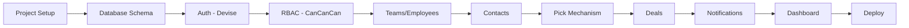

# AnKhangCRM - Implementation Plan

> **Version 1.0** | Estimated: 8 Weeks

---

## 📊 Tổng quan

| Metric | Value |
|--------|-------|
| **Tổng thời gian** | ~8 tuần |
| **Phases** | 5 |
| **Modules** | 11 (theo SRS) |

---

## Phase 1: Foundation (Tuần 1-2)

### 1.1 Project Setup
- [ ] Rails 7+ new project với cấu hình chuẩn
- [ ] Docker + docker-compose (Rails, MySQL, Redis)
- [ ] Gemfile: Devise, CanCanCan, Sidekiq, Tailwind, Hotwire
- [ ] CI/CD pipeline cơ bản (GitHub Actions)
- [ ] Environment variables setup

### 1.2 Database Schema
- [ ] ERD diagram hoàn chỉnh
- [ ] Migrations cho core tables
- [ ] Seed data (roles, permissions, admin user)

### 1.3 Authentication (AUTH-001 → AUTH-006)
- [ ] Devise setup
- [ ] Login/Logout
- [ ] Remember me (30 ngày)
- [ ] Forgot password (email reset, 1h expiry)
- [ ] Session timeout (3 ngày)
- [ ] Audit logging cho auth events

### 1.4 Authorization (PERM-001 → PERM-007)
- [ ] CanCanCan với dynamic permissions
- [ ] Role/Permission models
- [ ] 4 default roles seeding
- [ ] Permission matrix UI
- [ ] User-level overrides
- [ ] System role protection

**Deliverable Phase 1:** Có thể login, phân quyền hoạt động

---

## Phase 2: Core Features (Tuần 3-5)

### 2.1 Teams & Employees Module
- [ ] Team CRUD
- [ ] Employee CRUD
- [ ] Team assignment
- [ ] Role assignment UI

### 2.2 Contact Module (CONT)
- [ ] Contact CRUD
- [ ] Loại nhu cầu / Nguồn liên hệ (enums)
- [ ] Status flow (Mới → Đã nhận → ... → Đóng)
- [ ] Search & filter
- [ ] Lịch sử trao đổi (Interaction History)

### 2.3 Pick Mechanism ⚠️ Critical
- [ ] Pick button với locking (Redis/DB transaction)
- [ ] Cooldown 5 phút
- [ ] Real-time UI update (Turbo Stream)
- [ ] Concurrency testing

### 2.4 Deals Module
- [ ] Deal CRUD
- [ ] Link to Contact
- [ ] Multiple products per deal
- [ ] Payment status tracking

### 2.5 Products & Coupons
- [ ] Product CRUD
- [ ] Coupon CRUD
- [ ] Coupon assignment to employees

**Deliverable Phase 2:** Contact + Pick + Deal workflow hoàn chỉnh

---

## Phase 3: Notifications (Tuần 6)

### 3.1 Notification Rules Engine
- [ ] Rule model (trigger, conditions, channels, template)
- [ ] Rule builder UI

### 3.2 Web Push
- [ ] Service worker setup
- [ ] Push subscription management
- [ ] Broadcast khi contact.created

### 3.3 Email Notifications
- [ ] ActionMailer setup
- [ ] Email templates
- [ ] Sidekiq async sending

### 3.4 Zalo OA Integration
- [ ] Zalo OA API client
- [ ] ZNS template management
- [ ] CSKH gửi tin Zalo

### 3.5 Real-time (ActionCable)
- [ ] WebSocket connection
- [ ] Turbo Streams broadcasts
- [ ] Online user status

**Deliverable Phase 3:** Notifications hoạt động đa kênh

---

## Phase 4: Dashboard & Reports (Tuần 7)

### 4.1 Dashboard
- [ ] KPI cards (tổng contacts, chốt, doanh thu)
- [ ] Status distribution chart (pie/donut)
- [ ] Trend chart (line)
- [ ] Date range filter

### 4.2 Reports
- [ ] Top performers table
- [ ] Sales comparison (bar chart)
- [ ] Revenue by team

### 4.3 Audit Logs
- [ ] Activity log viewer
- [ ] Search & filter
- [ ] Diff view (before/after)

**Deliverable Phase 4:** Dashboard với data insights

---

## Phase 5: Polish & Deploy (Tuần 8)

### 5.1 Testing
- [ ] RSpec coverage > 80%
- [ ] System tests cho critical flows
- [ ] Load testing (100-200 users)

### 5.2 Security
- [ ] Security audit (Brakeman)
- [ ] OWASP checklist
- [ ] Rate limiting (Rack::Attack)

### 5.3 Deployment
- [ ] Production server setup
- [ ] SSL/TLS configuration
- [ ] Backup strategy
- [ ] Monitoring (Sentry/Skylight)

### 5.4 Documentation
- [ ] API documentation (nếu có)
- [ ] User guide
- [ ] Admin guide

**Deliverable Phase 5:** Production-ready MVP

---

## 📌 Dependencies

---

## ⚠️ Risks & Mitigations

| Risk | Impact | Mitigation |
|------|--------|------------|
| Pick concurrency bugs | High | Load test early, use DB locks |
| Zalo API changes | Medium | Abstract API client |
| Scope creep | High | Stick to SRS, defer Phase 2 features |

---

## 📅 Timeline Summary

| Phase | Tuần | Focus |
|-------|------|-------|
| 1 | 1-2 | Foundation (Setup, Auth, RBAC) |
| 2 | 3-5 | Core (Contact, Pick, Deal) |
| 3 | 6 | Notifications |
| 4 | 7 | Dashboard & Reports |
| 5 | 8 | Testing & Deploy |

---

> **Next Step:** Database Schema Design (ERD)
