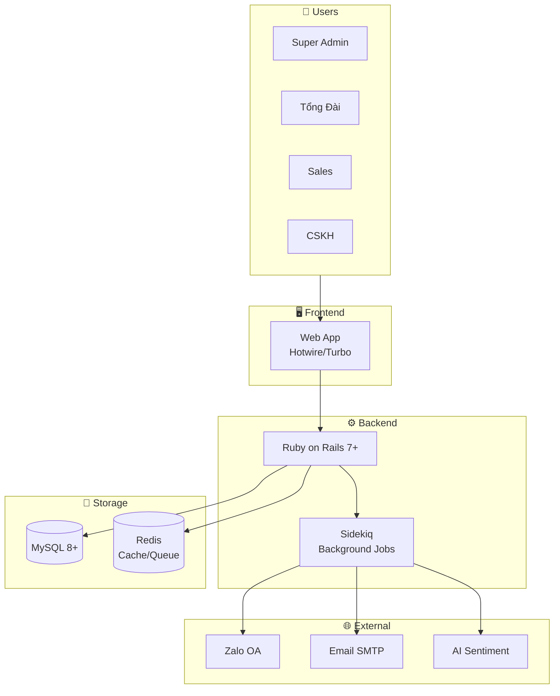
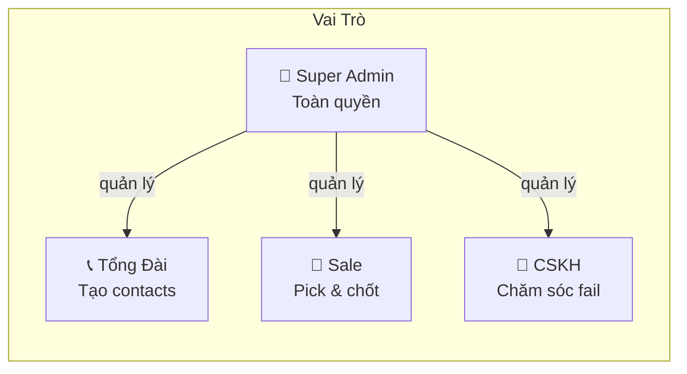
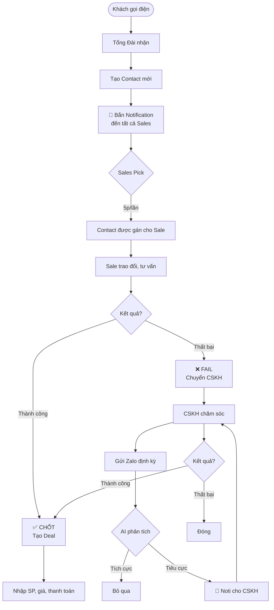
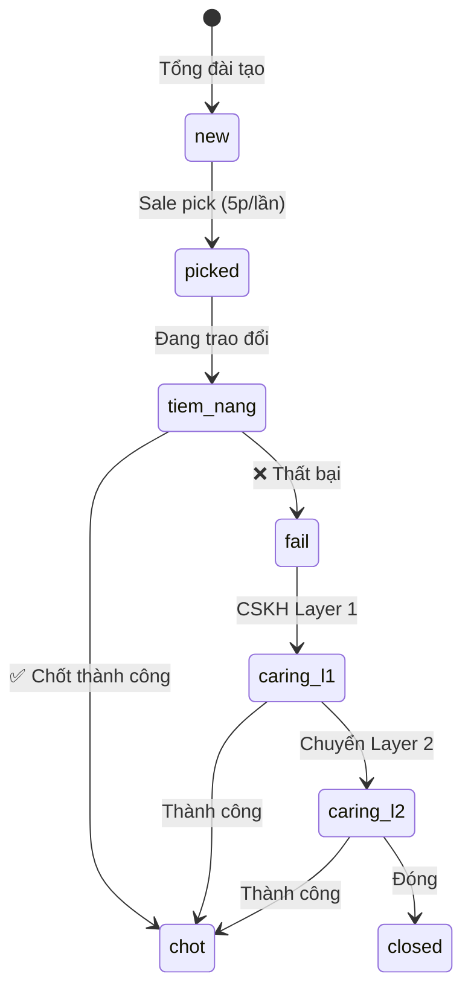
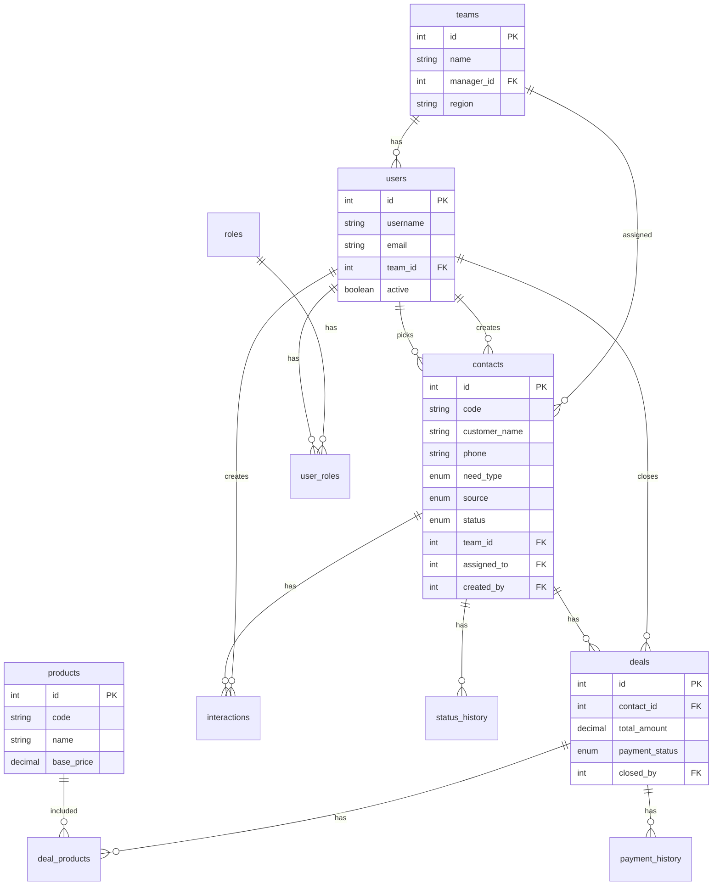
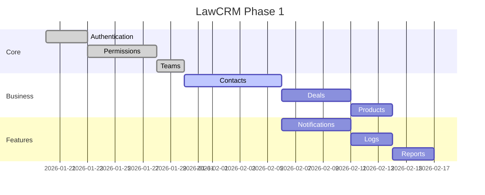

# 📋 LawCRM - Tổng Hợp Yêu Cầu Hệ Thống

> **Phiên bản**: 2.0  
> **Ngày cập nhật**: 2026-01-19  
> **Trạng thái**: Confirmed

---

## 1. Giới Thiệu

**LawCRM** là hệ thống quản lý khách hàng (CRM) cho doanh nghiệp dịch vụ luật, chuyển đổi số từ Google Sheets sang nền tảng chuyên nghiệp.

### 1.1 Mục Tiêu Chính
- ✅ Chuyển đổi số 100% từ Google Sheets
- ✅ Thông báo real-time khi có contact mới
- ✅ Cơ chế pick contact công bằng cho Sales
- ✅ Multi-layer CSKH chăm sóc contacts fail
- ✅ Audit trail đầy đủ

---

## 2. Kiến Trúc Hệ Thống

---

## 3. Vai Trò & Phân Quyền

| Vai trò | Quyền chính |
|---------|-------------|
| **Super Admin** | Quản lý users, teams, products, coupons, settings |
| **Tổng Đài** | Tạo contacts, phân loại nguồn |
| **Sale** | Pick contact, trao đổi, chốt deal |
| **CSKH** | Xem contacts fail, gửi Zalo, chăm sóc lại |

---

## 4. Luồng Hoạt Động Chính

---

## 5. Trạng Thái Contact

| Status | Mô tả | Color |
|--------|-------|-------|
| `new` | Mới tạo, chờ pick | 🔵 |
| `picked` | Đã nhận | 🟡 |
| `tiem_nang` | Đang trao đổi | 🟠 |
| `chot` | Chốt thành công | 🟢 |
| `fail` | Thất bại → CSKH | 🔴 |
| `caring_l1` | CSKH Layer 1 | 🟣 |
| `caring_l2` | CSKH Layer 2 | 🟣 |
| `closed` | Đóng | ⚫ |

---

## 6. Cơ Sở Dữ Liệu (ERD)

### Danh Sách Tables

| # | Table | Mô tả |
|---|-------|-------|
| 1 | teams | Quản lý teams (HN, HCM, Thực tập) |
| 2 | users | Nhân viên |
| 3 | roles | Vai trò |
| 4 | permissions | Quyền |
| 5 | contacts | Leads/Contacts |
| 6 | interactions | Lịch sử trao đổi |
| 7 | status_history | Lịch sử chuyển status |
| 8 | products | Sản phẩm/Dịch vụ |
| 9 | coupons | Mã giảm giá |
| 10 | deals | Deals khi chốt |
| 11 | deal_products | SP trong deal |
| 12 | payment_history | Lịch sử thanh toán |
| 13 | activity_logs | Audit logs |
| 14 | notification_rules | Rules thông báo |

---

## 7. Modules Overview

| # | Module | Mô tả | Priority |
|---|--------|-------|----------|
| 01 | [Authentication](./01-authentication/) | Login, logout, forgot password | Cao |
| 02 | [Permissions](./02-permissions/) | Dynamic roles & permissions | Cao ⭐ |
| 03 | [Contacts](./03-contacts/) | Quản lý contacts, pick mechanism | Cao ⭐ |
| 04 | [Employees](./04-employees/) | Quản lý nhân viên | Cao |
| 05 | [Notifications](./05-notifications/) | Web Push, Email, Zalo | Cao ⭐ |
| 06 | [Logs](./06-logs/) | Audit trail | Cao |
| 07 | [Reports](./07-reports/) | Dashboard & báo cáo | Trung |
| 10 | [Products](./10-products/) | Sản phẩm, Coupons | Cao |
| 11 | [Teams](./11-teams/) | Quản lý teams | Cao |
| 12 | [Deals](./12-deals/) | Quản lý deals | Cao |

---

## 8. Tech Stack

| Layer | Technology |
|-------|------------|
| **Backend** | Ruby on Rails 7+ |
| **Frontend** | HTML, CSS, JS, Hotwire |
| **Database** | MySQL 8+ |
| **Cache/Queue** | Redis |
| **Background Jobs** | Sidekiq |
| **Notifications** | Web Push, Email, Zalo OA |
| **AI** | Sentiment Analysis API |

---

## 9. Thông Tin Contact

| Field | Mô tả |
|-------|-------|
| code | Mã liên hệ (tự sinh) |
| customer_name | Tên khách (Zalo) |
| phone | Số điện thoại |
| need_type | TLDN, Thay đổi TT, Giấy phép con, Kế toán, FDI, SHTT, Khác |
| source | Ladi Zalo, Ladi Hotline, FB Mess, FB Hotline, Google, Giới thiệu, Khác |
| team_id | Team tư vấn |
| assigned_to | Sale đã pick |
| status | new → picked → tiem_nang → chot/fail |

---

## 10. Thông Tin Deal

| Field | Mô tả |
|-------|-------|
| contact_id | Liên kết Contact |
| total_amount | Tổng giá trị |
| payment_status | pending, partial, paid, refunded |
| deal_products | Nhiều SP, mỗi SP có: quantity, unit_price, closed_at |

---

## 11. Timeline (Phase 1)

---

## 12. Tài Liệu Tham Khảo

| File | Nội dung |
|------|----------|
| [00-overview](./00-overview/) | Tổng quan dự án |
| [08-database](./08-database/) | Database schema chi tiết |
| [09-phases](./09-phases/) | Timeline & milestones |

---

> **Ghi chú**: Tài liệu này là bản tổng hợp. Chi tiết từng module xem trong folder tương ứng.
