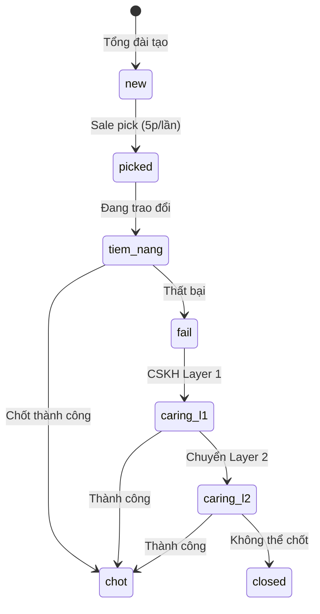

# 👥 Module: Contacts

> **Module ID**: CONT  
> **Priority**: Cao ⭐  
> **Phase**: 1  
> **Note**: Module QUAN TRỌNG - quản lý leads/contacts

---

## 1. Tổng Quan

Module quản lý thông tin contacts (leads) với đầy đủ CRUD, cơ chế pick contact, tìm kiếm nâng cao, và tracking trạng thái.

---

## 2. Yêu Cầu Chức Năng

| ID | Yêu cầu | Ưu tiên | Phase |
|----|---------|---------|-------|
| CONT-001 | Tổng đài tạo contact mới | Cao | 1 |
| CONT-002 | Sales pick contact (5 phút/lần) | Cao | 1 |
| CONT-003 | Xem danh sách contacts (pagination) | Cao | 1 |
| CONT-004 | Tìm kiếm nâng cao (multi-field) | Cao | 1 |
| CONT-005 | Lọc theo trạng thái, nguồn, team | Cao | 1 |
| CONT-006 | Cập nhật trạng thái contact | Cao | 1 |
| CONT-007 | Ghi lịch sử trao đổi | Cao | 1 |
| CONT-008 | Chuyển contact giữa các trạng thái | Cao | 1 |
| CONT-009 | Xem lịch sử thay đổi status | Trung | 1 |
| CONT-010 | Import từ CSV/Excel | Thấp | 2 |

---

## 3. Thông Tin Contact

### 3.1 Fields

| Field | Type | Required | Validation | Ghi chú |
|-------|------|----------|------------|---------|
| id | int | Auto | | PK |
| code | string(20) | Auto | | Mã liên hệ (tự sinh) |
| customer_name | string(255) | ✅ | Min 2 chars | Tên khách (thường là tên Zalo) |
| phone | string(20) | ✅ | Phone format | Số điện thoại (Zalo) |
| email | string(255) | | Email format | Email liên hệ (optional) |
| need_type | enum | ✅ | | Loại nhu cầu |
| team_id | int | | FK teams | Team tư vấn |
| source | enum | ✅ | | Nguồn liên hệ |
| notes | text | | | Ghi chú |
| status | enum | ✅ | | Trạng thái |
| assigned_to | int | | FK users | Sale đã pick (Tư vấn nhận) |
| created_by | int | Auto | FK users | Tổng đài tạo |
| created_at | datetime | Auto | | Ngày giờ tạo |
| updated_at | datetime | Auto | | |

### 3.2 Loại Nhu Cầu (`need_type`)

| Value | Display |
|-------|---------|
| `tldn_new` | TLDN Mới (Thành lập doanh nghiệp) |
| `info_change` | Thay đổi thông tin |
| `sub_license` | Giấy phép con |
| `accounting` | Kế toán |
| `fdi` | FDI (Đầu tư nước ngoài) |
| `ip` | SHTT (Sở hữu trí tuệ) |
| `other` | Khác |

### 3.3 Nguồn Liên Hệ (`source`)

| Value | Display |
|-------|---------|
| `ladi_zalo` | Ladi Zalo |
| `ladi_hotline` | Ladi Hotline |
| `fb_mess` | Facebook Messenger |
| `fb_hotline` | Facebook Hotline |
| `google` | Google Ads |
| `referral` | Giới thiệu |
| `other` | Khác |

### 3.4 Status Values

| Value | Display | Color | Description |
|-------|---------|-------|-------------|
| `new` | Mới | 🔵 Blue | Vừa tạo, chờ Sales pick |
| `picked` | Đã nhận | 🟡 Yellow | Sales đã pick |
| `tiem_nang` | Tiềm năng | 🟠 Orange | Đang trao đổi, chưa chốt |
| `chot` | Chốt | 🟢 Green | Chốt sale thành công |
| `fail` | Thất bại | 🔴 Red | Sales không chốt được |
| `caring_l1` | CSKH L1 | 🟣 Purple | CSKH chăm sóc lần 1 |
| `caring_l2` | CSKH L2 | 🟣 Purple | CSKH chăm sóc lần 2 |
| `closed` | Đóng | ⚫ Gray | Không thể chốt, kết thúc |

### 3.5 Status Flow



---

## 4. Cơ Chế Pick Contact

| Rule | Giá trị | Ghi chú |
|------|---------|---------|
| Cooldown | **5 phút** | 1 Sale chỉ pick được 1 contact trong 5 phút |
| Giới hạn đang xử lý | **Không giới hạn** | Sale có thể xử lý nhiều contacts cùng lúc |
| Khi pick | **Chuyển status** | Contact từ `new` → `picked`, gán `assigned_to` |
| Sau pick | **Không ẩn** | Contact vẫn hiển thị nhưng status đã đổi |

---

## 5. Interaction History

Bảng lưu lịch sử trao đổi với khách hàng.

| Field | Type | Mô tả |
|-------|------|-------|
| id | int | PK |
| contact_id | int | FK → Contact |
| user_id | int | FK → User (người trao đổi) |
| content | text | Nội dung trao đổi |
| interaction_type | enum | `call`, `zalo`, `email`, `meeting`, `other` |
| created_at | datetime | Ngày giờ trao đổi |

---

## 6. User Stories

| ID | Vai trò | Mong muốn | Để | Priority |
|----|---------|-----------|-----|----------|
| US-020 | Tổng đài | Tạo contact mới nhanh chóng | Lưu thông tin lead | Cao |
| US-021 | Sale | Nhận notification khi có contact mới | Không bỏ lỡ lead | Cao |
| US-022 | Sale | Pick contact để xử lý | Nhận việc | Cao |
| US-023 | Sale | Ghi lại nội dung trao đổi | Tracking lịch sử | Cao |
| US-024 | Sale | Cập nhật trạng thái contact | Theo dõi tiến độ | Cao |
| US-025 | CSKH | Xem contacts fail | Chăm sóc lại | Cao |
| US-026 | Manager | Xem ai đang xử lý contact nào | Theo dõi team | Trung |

---

## 7. API Endpoints

| Method | Endpoint | Description | Permission |
|--------|----------|-------------|------------|
| GET | `/api/v1/contacts` | List + search + filter | `contacts.view` |
| GET | `/api/v1/contacts/:id` | Contact detail | `contacts.view` |
| POST | `/api/v1/contacts` | Create contact | `contacts.create` |
| PUT | `/api/v1/contacts/:id` | Update contact | `contacts.edit` |
| POST | `/api/v1/contacts/:id/pick` | Pick contact | `contacts.pick` |
| PUT | `/api/v1/contacts/:id/status` | Update status | `contacts.update_status` |
| GET | `/api/v1/contacts/:id/interactions` | Interaction history | `contacts.view` |
| POST | `/api/v1/contacts/:id/interactions` | Add interaction | `contacts.edit` |
| GET | `/api/v1/contacts/:id/status-history` | Status history | `contacts.view` |

---

## 8. Database Table

### contacts

| Column | Type | Constraints |
|--------|------|-------------|
| id | int | PK, auto |
| code | varchar(20) | UNIQUE, NOT NULL |
| customer_name | varchar(255) | NOT NULL |
| phone | varchar(20) | NOT NULL |
| email | varchar(255) | |
| need_type | enum | NOT NULL |
| team_id | int | FK teams |
| source | enum | NOT NULL |
| notes | text | |
| status | enum | NOT NULL, default 'new' |
| assigned_to | int | FK users |
| created_by | int | FK users, NOT NULL |
| created_at | datetime | NOT NULL |
| updated_at | datetime | NOT NULL |

### Indexes

```sql
CREATE INDEX idx_contacts_status ON contacts(status);
CREATE INDEX idx_contacts_source ON contacts(source);
CREATE INDEX idx_contacts_team_id ON contacts(team_id);
CREATE INDEX idx_contacts_assigned_to ON contacts(assigned_to);
CREATE INDEX idx_contacts_created_by ON contacts(created_by);
CREATE FULLTEXT INDEX idx_contacts_search ON contacts(customer_name, phone);
```

---

## 9. Permissions Required

| Action | Permission |
|--------|------------|
| Xem danh sách, chi tiết | `contacts.view` |
| Tạo mới | `contacts.create` |
| Pick contact | `contacts.pick` |
| Sửa, ghi interaction | `contacts.edit` |
| Cập nhật status | `contacts.update_status` |
| Xem contacts fail | `contacts.view_failed` |

---

## 10. UI Screen Requirements

### 10.1 Màn hình: Tạo Contact Mới (`contacts_form.html`)

> [!IMPORTANT]
> **Quy tắc nghiệp vụ:**
> - Chỉ role **Tổng đài** được truy cập màn hình này
> - Status **tự động = `new`** khi tạo, KHÔNG cho phép chọn
> - Mã liên hệ (`code`) tự động sinh, hiển thị dạng preview

#### Layout
| Vùng | Nội dung |
|------|----------|
| Header | Breadcrumb: Kinh doanh > Khách hàng > Thêm mới |
| Main (2/3) | Form thông tin liên hệ + Nhu cầu dịch vụ |
| Sidebar (1/3) | Notification Settings |
| Footer | Action buttons: Hủy bỏ, Tạo Khách hàng |

#### Form Fields
| Field | Type | Required | Validation |
|-------|------|----------|------------|
| Mã liên hệ | Text (readonly) | Auto | Hiển thị preview "KH2026-XXX" |
| Họ và Tên | Text input | ✅ | Min 2 chars |
| Số điện thoại | Tel input + icon | ✅ | 10-11 digits, VN format |
| Email | Email input + icon | | Valid email format |
| Loại nhu cầu | Select dropdown | ✅ | 7 options từ `need_type` |
| Nguồn liên hệ | Select dropdown | ✅ | 7 options từ `source` |
| Ghi chú | Textarea | | Max 1000 chars |

#### Notification Settings (Sidebar)
| Component | Behavior |
|-----------|----------|
| Toggle Bật/Tắt | Bật mặc định, tắt = không gửi notification |
| Gửi đến Team | Multi-select modal, chọn 1 hoặc nhiều team |
| Gửi đến Nhân viên | Multi-select modal, override team |
| Kênh thông báo | Checkbox: Web Push ✅, Zalo OA ✅, Email ☐ |

#### Validation & Error States
| Trường hợp | UI Behavior |
|------------|-------------|
| Field required trống | Border đỏ + message "Trường này bắt buộc" |
| Phone format sai | Message "Số điện thoại không hợp lệ" |
| Email format sai | Message "Email không hợp lệ" |
| Submit thành công | Toast "Tạo khách hàng thành công" + redirect |
| Submit thất bại | Toast "Có lỗi xảy ra, vui lòng thử lại" |

#### Loading States
| Action | UI Behavior |
|--------|-------------|
| Submit form | Button disabled + spinner "Đang xử lý..." |
| Load Team/NV modal | Skeleton loading trong modal |

#### Buttons
| Button | Action | Style |
|--------|--------|-------|
| Hủy bỏ | Confirm modal → redirect `/contacts` | Secondary (outline) |
| Tạo Khách hàng | Validate → Submit → Redirect | Primary (blue) |

---

> **Related**: 
> - [nhat-ky-hoat-dong](../nhat-ky-hoat-dong/) - Log khi thay đổi status
> - [thong-bao](../thong-bao/) - Notification khi tạo contact mới
> - [co-hoi-ban-hang](../co-hoi-ban-hang/) - Thông tin khi chốt deal
