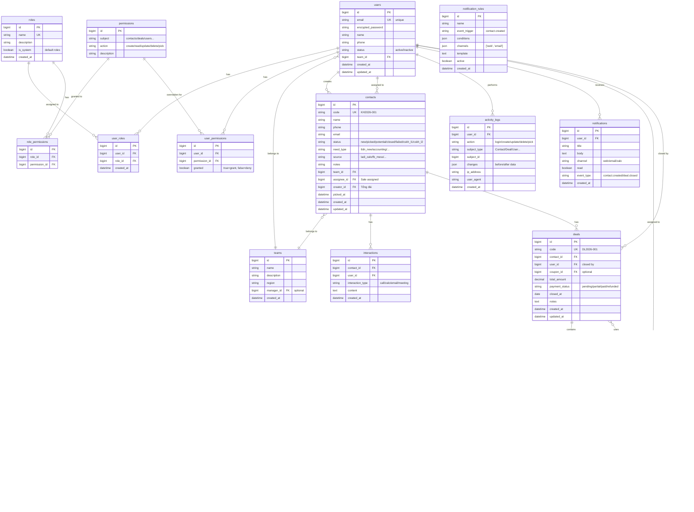

# AnKhangCRM - Entity Relationship Diagram (ERD)

> **Version:** 1.0  
> **Last Updated:** 2026-01-21  
> **Status:** Draft

---

## ERD Overview



---

## Tables Summary

| # | Table | Description | Records Est. |
|---|-------|-------------|--------------|
| 1 | `users` | Nhân viên/Tài khoản | ~100 |
| 2 | `roles` | Vai trò (Admin, Sale, CSKH...) | ~10 |
| 3 | `permissions` | Quyền hạn cụ thể | ~50 |
| 4 | `user_roles` | Gán roles cho users | ~100 |
| 5 | `role_permissions` | Gán permissions cho roles | ~200 |
| 6 | `user_permissions` | Override permissions cho user | ~50 |
| 7 | `teams` | Đội nhóm (HN, HCM...) | ~10 |
| 8 | `contacts` | Khách hàng/Leads | ~10,000+ |
| 9 | `interactions` | Lịch sử tương tác | ~50,000+ |
| 10 | `deals` | Cơ hội bán hàng | ~5,000+ |
| 11 | `deal_items` | Sản phẩm trong deal | ~10,000+ |
| 12 | `products` | Dịch vụ/Sản phẩm | ~50 |
| 13 | `coupons` | Mã khuyến mãi | ~100 |
| 14 | `activity_logs` | Nhật ký hoạt động | ~500,000+ |
| 15 | `notifications` | Thông báo | ~100,000+ |
| 16 | `notification_rules` | Quy tắc gửi thông báo | ~20 |

---

## Key Relationships

### 1. User ↔ Role ↔ Permission (RBAC)
```
User → has many → UserRoles → belongs to → Role
Role → has many → RolePermissions → belongs to → Permission
User → has many → UserPermissions (override) → belongs to → Permission
```

### 2. Contact Lifecycle
```
Contact (created by Tổng đài)
    ├── assigned to → User (Sale pick)
    ├── belongs to → Team (auto from Sale)
    ├── has many → Interactions (lịch sử)
    └── has many → Deals (khi chốt)
```

### 3. Deal Structure
```
Deal
    ├── belongs to → Contact
    ├── belongs to → User (người chốt)
    ├── has many → DealItems → Product
    └── uses → Coupon (optional)
```

---

## Indexes Required

| Table | Index | Purpose |
|-------|-------|---------|
| `users` | `email` (unique) | Login lookup |
| `users` | `team_id` | Filter by team |
| `contacts` | `code` (unique) | Quick search |
| `contacts` | `phone` | Duplicate check |
| `contacts` | `status` | Filter by status |
| `contacts` | `assignee_id` | My contacts |
| `contacts` | `team_id` | Team contacts |
| `deals` | `contact_id` | Contact's deals |
| `deals` | `user_id` | My deals |
| `activity_logs` | `user_id, created_at` | User history |
| `activity_logs` | `subject_type, subject_id` | Entity history |

---

## Notes

1. **Soft Delete**: Consider adding `deleted_at` to critical tables
2. **Version Control**: `contacts` and `deals` may need optimistic locking
3. **Audit**: All tables should have `created_at`, `updated_at`
4. **Encoding**: Use `utf8mb4` for Vietnamese support

---

## Detailed Table Specifications

### 1. users (Nhân viên)

> Lưu trữ thông tin tài khoản nhân viên sử dụng hệ thống.

| Column | Type | Null | Default | Description |
|--------|------|------|---------|-------------|
| `id` | bigint | NO | auto | Primary key |
| `email` | varchar(255) | NO | - | Email đăng nhập (unique) |
| `encrypted_password` | varchar(255) | NO | - | Mật khẩu đã mã hóa (bcrypt) |
| `name` | varchar(100) | NO | - | Họ và tên |
| `phone` | varchar(20) | YES | NULL | Số điện thoại |
| `status` | enum | NO | 'active' | Trạng thái: `active`, `inactive` |
| `team_id` | bigint | YES | NULL | FK → teams.id |
| `reset_password_token` | varchar(255) | YES | NULL | Token reset mật khẩu |
| `reset_password_sent_at` | datetime | YES | NULL | Thời điểm gửi reset token |
| `remember_created_at` | datetime | YES | NULL | Thời điểm remember me |
| `sign_in_count` | int | NO | 0 | Số lần đăng nhập |
| `current_sign_in_at` | datetime | YES | NULL | Đăng nhập hiện tại |
| `last_sign_in_at` | datetime | YES | NULL | Đăng nhập trước đó |
| `current_sign_in_ip` | varchar(45) | YES | NULL | IP hiện tại |
| `last_sign_in_ip` | varchar(45) | YES | NULL | IP trước đó |
| `created_at` | datetime | NO | NOW() | Ngày tạo |
| `updated_at` | datetime | NO | NOW() | Ngày cập nhật |

**Business Rules:**
- Email phải unique
- Username không đổi sau khi tạo
- Không tự vô hiệu hóa chính mình
- Phải có ít nhất 1 Admin active

---

### 2. roles (Vai trò)

> Định nghĩa các vai trò trong hệ thống phân quyền.

| Column | Type | Null | Default | Description |
|--------|------|------|---------|-------------|
| `id` | bigint | NO | auto | Primary key |
| `name` | varchar(50) | NO | - | Tên vai trò (unique) |
| `description` | varchar(255) | YES | NULL | Mô tả vai trò |
| `is_system` | boolean | NO | false | Vai trò hệ thống (không xóa được) |
| `created_at` | datetime | NO | NOW() | Ngày tạo |
| `updated_at` | datetime | NO | NOW() | Ngày cập nhật |

**Default Roles:**
| Name | is_system | Description |
|------|-----------|-------------|
| Super Admin | true | Toàn quyền |
| Tổng Đài | true | Nhận cuộc gọi, tạo contact |
| Sale | true | Tư vấn, chốt deal |
| CSKH | true | Chăm sóc khách hàng |

---

### 3. permissions (Quyền hạn)

> Danh sách các quyền hạn cụ thể trong hệ thống.

| Column | Type | Null | Default | Description |
|--------|------|------|---------|-------------|
| `id` | bigint | NO | auto | Primary key |
| `subject` | varchar(50) | NO | - | Đối tượng: contacts, deals, users... |
| `action` | varchar(50) | NO | - | Hành động: create, read, update, delete, pick |
| `description` | varchar(255) | YES | NULL | Mô tả quyền |
| `created_at` | datetime | NO | NOW() | Ngày tạo |

**Example Permissions:**
| Subject | Action | Description |
|---------|--------|-------------|
| contacts | create | Tạo khách hàng mới |
| contacts | read | Xem danh sách khách hàng |
| contacts | pick | Nhận khách hàng về xử lý |
| contacts | update | Cập nhật thông tin KH |
| deals | create | Tạo cơ hội bán hàng |
| users | manage | Quản lý nhân viên |
| roles | manage | Quản lý vai trò |

---

### 4. user_roles (Gán vai trò)

> Bảng trung gian quan hệ N-N giữa users và roles.

| Column | Type | Null | Default | Description |
|--------|------|------|---------|-------------|
| `id` | bigint | NO | auto | Primary key |
| `user_id` | bigint | NO | - | FK → users.id |
| `role_id` | bigint | NO | - | FK → roles.id |
| `created_at` | datetime | NO | NOW() | Ngày gán |

**Constraints:**
- Unique index trên (`user_id`, `role_id`)

---

### 5. role_permissions (Quyền của vai trò)

> Bảng trung gian quan hệ N-N giữa roles và permissions.

| Column | Type | Null | Default | Description |
|--------|------|------|---------|-------------|
| `id` | bigint | NO | auto | Primary key |
| `role_id` | bigint | NO | - | FK → roles.id |
| `permission_id` | bigint | NO | - | FK → permissions.id |

**Constraints:**
- Unique index trên (`role_id`, `permission_id`)

---

### 6. user_permissions (Override quyền)

> Cho phép grant/deny quyền riêng cho từng user.

| Column | Type | Null | Default | Description |
|--------|------|------|---------|-------------|
| `id` | bigint | NO | auto | Primary key |
| `user_id` | bigint | NO | - | FK → users.id |
| `permission_id` | bigint | NO | - | FK → permissions.id |
| `granted` | boolean | NO | true | true=grant, false=deny |
| `created_at` | datetime | NO | NOW() | Ngày tạo |

**Logic:**
- Nếu `granted=true`: User được cấp quyền này (dù role không có)
- Nếu `granted=false`: User bị chặn quyền này (dù role có)

---

### 7. teams (Đội nhóm)

> Phân chia nhân viên theo vùng/nhóm.

| Column | Type | Null | Default | Description |
|--------|------|------|---------|-------------|
| `id` | bigint | NO | auto | Primary key |
| `name` | varchar(100) | NO | - | Tên team |
| `description` | text | YES | NULL | Mô tả |
| `region` | varchar(50) | YES | NULL | Vùng: Bắc, Nam, Trung |
| `manager_id` | bigint | YES | NULL | FK → users.id (Trưởng nhóm) |
| `created_at` | datetime | NO | NOW() | Ngày tạo |
| `updated_at` | datetime | NO | NOW() | Ngày cập nhật |

**Example Teams:**
| Name | Region |
|------|--------|
| Team Hà Nội | Bắc |
| Team HCM | Nam |
| Team Kế toán | Trung tâm |

---

### 8. contacts (Khách hàng)

> Thông tin khách hàng tiềm năng và đã chốt.

| Column | Type | Null | Default | Description |
|--------|------|------|---------|-------------|
| `id` | bigint | NO | auto | Primary key |
| `code` | varchar(20) | NO | auto | Mã KH: KH2026-0001 (unique) |
| `name` | varchar(100) | NO | - | Tên khách hàng |
| `phone` | varchar(20) | NO | - | Số điện thoại |
| `email` | varchar(255) | YES | NULL | Email |
| `status` | enum | NO | 'new' | Trạng thái (xem bảng dưới) |
| `need_type` | enum | NO | - | Loại nhu cầu |
| `source` | enum | NO | - | Nguồn liên hệ |
| `notes` | text | YES | NULL | Ghi chú |
| `team_id` | bigint | YES | NULL | FK → teams.id |
| `assignee_id` | bigint | YES | NULL | FK → users.id (Sale phụ trách) |
| `creator_id` | bigint | NO | - | FK → users.id (Người tạo) |
| `picked_at` | datetime | YES | NULL | Thời điểm được pick |
| `created_at` | datetime | NO | NOW() | Ngày tạo |
| `updated_at` | datetime | NO | NOW() | Ngày cập nhật |

**Status Values:**
| Value | Label | Mô tả |
|-------|-------|-------|
| `new` | Mới | Vừa tạo, chờ pick |
| `picked` | Đã nhận | Sale đã pick |
| `potential` | Tiềm năng | Đang tư vấn |
| `closed` | Chốt | Ký HĐ thành công |
| `failed` | Thất bại | Không chốt được |
| `cskh_l1` | CSKH L1 | Chăm sóc lần 1 |
| `cskh_l2` | CSKH L2 | Chăm sóc lần 2 |

**Need Type Values:**
| Value | Label |
|-------|-------|
| `tldn_new` | Thành lập DN mới |
| `info_change` | Thay đổi thông tin DN |
| `sub_license` | Giấy phép con |
| `accounting` | Kế toán |
| `fdi` | Đầu tư nước ngoài |
| `ip` | Sở hữu trí tuệ |
| `other` | Khác |

**Source Values:**
| Value | Label |
|-------|-------|
| `ladi_zalo` | Ladi Zalo |
| `ladi_hotline` | Ladi Hotline |
| `fb_mess` | Facebook Messenger |
| `fb_hotline` | Facebook Hotline |
| `google` | Google Ads |
| `referral` | Giới thiệu |
| `other` | Khác |

---

### 9. interactions (Lịch sử trao đổi)

> Ghi nhận mọi lần tương tác với khách hàng.

| Column | Type | Null | Default | Description |
|--------|------|------|---------|-------------|
| `id` | bigint | NO | auto | Primary key |
| `contact_id` | bigint | NO | - | FK → contacts.id |
| `user_id` | bigint | NO | - | FK → users.id (Người trao đổi) |
| `interaction_type` | enum | NO | - | Loại: call, zalo, email, meeting, other |
| `content` | text | NO | - | Nội dung trao đổi |
| `created_at` | datetime | NO | NOW() | Thời điểm |

---

### 10. deals (Cơ hội bán hàng)

> Ghi nhận khi khách hàng chốt deal.

| Column | Type | Null | Default | Description |
|--------|------|------|---------|-------------|
| `id` | bigint | NO | auto | Primary key |
| `code` | varchar(20) | NO | auto | Mã deal: DL2026-0001 |
| `contact_id` | bigint | NO | - | FK → contacts.id |
| `user_id` | bigint | NO | - | FK → users.id (Người chốt) |
| `coupon_id` | bigint | YES | NULL | FK → coupons.id |
| `total_amount` | decimal(15,2) | NO | 0 | Tổng giá trị |
| `discount_amount` | decimal(15,2) | NO | 0 | Số tiền giảm |
| `final_amount` | decimal(15,2) | NO | 0 | Thành tiền cuối |
| `payment_status` | enum | NO | 'pending' | Trạng thái thanh toán |
| `closed_at` | date | NO | - | Ngày chốt |
| `notes` | text | YES | NULL | Ghi chú |
| `created_at` | datetime | NO | NOW() | Ngày tạo |
| `updated_at` | datetime | NO | NOW() | Ngày cập nhật |

**Payment Status Values:**
| Value | Label | Mô tả |
|-------|-------|-------|
| `pending` | Chưa TT | Chưa thanh toán |
| `partial` | TT một phần | Đã TT một phần |
| `paid` | Đã TT đủ | Hoàn tất thanh toán |
| `refunded` | Hoàn tiền | Đã hoàn tiền |

---

### 11. deal_items (Sản phẩm trong deal)

> Chi tiết sản phẩm/dịch vụ trong mỗi deal.

| Column | Type | Null | Default | Description |
|--------|------|------|---------|-------------|
| `id` | bigint | NO | auto | Primary key |
| `deal_id` | bigint | NO | - | FK → deals.id |
| `product_id` | bigint | NO | - | FK → products.id |
| `quantity` | int | NO | 1 | Số lượng |
| `unit_price` | decimal(15,2) | NO | - | Đơn giá |
| `subtotal` | decimal(15,2) | NO | - | Thành tiền (quantity × unit_price) |

---

### 12. products (Sản phẩm/Dịch vụ)

> Danh mục dịch vụ của công ty.

| Column | Type | Null | Default | Description |
|--------|------|------|---------|-------------|
| `id` | bigint | NO | auto | Primary key |
| `code` | varchar(20) | NO | - | Mã SP: TLDN-7 (unique) |
| `name` | varchar(200) | NO | - | Tên sản phẩm |
| `description` | text | YES | NULL | Mô tả chi tiết |
| `base_price` | decimal(15,2) | NO | 0 | Giá niêm yết |
| `category` | varchar(50) | YES | NULL | Danh mục |
| `status` | enum | NO | 'active' | Trạng thái: active, inactive |
| `created_at` | datetime | NO | NOW() | Ngày tạo |
| `updated_at` | datetime | NO | NOW() | Ngày cập nhật |

---

### 13. coupons (Mã khuyến mãi)

> Mã giảm giá gán cho nhân viên cụ thể.

| Column | Type | Null | Default | Description |
|--------|------|------|---------|-------------|
| `id` | bigint | NO | auto | Primary key |
| `code` | varchar(20) | NO | - | Mã coupon: SALE2026 (unique) |
| `description` | varchar(255) | YES | NULL | Mô tả |
| `discount_type` | enum | NO | 'percent' | Loại: percent, fixed |
| `discount_value` | decimal(10,2) | NO | - | Giá trị giảm |
| `min_order_value` | decimal(15,2) | YES | NULL | Đơn hàng tối thiểu |
| `expires_at` | date | YES | NULL | Ngày hết hạn |
| `assigned_user_id` | bigint | NO | - | FK → users.id (NV được gán) |
| `used` | boolean | NO | false | Đã sử dụng chưa |
| `used_at` | datetime | YES | NULL | Thời điểm sử dụng |
| `created_at` | datetime | NO | NOW() | Ngày tạo |

**Business Rules:**
- Mỗi coupon gán cho 1 nhân viên cụ thể
- Chỉ nhân viên được gán mới dùng được
- Mỗi coupon chỉ dùng 1 lần

---

### 14. activity_logs (Nhật ký hoạt động)

> Ghi nhận mọi hành động trong hệ thống (Audit Trail).

| Column | Type | Null | Default | Description |
|--------|------|------|---------|-------------|
| `id` | bigint | NO | auto | Primary key |
| `user_id` | bigint | YES | NULL | FK → users.id (NULL nếu system) |
| `action` | varchar(50) | NO | - | Hành động: login, create, update, delete, pick... |
| `subject_type` | varchar(50) | NO | - | Loại đối tượng: Contact, Deal, User... |
| `subject_id` | bigint | YES | NULL | ID đối tượng |
| `changes` | json | YES | NULL | Dữ liệu trước/sau thay đổi |
| `ip_address` | varchar(45) | YES | NULL | Địa chỉ IP |
| `user_agent` | text | YES | NULL | Browser/Device info |
| `created_at` | datetime | NO | NOW() | Thời điểm |

**Example Changes JSON:**
```json
{
  "before": { "status": "new", "assignee_id": null },
  "after": { "status": "picked", "assignee_id": 123 }
}
```

---

### 15. notifications (Thông báo)

> Thông báo gửi đến từng user.

| Column | Type | Null | Default | Description |
|--------|------|------|---------|-------------|
| `id` | bigint | NO | auto | Primary key |
| `user_id` | bigint | NO | - | FK → users.id (Người nhận) |
| `title` | varchar(200) | NO | - | Tiêu đề |
| `body` | text | NO | - | Nội dung |
| `channel` | enum | NO | 'web' | Kênh: web, email, zalo |
| `event_type` | varchar(50) | YES | NULL | Loại sự kiện trigger |
| `read` | boolean | NO | false | Đã đọc chưa |
| `read_at` | datetime | YES | NULL | Thời điểm đọc |
| `created_at` | datetime | NO | NOW() | Thời điểm gửi |

---

### 16. notification_rules (Quy tắc thông báo)

> Cấu hình quy tắc gửi thông báo tự động.

| Column | Type | Null | Default | Description |
|--------|------|------|---------|-------------|
| `id` | bigint | NO | auto | Primary key |
| `name` | varchar(100) | NO | - | Tên quy tắc |
| `event_trigger` | varchar(50) | NO | - | Sự kiện: contact.created, deal.closed... |
| `conditions` | json | YES | NULL | Điều kiện filter |
| `channels` | json | NO | - | Kênh gửi: ["web", "email"] |
| `template` | text | NO | - | Template nội dung |
| `active` | boolean | NO | true | Đang hoạt động |
| `created_at` | datetime | NO | NOW() | Ngày tạo |
| `updated_at` | datetime | NO | NOW() | Ngày cập nhật |

**Example Conditions JSON:**
```json
{
  "roles": ["sale", "cskh"],
  "teams": [1, 2]
}
```
