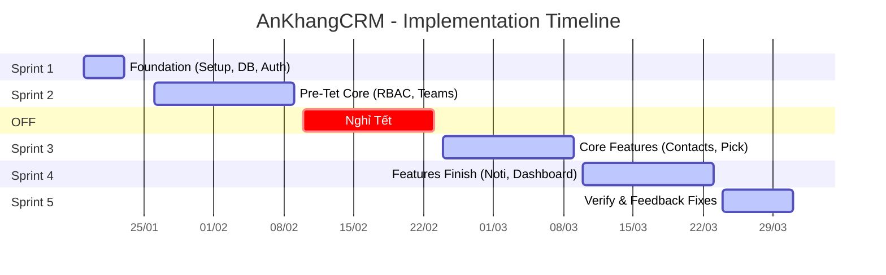

# AnKhangCRM - Implementation Plan

> **Version**: 1.1 (Final Proposal)  
> **Start Date**: 19/01/2026  
> **End Date**: 31/03/2026  
> **Total Duration**: ~10 weeks (bao gồm 2 tuần nghỉ Tết)

---

## Timeline Tổng Quan

---

## Chi Tiết Các Sprint

### Sprint 1: Foundation (Khởi động)
**Thời gian:** 19/01/2026 - 23/01/2026 (1 tuần)

Tuần đầu tiên tập trung setup hạ tầng để team có thể bắt đầu code ngay.
- **Hạ tầng:** Setup Rails, Docker, Database.
- **Database:** ERD, Core Tables.
- **Auth:** Login, Logout.
- **Output:** Môi trường Dev sẵn sàng, User đăng nhập được.

### Sprint 2: Pre-Tet Core
**Thời gian:** 26/01/2026 - 09/02/2026 (2 tuần)

Hoàn thiện các tính năng quản trị tổ chức để demo trước khi nghỉ Tết.
- **Authorization:** Phân quyền động (CanCanCan).
- **Organization:** Quản lý Teams, Employees (RBAC).
- **Output:** Hệ thống quản trị vận hành được (Admin/Manager/Sale accounts ready).

### Giai đoạn Nghỉ Tết (10/02 - 23/02)
- Server Development vẫn duy trì (demo mode).
- Team nghỉ ngơi.

### Sprint 3: Core Features
**Thời gian:** 24/02/2026 - 09/03/2026 (2 tuần)

Tập trung vào nghiệp vụ lõi Sales.
- **Contacts:** Quản lý khách hàng chuyên sâu.
- **Pick Mechanism:** Sales nhận khách (Critical).
- **Pick Rules Engine:** Cấu hình giới hạn Pick theo loại nhu cầu (Max/Day).
- **Deals:** Quản lý cơ hội bán hàng.
- **Output:** Flow Guest → Lead → Deal hoàn thiện.

### Sprint 4: Feature Finish (Notifications & Dashboard)
**Thời gian:** 10/03/2026 - 23/03/2026 (2 tuần)

Hoàn tất toàn bộ tính năng trước khi bước vào tuần cuối.
- **Advanced Features:** Sản phẩm, Coupon, Zalo/Email Notifications.
- **Dashboard & Reports:** Biểu đồ KPI, Báo cáo doanh thu, Audit Logs.
- **Output:** **Hoàn thành 100% Feature Development.**

### Sprint 5: Verification & Handover
**Thời gian:** 24/03/2026 - 31/03/2026 (1 tuần)

Dành riêng cho việc kiểm thử, sửa lỗi theo feedback khách hàng và bàn giao.
- **Verify:** UAT (User Acceptance Testing) với khách hàng.
- **Fixes:** Sửa lỗi và tinh chỉnh UI/UX theo feedback.
- **Deployment:** Production Release.
- **Handover:** Bàn giao tài liệu và hướng dẫn sử dụng.

---

## Giải thích thuật ngữ (Glossary)

| Thuật ngữ | Viết đầy đủ | Giải thích |
|-----------|-------------|------------|
| **MVP** | Minimum Viable Product | Sản phẩm khả dụng tối thiểu (Phiên bản đầu tiên chạy được các tính năng cốt lõi). |
| **RBAC** | Role-Based Access Control | Cơ chế phân quyền dựa trên vai trò (Ví dụ: Admin, Sale, CSKH...). |
| **CRUD** | Create, Read, Update, Delete | 4 thao tác cơ bản với dữ liệu: Tạo mới, Xem, Cập nhật, Xóa. |
| **ERD** | Entity Relationship Diagram | Sơ đồ cấu trúc dữ liệu và mối quan hệ giữa các bảng. |
| **UAT** | User Acceptance Testing | Giai đoạn khách hàng kiểm thử và nghiệm thu sản phẩm. |
| **ZNS** | Zalo Notification Service | Dịch vụ gửi tin nhắn chăm sóc khách hàng tự động qua Zalo OA. |

---

## Rủi ro & Giải pháp (Risk Management)

| Rủi ro | Mức độ | Giải pháp |
|--------|--------|-----------|
| **Nghỉ Tết làm gián đoạn mạch code** | Trung bình | Hoàn thành dứt điểm Module Admin/RBAC trước Tết. Document kỹ để bắt nhịp lại nhanh sau Tết. |
| **Zalo OA duyệt template lâu** | Cao | Đăng ký template ngay từ tuần đầu tiên của dự án. |
| **Phát sinh requirement mới** | Cao | Chốt cứng scope vào ngày 31/01. Mọi thay đổi sau đó sẽ đẩy sang Phase 2 (Maintenance). |

---

> **Cam kết:** Bàn giao hệ thống MVP (Minimum Viable Product) hoàn chỉnh vào ngày **31/03/2026**.
