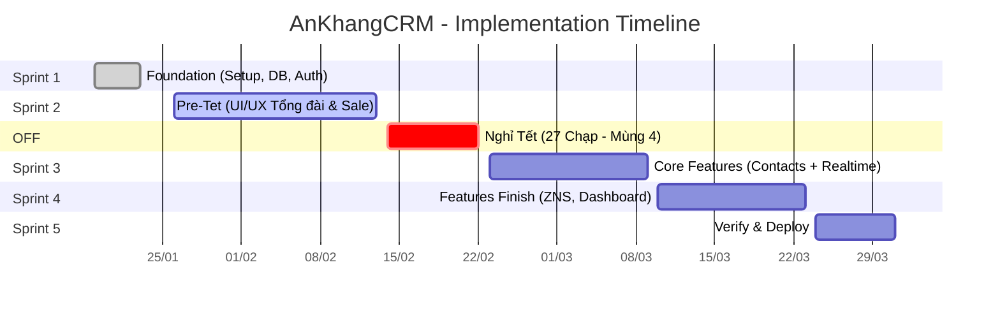

# AnKhangCRM - Implementation Plan

> **Version**: 2.0 (Updated)  
> **Start Date**: 19/01/2026  
> **End Date**: 31/03/2026  
> **Total Duration**: ~10 weeks (bao gồm 9 ngày nghỉ Tết)

---

## Timeline Tổng Quan

---

## Chi Tiết Các Sprint

### Sprint 1: Foundation (Khởi động)
**Thời gian:** 19/01/2026 - 23/01/2026 (1 tuần)

Tuần đầu tiên tập trung setup hạ tầng để team có thể bắt đầu code ngay.
- **Hạ tầng:** Setup Rails, Docker, Database.
- **Database:** ERD, Core Tables (Users, Roles, Permissions).
- **Auth:** Login, Logout, RBAC.
- **Output:** Môi trường Dev sẵn sàng, User đăng nhập được.

### Sprint 2: Pre-Tet (UI/UX Tổng đài & Sale)
**Thời gian:** 26/01/2026 - 13/02/2026 (2.5 tuần)

**Mục tiêu:** Hoàn thiện UI/UX cho 2 màn hình chính để demo trước Tết.

- **Organization:** Quản lý Teams, Employees (RBAC).
- **Contacts:** Model, Form tạo Contact, Danh sách Contact.
- **Dashboard Tổng đài:** Form nhập nhanh, thống kê cơ bản.
- **Dashboard Sale:** Danh sách khách mới, lịch hẹn.
- **Lịch làm việc:** Quản lý ngày nghỉ/lễ, DS đi làm Thứ 7.
- **Output:** Demo được flow Tổng đài tạo Contact → Sale xem danh sách.

### Giai đoạn Nghỉ Tết (14/02 - 22/02)
- **Thời gian:** Thứ Bảy 14/02 (27 Chạp) → Chủ Nhật 22/02 (Mùng 4 Tết)
- Server Development vẫn duy trì (demo mode).
- Team nghỉ ngơi.

### Sprint 3: Core Features (Contacts + Real-time)
**Thời gian:** 23/02/2026 - 09/03/2026 (2 tuần)

Tập trung vào nghiệp vụ lõi và real-time notifications.
- **Contacts:** Pick mechanism, Pick Rules Engine, Chi tiết & Lịch sử.
- **Smart Routing:** Config thời gian chờ, mapping Loại nhu cầu → Team.
- **Real-time:** WebSocket (ActionCable), Web Push notifications.
- **Admin Re-assign:** Chuyển Contact cho người khác.
- **Output:** Flow Pick hoàn thiện với real-time updates.

### Sprint 4: Feature Finish (ZNS & Dashboard)
**Thời gian:** 10/03/2026 - 23/03/2026 (2 tuần)

Hoàn tất toàn bộ tính năng trước khi bước vào tuần cuối.
- **ZNS Integration:** Tích hợp Zalo OA, gửi tin nhắn ZNS.
- **Email Notifications:** ActionMailer + Sidekiq.
- **Dashboard & Reports:** KPI cards, biểu đồ, Top performers.
- **Activity Logs:** Xem lịch sử hoạt động.
- **Output:** **Hoàn thành 100% Feature Development.**

### Sprint 5: Verification & Handover
**Thời gian:** 24/03/2026 - 31/03/2026 (1 tuần)

Dành riêng cho việc kiểm thử, sửa lỗi và bàn giao.
- **Verify:** UAT (User Acceptance Testing) với khách hàng.
- **Fixes:** Sửa lỗi và tinh chỉnh UI/UX theo feedback.
- **Deployment:** Production Release.
- **Handover:** Bàn giao tài liệu và hướng dẫn sử dụng.

---

## Phase 1 Scope (Theo SRS v2)

### ✅ Làm trong Phase 1
| Module | Mô tả |
|--------|-------|
| Authentication | Login, Logout, Quên mật khẩu |
| Teams & Employees | CRUD, Many-to-Many |
| Contacts | Full CRUD, Status flow, Lịch sử chăm sóc |
| Smart Routing | Random assign, Config thời gian chờ |
| Pick Mechanism | Nhận khách + Rules Engine |
| Notifications | Web Push, Email, Slack fallback |
| ZNS | Gửi thủ công + mẫu template |
| Dashboard | KPI, Charts, Top performers |
| Activity Logs | Audit trail |
| Lịch thứ 7, Ngày lễ | Admin quản lý |

### ❌ Không làm (Phase 2)
| Module | Lý do |
|--------|-------|
| Deals | SRS v2 không yêu cầu |
| Products | SRS v2 không yêu cầu |
| Coupon | SRS v2 không yêu cầu |
| Mobile App | Phase sau |
| AI Features | Phase sau |
| Import Google Sheets | Phase sau |
| 2FA | Phase sau |
| Export PDF | Phase sau |

---

## Giải thích thuật ngữ (Glossary)

| Thuật ngữ | Viết đầy đủ | Giải thích |
|-----------|-------------|------------|
| **MVP** | Minimum Viable Product | Sản phẩm khả dụng tối thiểu (Phiên bản đầu tiên chạy được các tính năng cốt lõi). |
| **RBAC** | Role-Based Access Control | Cơ chế phân quyền dựa trên vai trò (Ví dụ: Admin, Sale, CSKH...). |
| **CRUD** | Create, Read, Update, Delete | 4 thao tác cơ bản với dữ liệu: Tạo mới, Xem, Cập nhật, Xóa. |
| **ERD** | Entity Relationship Diagram | Sơ đồ cấu trúc dữ liệu và mối quan hệ giữa các bảng. |
| **UAT** | User Acceptance Testing | Giai đoạn khách hàng kiểm thử và nghiệm thu sản phẩm. |
| **ZNS** | Zalo Notification Service | Dịch vụ gửi tin nhắn chăm sóc khách hàng tự động qua Zalo OA. |

---

## Rủi ro & Giải pháp (Risk Management)

| Rủi ro | Mức độ | Giải pháp |
|--------|--------|-----------|
| **Nghỉ Tết làm gián đoạn mạch code** | Trung bình | Hoàn thành UI/UX Dashboard trước Tết. Document kỹ để bắt nhịp lại nhanh sau Tết. |
| **Zalo OA duyệt template lâu** | Cao | Đăng ký template ngay từ tuần đầu tiên của dự án. |
| **Phát sinh requirement mới** | Cao | Chốt cứng scope vào ngày 31/01. Mọi thay đổi sau đó sẽ đẩy sang Phase 2 (Maintenance). |

---

> **Cam kết:** Bàn giao hệ thống MVP (Minimum Viable Product) hoàn chỉnh vào ngày **31/03/2026**.
