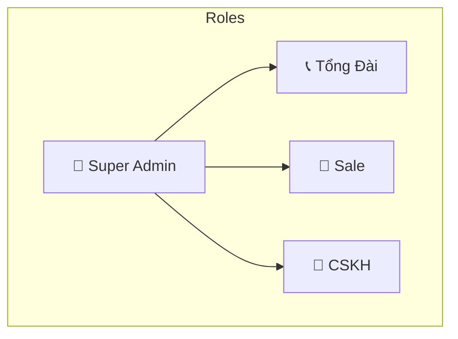
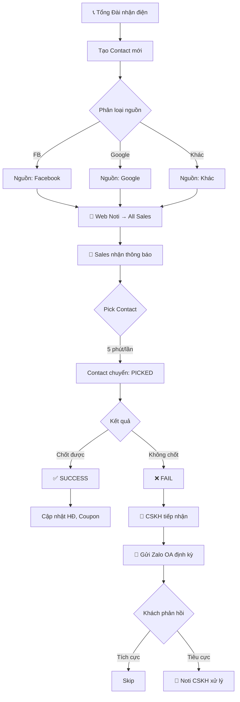
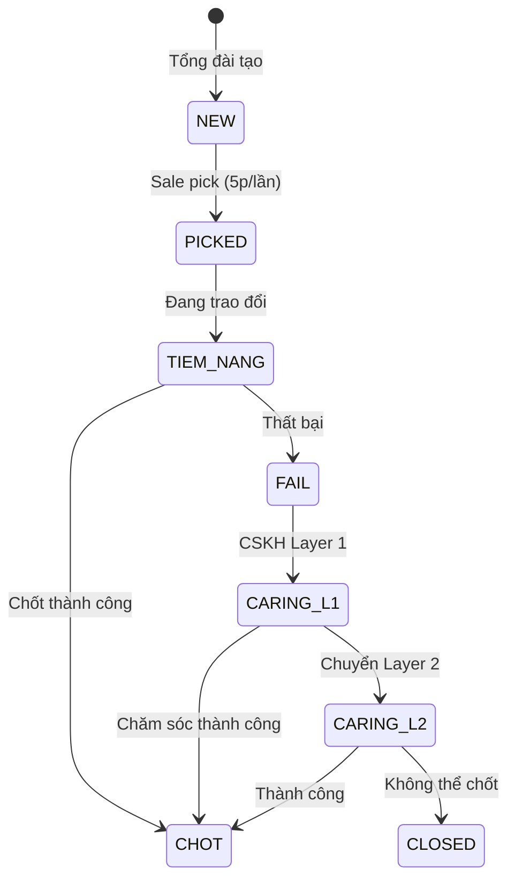
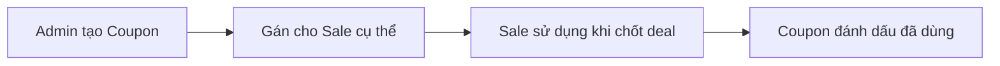

# 📋 LawCRM - Requirements (Confirmed)

> **Phiên bản**: 2.0 (Cập nhật theo yêu cầu mới)  
> **Ngày cập nhật**: 2026-01-19  
> **Trạng thái**: ✅ Partially Confirmed

---

## 1. Tổng Quan Hệ Thống

### 1.1 Mục Tiêu
Xây dựng **hệ thống CRM** để chuyển đổi số từ Google Sheets, hỗ trợ:
- Quản lý **Contacts/Leads** từ Marketing
- Cơ chế cạnh tranh **pick contact** cho Sales
- Chăm sóc lại khách hàng **fail** qua Zalo OA
- **Log** tất cả hoạt động users

### 1.2 Tech Stack (Giữ nguyên)
| Layer | Technology |
|-------|------------|
| Backend | Ruby on Rails 7+ |
| Frontend | HTML, CSS, JS + Hotwire |
| Database | MySQL 8+ |
| Cache/Queue | Redis + Sidekiq |
| Hosting | AWS / VPS |

---

## 2. Roles & Chức Năng (✅ Confirmed)

> [!NOTE]
> **Phân quyền động**: ✅ CẦN - để scale sau này

### 2.1 Roles Mặc Định (4 roles)

### 2.2 Chi Tiết Chức Năng

#### 👑 Super Admin
| Chức năng | Permission |
|-----------|------------|
| Quản lý Users | `users.*` |
| Quản lý Teams | `teams.*` |
| Phân quyền (dynamic roles) | `roles.*`, `permissions.*` |
| Quản lý Sản phẩm/Hợp đồng | `products.*` |
| Quản lý Coupons | `coupons.*` |
| Xem Dashboard/Reports | `reports.*` |
| Xem tất cả Logs | `logs.view_all` |

#### 📞 Tổng Đài
| Chức năng | Permission |
|-----------|------------|
| Tạo Contact mới | `contacts.create` |
| Phân loại nguồn (FB/Google/Khác) | `contacts.create` |
| Xem danh sách Contacts | `contacts.view` |

#### 💼 Sale
| Chức năng | Permission |
|-----------|------------|
| Nhận Web Notification | `notifications.receive` |
| Pick Contact (5 phút/lần) | `contacts.pick` |
| Xử lý Contact | `contacts.edit` |
| Cập nhật Success/Fail | `contacts.update_status` |
| Chọn Sản phẩm/Coupon | `contacts.edit` |

#### 🤝 CSKH
| Chức năng | Permission |
|-----------|------------|
| Xem Contacts Fail | `contacts.view_failed` |
| Gửi tin Zalo OA | `zalo.send` |
| Xem phản hồi khách hàng | `contacts.view_responses` |
| Nhận Noti khi phản hồi tiêu cực | `notifications.receive` |

---

## 2.5 Module: Teams (✅ New)

> [!NOTE]
> Mỗi Sale thuộc về 1 Team. Admin quản lý Teams.

### Teams Table
| Field | Type | Mô tả |
|-------|------|-------|
| id | int | PK |
| name | string | Tên team (vd: Team A, Team B) |
| description | text | Mô tả |
| manager_id | int | FK → User (Trưởng team, optional) |
| created_at | datetime | |

### User-Team Relationship
| Relationship | Mô tả |
|--------------|-------|
| User belongs_to Team | Mỗi user thuộc 1 team |
| Team has_many Users | 1 team có nhiều users |
| Contact has Team | Contact được gán team khi tạo |

---

## 3. Luồng Hoạt Động Chính (✅ Confirmed)

---

## 4. Module: Contacts (✅ Confirmed)

### 4.1 Thông Tin Contact (✅ Updated)

| Field | Type | Required | Ghi chú |
|-------|------|----------|---------|
| id | int | Auto | PK |
| code | string | Auto | Mã liên hệ (tự sinh) |
| customer_name | string | ✅ | Thông tin KH (thường là tên Zalo) |
| phone | string | ✅ | Số điện thoại (Zalo) |
| email | string | | Email liên hệ (optional) |
| need_type | enum | ✅ | Nhu cầu (xem bảng 4.1.1) |
| team_id | int | | FK → Team (Team tư vấn) |
| source | enum | ✅ | Nguồn liên hệ (xem bảng 4.1.2) |
| notes | text | | Ghi chú |
| status | enum | ✅ | Trạng thái |
| assigned_to | int | | FK → Sale (Tư vấn nhận = người pick) |
| created_by | int | ✅ | FK → Tổng đài tạo |
| created_at | datetime | Auto | Ngày giờ tạo |

#### 4.1.1 Loại Nhu Cầu (`need_type`)
| Value | Display |
|-------|---------|
| `tldn_new` | TLDN Mới (Thành lập doanh nghiệp) |
| `info_change` | Thay đổi thông tin |
| `sub_license` | Giấy phép con |
| `accounting` | Kế toán |
| `fdi` | FDI (Đầu tư nước ngoài) |
| `ip` | SHTT (Sở hữu trí tuệ) |
| `other` | Khác |

#### 4.1.2 Nguồn Liên Hệ (`source`)
| Value | Display |
|-------|---------|
| `ladi_zalo` | Ladi Zalo |
| `ladi_hotline` | Ladi Hotline |
| `fb_mess` | Facebook Messenger |
| `fb_hotline` | Facebook Hotline |
| `google` | Google Ads |
| `referral` | Giới thiệu |
| `other` | Khác |

### 4.2 Contact Status Flow (✅ Updated)

> [!IMPORTANT]
> **Quy tắc tạo Contact:**
> - Khi Tổng đài tạo Contact mới → Status **tự động = `new`**
> - Tổng đài **KHÔNG được** chọn status khác khi tạo
> - Status chỉ được thay đổi bởi Sales khi pick hoặc xử lý

| Status | Display | Mô tả |
|--------|---------|-------|
| `new` | Mới | Vừa tạo, chờ Sales pick |
| `picked` | Đã nhận | Sales đã pick |
| `tiem_nang` | Tiềm năng | Đang trao đổi, chưa chốt |
| `chot` | Chốt | ✅ Chốt sale thành công |
| `fail` | Thất bại | Sales không chốt được → chuyển CSKH |
| `caring_l1` | CSKH Layer 1 | CSKH chăm sóc lần 1 |
| `caring_l2` | CSKH Layer 2 | CSKH chăm sóc lần 2 |
| `closed` | Đóng | Không thể chốt, kết thúc |

> [!TIP]
> **Mở rộng**: Có thể thêm nhiều layer CSKH (L3, L4...) để quay vòng liên hệ, hạn chế lãng phí contacts.

### 4.3 Cơ Chế Pick Contact (✅ Confirmed)

| Rule | Giá trị | Ghi chú |
|------|---------|---------|
| Cooldown | **5 phút** | 1 Sale chỉ pick được 1 contact trong 5 phút |
| Giới hạn đang xử lý | **Không giới hạn** | Sale có thể xử lý nhiều contacts cùng lúc |
| Khi pick | **Chuyển status** | Contact từ `new` → `picked`, gán `assigned_to` = Sale |
| Sau pick | **Không ẩn** | Contact vẫn hiển thị nhưng status đã đổi |

### 4.4 Lịch Sử Trao Đổi (Interaction History) ✅ New

> [!NOTE]
> Mỗi lần Sale/CSKH trao đổi với khách, cần ghi lại log.

| Field | Type | Mô tả |
|-------|------|-------|
| id | int | PK |
| contact_id | int | FK → Contact |
| user_id | int | FK → User (người trao đổi) |
| content | text | Nội dung trao đổi |
| interaction_type | enum | `call`, `zalo`, `email`, `meeting`, `other` |
| created_at | datetime | Ngày giờ trao đổi |

### 4.5 Thông Tin Khi Chốt (Deal Info) ✅ New

> [!NOTE]
> Khi Contact chuyển sang trạng thái `chot`, cần nhập thêm thông tin deal.

| Field | Type | Mô tả |
|-------|------|-------|
| id | int | PK |
| contact_id | int | FK → Contact |
| service_price | decimal | Giá dịch vụ |
| payment_status | enum | Tình trạng thanh toán (xem bảng) |
| primary_product_id | int | FK → Product (SP chính) |
| additional_products | json | Các SP thứ 2, thứ 3... |
| closed_by | int | FK → User (người chốt) |
| closed_at | datetime | Ngày chốt |
| notes | text | Ghi chú |

#### Payment Status (`payment_status`)
| Value | Display |
|-------|---------|
| `pending` | Chưa thanh toán |
| `partial` | Thanh toán một phần |
| `paid` | Đã thanh toán đủ |
| `refunded` | Hoàn tiền |

---

## 5. Module: Notifications (✅ Confirmed)

> [!NOTE]
> **Notification Rules**: ✅ CẦN thiết kế phức tạp, có filter conditions

### 5.1 Channels
| Channel | Phase | Required |
|---------|-------|----------|
| Web Push | 1 | ✅ |
| Email | 1 | ✅ |
| Slack | 1 | Optional |
| Zalo OA | 1 | ✅ (CSKH) |

### 5.2 Default Rules

| Rule | Trigger | Recipients | Channels |
|------|---------|------------|----------|
| Contact mới | `contact.created` | All Sales | Web Push |
| Phản hồi tiêu cực | `response.negative` | Assigned CSKH | Web Push, Email |

### 5.3 Notification Settings (khi tạo Contact) ✅ New

> [!NOTE]
> Khi Tổng đài tạo Contact, có thể tùy chỉnh notification:

| Option | Mô tả |
|--------|-------|
| Gửi đến Team | Chọn 1 hoặc nhiều Team nhận thông báo |
| Gửi đến Nhân viên | Chọn cụ thể nhân viên nhận (override Team) |
| Kênh thông báo | Web Push, Zalo OA, Email (checkbox) |
| Bật/Tắt | Toggle cho phép tắt notification |

---

## 6. Module: AI Sentiment Analysis (✅ Confirmed)

> [!TIP]
> **Confirmed**: Sử dụng **OpenAI GPT** cho sentiment analysis

### 6.1 Yêu Cầu
| Yêu cầu | Mô tả |
|---------|-------|
| Input | Nội dung phản hồi từ khách hàng (text) |
| Output | `positive` / `negative` |
| Action | Nếu `negative` → trigger notification cho CSKH |
| Provider | **OpenAI GPT** ✅ |

### 6.2 Implementation
| Config | Value |
|--------|-------|
| Provider | OpenAI GPT-4o-mini |
| Fallback | Simple keyword matching |
| Rate Limit | 100 requests/minute |

---

## 7. Module: Products & Coupons

### 7.1 Products (Dịch vụ/Hợp đồng) ✅ Updated

| Field | Type | Mô tả |
|-------|------|-------|
| id | int | PK |
| code | string | Mã dịch vụ |
| name | string | Tên dịch vụ |
| category | enum | Loại dịch vụ (xem bảng) |
| description | text | Mô tả |
| base_price | decimal | Giá cơ bản |
| is_active | boolean | Đang kinh doanh |
| created_at | datetime | |

#### Product Categories (`category`)
| Value | Display |
|-------|---------|
| `tldn` | Thành lập doanh nghiệp |
| `info_change` | Thay đổi thông tin |
| `sub_license` | Giấy phép con |
| `accounting` | Kế toán |
| `fdi` | FDI (Đầu tư nước ngoài) |
| `ip` | SHTT (Sở hữu trí tuệ) |
| `other` | Khác |

> [!NOTE]
> Danh sách category khớp với `need_type` của Contact. Khi chốt deal, chọn Product tương ứng với nhu cầu.

### 7.2 Coupons (✅ Confirmed)

| Field | Type | Mô tả |
|-------|------|-------|
| id | int | PK |
| code | string | Mã coupon |
| description | text | Mô tả |
| discount_type | enum | `percent`, `fixed` |
| discount_value | decimal | Giá trị |
| expiry_date | date | Hạn sử dụng |
| is_active | boolean | Còn hiệu lực |
| created_by | int | Admin tạo |

> [!IMPORTANT]
> **Confirmed**: Coupon được tạo bởi Admin và **gửi cho nhân viên cụ thể** (không pool chung).

### 7.3 Coupon Assignment Flow

---

## 8. Module: History Logs ✅ New

### 8.1 Status History (Lịch sử chuyển trạng thái)

> [!NOTE]
> Log mọi thay đổi status của Contact.

| Field | Type | Mô tả |
|-------|------|-------|
| id | int | PK |
| contact_id | int | FK → Contact |
| old_status | enum | Trạng thái cũ |
| new_status | enum | Trạng thái mới |
| changed_by | int | FK → User |
| reason | text | Lý do chuyển (optional) |
| created_at | datetime | Thời điểm chuyển |

### 8.2 Payment History (Lịch sử thanh toán)

> [!NOTE]
> Log mọi thay đổi trạng thái thanh toán.

| Field | Type | Mô tả |
|-------|------|-------|
| id | int | PK |
| deal_id | int | FK → Deal |
| old_status | enum | Trạng thái cũ |
| new_status | enum | Trạng thái mới |
| amount | decimal | Số tiền thay đổi |
| changed_by | int | FK → User |
| notes | text | Ghi chú |
| created_at | datetime | Thời điểm |

---

## 9. Module: Zalo OA Integration

> [!NOTE]
> **API Credentials**: ✅ Đã có

### 9.1 Câu Hỏi Chờ Trả Lời
| # | Câu hỏi | Trả lời |
|---|---------|---------|
| 1 | Tần suất gửi tin nhắn định kỳ? | ⏳ _Chờ khách hàng_ |
| 2 | Có bao nhiêu ZNS templates? | ⏳ _Chờ khách hàng_ |
| 3 | Nội dung tin nhắn mẫu? | ⏳ _Chờ khách hàng_ |
| 4 | Thông tin API credentials? | ✅ Đã có |

---

## 10. Module: Activity Logs (✅ Confirmed)

Cần log **tất cả** actions của users:

| Event | Data logged |
|-------|-------------|
| User login/logout | user_id, timestamp, IP |
| Contact created | contact_id, created_by |
| Contact picked | contact_id, picked_by, timestamp |
| Status changed | contact_id, old_status, new_status, changed_by |
| Zalo message sent | contact_id, sent_by, template |
| Permission changed | user_id, changed_by, old_value, new_value |

---

## 📋 Summary: Câu Hỏi Đã Trả Lời

| # | Câu hỏi | ✅ Trả lời |
|---|---------|-----------|
| 1 | Phân quyền động? | ✅ CẦN - để scale |
| 2 | Notification Rules? | ✅ CẦN phức tạp |
| 3 | 5 phút/1 contact? | ✅ Đúng |
| 4 | Giới hạn contact đang xử lý? | ❌ Không |
| 5 | Contact ẩn sau pick? | ❌ Chỉ chuyển status |
| 6 | AI Phase 1? | ✅ Có, dùng **OpenAI** |
| 7 | Fields Contact? | ✅ Tên, SĐT, Email, Zalo, Nguồn, Ghi chú |
| 8 | Coupon? | ✅ Tạo & gửi **nhân viên cụ thể** |
| 9 | Session Timeout? | ✅ **3 ngày** |
| 10 | Export Reports? | ✅ **PDF** trước |
| 11 | Team Assignment? | ✅ **Option D**: Tự động gán team của Sales khi pick |

---

## 📋 TODO: Câu Hỏi Chờ Trả Lời

| # | Module | Câu hỏi | Status |
|---|--------|---------|--------|
| 1 | Products | Xác nhận danh sách dịch vụ chi tiết | ⏳ Chờ khách ||
| 2 | Multi-layer CSKH | Cần bao nhiêu layer? Cơ chế chuyển? | ⏳ Chờ xác nhận |
| 3 | Zalo OA | Tần suất gửi tin nhắn định kỳ? | ⏳ Chờ |
| 4 | Zalo OA | Có bao nhiêu ZNS templates? | ⏳ Chờ |
| 5 | Zalo OA | Nội dung tin nhắn mẫu? | ⏳ Chờ |

---

> **Tiếp theo**: Khi có câu trả lời cho các TODO, tôi sẽ cập nhật và chuyển sang giai đoạn viết requirements chính thức cho từng module.
