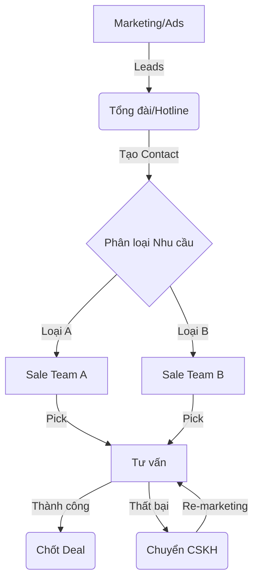
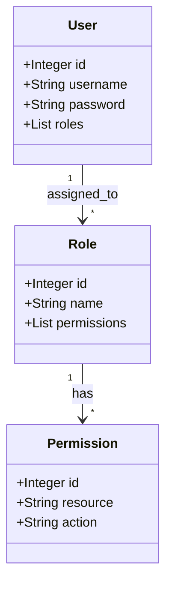
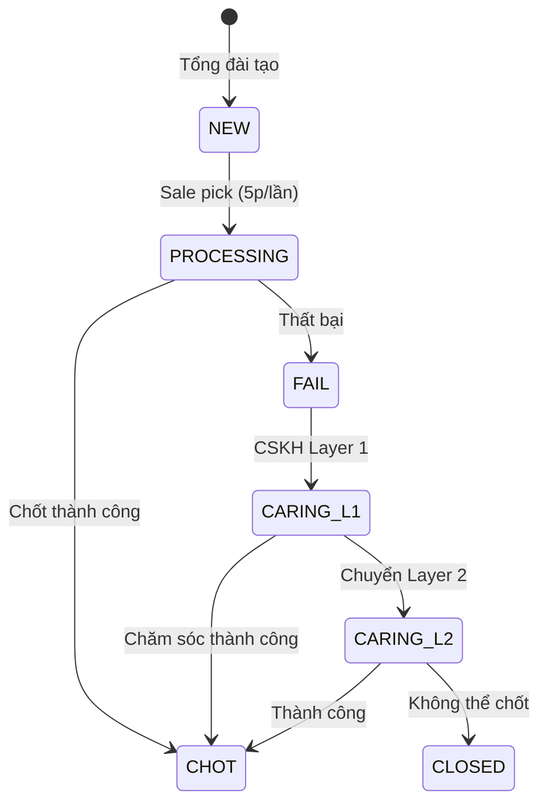
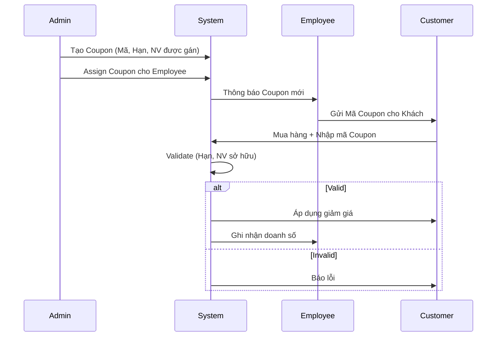

# TÀI LIỆU ĐẶC TẢ YÊU CẦU PHẦN MỀM
## Hệ thống Quản lý Khách hàng - AnKhangCRM

---

| Thông tin | Chi tiết |
| :--- | :--- |
| **Tên dự án** | AnKhangCRM - Hệ thống Quản lý Khách hàng |
| **Khách hàng** | Luật An Khang |
| **Phiên bản** | 1.2 |
| **Ngày lập** | 24/01/2026 |
| **Người lập** | Hybro Technology |
| **Trạng thái** | Đã xác nhận (Design V3) |

---

## MỤC LỤC

1. [Giới thiệu](#1-giới-thiệu)
2. [Mô tả tổng quan](#2-mô-tả-tổng-quan)
3. [Đối tượng sử dụng](#3-đối-tượng-sử-dụng)
4. [Yêu cầu chức năng](#4-yêu-cầu-chức-năng)
5. [Yêu cầu phi chức năng](#5-yêu-cầu-phi-chức-năng)
6. [Phạm vi dự án](#6-phạm-vi-dự-án)
7. [Các vấn đề cần xác nhận](#7-các-vấn-đề-cần-xác-nhận)
8. [Phụ lục](#8-phụ-lục)

---

## 1. GIỚI THIỆU

### 1.1 Mục đích tài liệu

Tài liệu này mô tả chi tiết các yêu cầu chức năng và phi chức năng của Hệ thống Quản lý Khách hàng AnKhangCRM. Mục đích là để khách hàng xem xét và xác nhận trước khi tiến hành phát triển.

### 1.2 Phạm vi hệ thống

**AnKhangCRM** là hệ thống quản lý khách hàng (CRM) được thiết kế riêng cho doanh nghiệp cung cấp dịch vụ pháp lý, nhằm chuyển đổi số quy trình làm việc từ Google Sheets sang nền tảng phần mềm chuyên nghiệp.

### 1.3 Vấn đề cần giải quyết

| # | Vấn đề hiện tại | Giải pháp đề xuất |
| :--- | :--- | :--- |
| 1 | Dữ liệu phân tán trên nhiều Google Sheets | Tập trung trên 1 hệ thống duy nhất |
| 2 | Khó theo dõi và tìm kiếm thông tin liên hệ | Tìm kiếm nâng cao, filter đa tiêu chí |
| 3 | Không có thông báo tự động khi có lead mới | Hệ thống thông báo đa kênh |
| 4 | Không có lịch sử hoạt động | Audit trail đầy đủ |
| 5 | Phân quyền thủ công | Phân quyền động theo vai trò |
| 6 | Không có cơ chế cạnh tranh cho Sales | Cơ chế pick contact công bằng |

### 1.4 Thuật ngữ và Viết tắt

| Thuật ngữ | Định nghĩa |
| :--- | :--- |
| **CRM** | Customer Relationship Management - Quản lý quan hệ khách hàng |
| **Lead** | Khách hàng tiềm năng, chưa phát sinh giao dịch |
| **Contact** | Thông tin liên hệ của khách hàng trong hệ thống |
| **Deal** | Cơ hội bán hàng/Giao dịch cụ thể gắn với một Contact |
| **Pick** | Hành động Sale chủ động nhận Contact về xử lý |
| **ZNS** | Zalo Notification Service - Dịch vụ gửi tin nhắn thông báo qua Zalo |
| **Zalo OA** | Zalo Official Account - Tài khoản doanh nghiệp trên Zalo |
| **Audit Trail** | Nhật ký ghi nhận toàn bộ lịch sử thay đổi dữ liệu |
| **MVP** | Minimum Viable Product - Sản phẩm khả dụng tối thiểu |
| **Role** | Vai trò người dùng, xác định tập hợp các quyền hạn |
| **Permission** | Quyền hạn cụ thể để thực hiện một hành động (VD: xem, sửa, xóa) |

### 1.5 Giả định và Phụ thuộc

1.  **Phụ thuộc bên thứ 3 (Zalo):**
    *   Hệ thống phụ thuộc vào tính ổn định và chính sách API của Zalo OA.
    *   Giả định rằng Zalo API duy trì backward compatibility cho các tính năng gửi tin nhắn.
2.  **Hạ tầng:**
    *   Hệ thống được vận hành trên hạ tầng đảm bảo uptime 99.9%.
    *   Kết nối Internet tại phía người dùng cuối (End-user) ổn định.
3.  **Quy trình nghiệp vụ:**
    *   Quy trình phân chia contact (Pick) được chấp thuận bởi ban giám đốc và Sale team trước khi triển khai.

---

## 2. MÔ TẢ TỔNG QUAN

### 2.1 Mục tiêu dự án

| # | Mục tiêu | Tiêu chí đo lường |
| :--- | :--- | :--- |
| 1 | Chuyển đổi số hoàn toàn | 100% dữ liệu được quản lý trên hệ thống mới |
| 2 | Thông báo real-time | Thời gian thông báo < 5 giây cho 100-200 users |
| 3 | Dễ sử dụng | Thời gian đào tạo < 1 ngày |
| 4 | Bảo mật | 100% hành động được ghi log |
| 5 | Tăng hiệu suất Sales | Cơ chế pick contact công bằng, minh bạch |

### 2.2 Luồng nghiệp vụ chính

---

## 3. ĐỐI TƯỢNG SỬ DỤNG

### 3.1 Vai trò và số lượng dự kiến

| Vai trò | Mô tả công việc | Số lượng |
| :--- | :--- | :--- |
| **Super Admin** | Quản trị toàn bộ hệ thống, phân quyền, cấu hình | 2-3 người |
| **Tổng Đài** | Nhận cuộc gọi, tạo thông tin khách hàng mới | 5-10 người |
| **Sale** | Nhận phân bổ, tư vấn, chốt hợp đồng | 50-80 người |
| **CSKH** | Chăm sóc lại khách hàng chưa chốt | 5-10 người |
| **Tổng cộng** | | ~100 người |

### 3.2 Bảng quyền hạn chi tiết

| Quyền | Super Admin | Tổng Đài | Sale | CSKH |
| :--- | :---: | :---: | :---: | :---: |
| Quản lý người dùng | &#9989; | &#10060; | &#10060; | &#10060; |
| Quản lý đội nhóm | &#9989; | &#10060; | &#10060; | &#10060; |
| Phân quyền động | &#9989; | &#10060; | &#10060; | &#10060; |
| Quản lý sản phẩm | &#9989; | &#10060; | &#10060; | &#10060; |
| Quản lý khuyến mãi | &#9989; | &#10060; | &#10060; | &#10060; |
| Xem Dashboard/Báo cáo | &#9989; | &#10060; | &#10060; | &#10060; |
| Xem tất cả logs | &#9989; | &#10060; | &#10060; | &#10060; |
| Tạo khách hàng mới | &#9989; | &#9989; | &#10060; | &#10060; |
| Phân loại nguồn liên hệ | &#9989; | &#9989; | &#10060; | &#10060; |
| Xem danh sách khách hàng | &#9989; | &#9989; | &#9989; | &#9989; |
| Pick khách hàng | &#10060; | &#10060; | &#9989; | &#10060; |
| Cập nhật trạng thái KH | &#9989; | &#10060; | &#9989; | &#9989; |
| Chọn SP/Coupon khi chốt | &#9989; | &#10060; | &#9989; | &#10060; |
| Xem KH thất bại | &#9989; | &#10060; | &#10060; | &#9989; |
| Gửi tin Zalo OA | &#10060; | &#10060; | &#10060; | &#9989; |
| Nhận thông báo | &#9989; | &#9989; | &#9989; | &#9989; |

---

## 4. YÊU CẦU CHỨC NĂNG

### 4.1 Module: Xác thực (Authentication)

| ID | Yêu cầu | Ưu tiên | Mô tả |
| :--- | :--- | :--- | :--- |
| AUTH-001 | Đăng nhập | Cao | Bằng username/password |
| AUTH-002 | Remember me | Cao | Session kéo dài 30 ngày |
| AUTH-003 | Quên mật khẩu | Cao | Gửi link reset qua email (hết hạn sau 1 giờ) |
| AUTH-004 | Đổi mật khẩu | Cao | Trong settings cá nhân |
| AUTH-005 | Đăng xuất | Cao | Xóa session |
| AUTH-006 | Session timeout | Trung | Tự động logout sau **3 ngày** không hoạt động |
| AUTH-007 | 2FA (Phase 2) | Trung | Xác thực 2 lớp |

**Yêu cầu bảo mật:**
- Password hash: bcrypt (cost 12)
- Độ dài password tối thiểu: 8 ký tự
- Chống brute force: Rate limiting (5 lần/phút)

---

### 4.2 Module: Phân quyền động (Dynamic Permissions)

**Mô hình:**

| ID | Yêu cầu | Ưu tiên | Mô tả |
| :--- | :--- | :--- | :--- |
| PERM-001 | Tạo/sửa/xóa Roles | Cao | Admin tùy chỉnh roles |
| PERM-002 | Mỗi Role có tập Permissions | Cao | Checkbox chọn permissions |
| PERM-003 | Gán nhiều Roles cho User | Cao | 1 user có thể có nhiều roles |
| PERM-004 | Override permission cho User | Cao | Grant/Deny cụ thể cho 1 user |
| PERM-005 | UI quản lý trực quan | Cao | Ma trận permissions |
| PERM-006 | Bảo vệ system roles | Cao | Không cho xóa role Admin |
| PERM-007 | Clone role | Trung | Tạo role mới từ role có sẵn |

**4 Roles mặc định:**

| Role | Permissions |
| :--- | :--- |
| Super Admin | Tất cả |
| Tổng Đài | contacts.create, contacts.view, notifications.receive |
| Sale | contacts.view/pick/edit/update_status, deals.*, notifications.receive, dashboard.view_sales |
| CSKH | contacts.view_failed/edit/update_status, zalo.send, notifications.receive, contacts.request_reassign (Phase 2) |

---

### 4.3 Module: Khách hàng (Contacts)

#### 4.3.1 Thông tin khách hàng

| Trường | Bắt buộc | Mô tả |
| :--- | :--- | :--- |
| Mã liên hệ | Tự động | Hệ thống tự sinh (VD: KH2026-001) |
| Tên khách hàng | &#9989; | Thường là tên Zalo |
| Số điện thoại | &#9989; | Số Zalo/điện thoại (Check trùng lặp ngay khi nhập) |
| Zalo Link | | Link profile Zalo (nếu có) |
| Zalo QR | | Ảnh QR Code (Upload/Paste) |
| Email | | Email liên hệ |
| Loại nhu cầu | &#9989; | Xem bảng bên dưới |
| Nguồn liên hệ | &#9989; | Xem bảng bên dưới |
| Team tư vấn | | Team được gán |
| Ghi chú | | Thông tin bổ sung |
| Trạng thái | Tự động | Mới khi tạo |
| Người tư vấn | | Sale đã pick |
| Người tạo | Tự động | Tổng đài tạo |

#### 4.3.2 Loại nhu cầu (Quản lý động)

**Yêu cầu:** Admin có thể cấu hình danh sách "Loại nhu cầu" (Service Types) thay vì cố định trong code.

| Trường | Mô tả |
| :--- | :--- |
| Mã (Code) | Mã định danh (VD: TLDN, KTDN...) |
| Tên hiển thị | Tên loại nhu cầu (VD: Thành lập doanh nghiệp) |
| Mô tả | Ghi chú chi tiết |
| Trạng thái | Kích hoạt / Ẩn |
| Thứ tự | Thứ tự hiển thị trên dropdown |

#### 4.3.3 Nguồn liên hệ

| Mã | Hiển thị |
| :--- | :--- |
| ladi_zalo | Ladi Zalo |
| ladi_hotline | Ladi Hotline |
| fb_mess | Facebook Messenger |
| fb_hotline | Facebook Hotline |
| google | Google Ads |
| referral | Giới thiệu |
| other | Khác |

#### 4.3.4 Luồng trạng thái

> **Cập nhật v1.1:** Gộp trạng thái "Đã nhận" và "Tiềm năng" thành **"Đang tư vấn"** để tối ưu thao tác Sales. Người dùng chỉ cần Pick -> hệ thống tự chuyển sang "Đang tư vấn".

| Trạng thái | Mô tả | Người thay đổi |
| :--- | :--- | :--- |
| Mới | Vừa tạo, chưa ai nhận | Tự động |
| Tiềm năng | Khách hàng quan tâm nhưng chưa chốt ngay (Pending) | Sale |
| Đang tư vấn | Sale đã pick và đang chăm sóc (Active) | Hệ thống (sau khi Pick) |
| Chốt Mới | Ký hợp đồng thành công trong tháng hiện tại | Sale |
| Chốt Cũ | Ký hợp đồng thành công (từ khách tồn tháng trước) | Sale |
| Thất bại | Không chốt được, chuyển qua CSKH | Sale |
| CSKH L1 | Chăm sóc lần 1 (Sau khi Fail) | Hệ thống/CSKH |
| CSKH L2 | Chăm sóc lần 2 | CSKH |
| Tiềm năng cũ | Khách tiềm năng chuyển sang từ tháng trước | Hệ thống (Cronjob) |
| Đóng | Kết thúc, không còn tiềm năng | CSKH |

#### 4.3.5 Cơ chế Smart Routing (Phân bổ thông minh) - NEW v1.2

Cơ chế "Pick" truyền thống được thay thế bằng **Smart Routing Engine** để đảm bảo công bằng và tốc độ xử lý.

**Luồng phân bổ (Routing Logic):**

1.  **Trong giờ hành chính (T2-T6: 8h00-17h30, T7: 8h00-11h30):**
    *   **Bước 1:** Hệ thống tìm các Sale đang online thuộc Team phù hợp (dựa trên Loại nhu cầu).
    *   **Bước 2:** Chọn ngẫu nhiên (Random/Round-Robin) 1 Sale để "mời" (Offer).
    *   **Bước 3:** Hiển thị thông báo (Popup/Sound) cho Sale đó.
    *   **Bước 4:** Sale có **2 phút** để bấm "Nhận".
        *   *Nếu Nhận:* Contact chuyển trạng thái "Đang tư vấn", gán cho Sale.
        *   *Nếu Từ chối hoặc Hết giờ:* Hệ thống đánh dấu "Missed", chọn tiếp Sale ngẫu nhiên khác trong danh sách.
    *   **Lưu ý:** Ngày thứ 7 chỉ phân bổ cho danh sách nhân viên đăng ký đi làm ("Saturday Roster").

2.  **Ngoài giờ hành chính:**
    *   Hoạt động theo cơ chế **Pool Pick** (Ai bấm trước được trước) cho tất cả nhân viên trong Team.

**Quy tắc bổ sung:**
*   **Websocket Priority:** Thông báo Web Push xuất hiện ngay lập tức (Real-time).
*   **Re-assign:** Admin có quyền chuyển contact đang giữ bởi Sale A sang Sale B (hoặc trả về Pool).
*   **CSKH Request:** (Phase 2) CSKH có quyền yêu cầu lấy lại khách nếu Sale chăm sóc kém (Cần Leader duyệt).

#### 4.3.6 Lịch sử trao đổi (Interaction History)

Mỗi lần Sale/CSKH trao đổi với khách cần ghi log:
- Nội dung trao đổi
- Loại: Gọi điện / Zalo / Email / Gặp mặt / Khác
- **Lịch hẹn tiếp theo:** (Datetime, optional) -> Hiển thị trên Dashboard Dashboard.
- Thời điểm
- Người trao đổi

---

### 4.4 Module: Cơ hội bán hàng (Deals)

Khi khách hàng chuyển sang "Chốt", tạo Deal:

| Trường | Bắt buộc | Mô tả |
| :--- | :--- | :--- |
| Khách hàng | &#9989; | Liên kết Contact |
| Tổng giá trị | Tự động | Tổng từ các SP |
| Trạng thái thanh toán | &#9989; | Xem bảng bên dưới |
| Người chốt | Tự động | Sale đang xử lý |
| Ngày chốt | &#9989; | Ngày ký HĐ |
| Ghi chú | | Thông tin bổ sung |

**Sản phẩm trong Deal:**
- 1 Deal có thể có **nhiều sản phẩm**
- Mỗi SP có: Số lượng, Đơn giá, Thời điểm chốt

**Trạng thái thanh toán:**

| Mã | Hiển thị |
| :--- | :--- |
| pending | Chưa thanh toán |
| partial | Thanh toán một phần |
| paid | Đã thanh toán đủ |
| refunded | Hoàn tiền |

---

### 4.5 Module: Sản phẩm/Dịch vụ (Products)

| Trường | Mô tả |
| :--- | :--- |
| Mã sản phẩm | VD: TLDN-7, DVK-25 |
| Tên sản phẩm | Tên dịch vụ |
| Mô tả | Chi tiết dịch vụ |
| Giá cơ bản | Giá niêm yết |
| Loại quy trình | Workflow triển khai (Phase 2) |
| Trạng thái | Đang kinh doanh / Ngừng |

**Ví dụ sản phẩm:**

| Mã | Tên | Loại |
| :--- | :--- | :--- |
| TLDN-7 | TLDN Gói Nâng Cao | Thành lập DN |
| TLDN-5 | Gói VIP 2026 | Thành lập DN |
| DVK-25 | Dịch vụ khác | Khác |
| KTDN | Kế toán lẻ | Kế toán |

---

### 4.6 Module: Khuyến mãi (Coupons)

| Trường | Mô tả |
| :--- | :--- |
| Mã coupon | VD: SALE2026 |
| Mô tả | Nội dung khuyến mãi |
| Loại giảm giá | Phần trăm (%) / Số tiền cố định |
| Giá trị | Mức giảm |
| Hạn sử dụng | Ngày hết hạn |
| Gán cho nhân viên | &#9989; Bắt buộc |

> **Lưu ý quan trọng**: Coupon được Admin tạo và **gán cho nhân viên cụ thể**, không phải pool chung.

**Luồng sử dụng:**

---

### 4.7 Module: Đội nhóm (Teams)

| Trường | Mô tả |
| :--- | :--- |
| Tên team | VD: Team Hà Nội, Team HCM |
| Mô tả | Mô tả / Địa điểm |
| Trưởng team | Manager (tùy chọn) |
| Khu vực | Vùng hoạt động |

**Cấu trúc Team (v1.2):**
- Quan hệ **Many-to-Many**: 1 Nhân viên có thể thuộc nhiều Team.
- Quan hệ Leader: Mỗi nhân viên có 1 Leader cụ thể *trong phạm vi* 1 Team.
- **Saturday Roster**: Admin/Manager tạo danh sách nhân viên đi làm thứ 7 theo từng tuần để hệ thống Routing phân bổ đúng.

---

### 4.8 Module: Nhân viên (Employees)

| Trường | Bắt buộc | Mô tả |
| :--- | :--- | :--- |
| Username | &#9989; | Dùng để đăng nhập |
| Họ và tên | &#9989; | Tên hiển thị |
| Email | &#9989; | Email công việc |
| Số điện thoại | | SĐT liên hệ |
| Team | | Đội nhóm thuộc về |
| Chức vụ | | Vị trí công việc |
| Roles | &#9989; | Vai trò phân quyền |
| Trạng thái | &#9989; | Hoạt động / Khóa |

**Quy tắc nghiệp vụ:**
- Không tự vô hiệu hóa chính mình
- Phải có ít nhất 1 Admin
- Username không thể đổi sau khi tạo
- Password tối thiểu 8 ký tự, có cả số và chữ

---

### 4.9 Module: Thông báo (Notifications)

#### 4.9.1 Kênh thông báo

| Kênh | Phase | Bắt buộc | Ghi chú |
| :--- | :--- | :--- | :--- |
| Web Push | 1 | &#9989; | Browser notification |
| Email | 1 | &#9989; | Qua SMTP/SendGrid |
| Zalo OA | 1 | &#9989; | Cho CSKH, cần ZNS template |
| Slack | 1 | Tùy chọn | Webhook |
| Facebook | 1 | Tùy chọn | Page subscription |
| In-app (WebSocket) | 2 | | Real-time |

#### 4.9.2 Quy tắc thông báo (Notification Rules)

Admin tạo rules với cấu trúc:
- **Trigger Event**: Khi nào gửi
- **Conditions**: Ai nhận (filter theo role, team...)
- **Channels**: Gửi qua kênh nào
- **Template**: Nội dung tin nhắn

**Sự kiện trigger:**

| Event | Mô tả |
| :--- | :--- |
| contact.created | Tổng đài tạo contact mới |
| contact.picked | Sale pick contact |
| contact.status_changed | Đổi trạng thái |
| deal.created | Chốt deal |
| response.negative | Khách phản hồi tiêu cực (AI detect) |

#### 4.9.3 Yêu cầu hiệu năng

- 100-200 users nhận cùng lúc trong **< 5 giây**
- Không duplicate
- Retry nếu thất bại

---

### 4.10 Module: Nhật ký hoạt động (Activity Logs)

Ghi log **tất cả** hành động trong hệ thống:

| Nhóm | Hành động |
| :--- | :--- |
| **Authentication** | Đăng nhập, đăng nhập thất bại, đăng xuất, đổi password |
| **Contacts** | Tạo, pick, cập nhật, đổi trạng thái, thêm lịch sử trao đổi |
| **Deals** | Tạo, cập nhật, đổi trạng thái thanh toán |
| **Teams** | Tạo, sửa, xóa, thêm/xóa thành viên |
| **Employees** | Tạo, sửa, kích hoạt, vô hiệu hóa, đổi roles |
| **Roles** | Tạo, sửa, xóa, đổi permissions |
| **Notifications** | Tạo rule, sửa rule, bật/tắt rule, gửi notification |
| **Zalo** | Gửi tin nhắn |

**Thông tin mỗi log entry:**
- Thời gian
- Người thực hiện
- Hành động
- Đối tượng bị ảnh hưởng
- Dữ liệu trước/sau thay đổi
- IP address
- Browser/Device

---

### 4.11 Module: Báo cáo (Reports & Dashboard)

#### 4.11.1 KPI Cards

| Chỉ số | Mô tả |
| :--- | :--- |
| Tổng Contacts | Tổng số khách hàng |
| Contacts mới (Tuần) | Khách tạo trong 7 ngày gần |
| Chốt thành công | Số deal đã chốt |
| Tỷ lệ chốt | % chốt / tổng |
| Doanh thu | Tổng giá trị deals |

#### 4.11.2 Biểu đồ

| Biểu đồ | Loại | Dữ liệu |
| :--- | :--- | :--- |
| Phân bổ trạng thái | Pie/Donut | Contacts theo status |
| Trend khách mới | Line | Theo ngày/tuần/tháng |
| So sánh Sales | Bar | Contacts picked theo Sale |
| Doanh thu theo Team | Bar | Revenue theo team |

#### 4.11.3 Bảng dữ liệu

| Bảng | Nội dung |
| :--- | :--- |
| Top Performers | Tên, số KH, số deal, doanh thu |
| Recent Activities | Feed hoạt động gần đây |
| Contacts Fail | KH đang được CSKH chăm sóc |

#### 4.11.4 Filter

- Theo period: Hôm nay / Tuần / Tháng / Quý / Năm
- Theo date range tùy chọn
- Theo team

---

---

### 4.12 Module: Giao diện bên ngoài (External Interfaces)

Quy định về các điểm giao tiếp giữa AnKhangCRM và thế giới bên ngoài.

#### 4.12.1 Giao diện người dùng (User Interfaces)
*   **Design System:** Sử dụng Bootstrap 5 hoặc Tailwind CSS.
*   **Responsive:** Tương thích tốt trên Desktop (1366x768 trở lên) và Mobile Web (375x667 trở lên).
*   **Style:** Màu sắc chủ đạo theo Brand Identity của khách hàng (Blue/White/Gold). Font chữ: Inter hoăc Roboto.

#### 4.12.2 Giao diện phần cứng (Hardware Interfaces)
*   Không có yêu cầu phần cứng đặc biệt.
*   Chạy trên các trình duyệt phổ biến: Chrome 90+, Firefox 88+, Safari 14+, Edge.

#### 4.12.3 Giao diện phần mềm (Software Interfaces)
*   **Database:** MySQL Server 8.0 (qua dây kết nối TCP/IP, cổng mặc định 3306).
*   **Cache:** Solid Cache (Lưu trữ trong MySQL).
*   **OS:** Ubuntu LTS 20.04/22.04 hoặc CentOS 8.

#### 4.12.4 Các giao diện truyền thông (Communication Interfaces)
*   **Zalo OA API:**
    *   Protocol: HTTPS
    *   Format: JSON
    *   Auth: OAuth 2.0 (Access Token + Refresh Token)
    *   Mục đích: Gửi ZNS, nhận tin nhắn từ người dùng.
*   **Email Service (SMTP/SendGrid):**
    *   Protocol: SMTP / API HTTPS
    *   Mục đích: Gửi email reset password, thông báo hệ thống.
*   **Internal API (nếu có Mobile App sau này):**
    *   Style: RESTful API
    *   Security: Bearer Token (JWT)

---

### 4.13 Module: Vòng đời dữ liệu (Data Lifecycle Management)

Quy định về cách dữ liệu được tạo ra, lưu trữ, và tiêu hủy nhằm đảm bảo tuân thủ quy định pháp lý.

| Loại dữ liệu | Thời gian lưu trữ (Retention Period) | Hành động khi hết hạn |
| :--- | :--- | :--- |
| System Logs (Access/Error) | 12 tháng | Archive sang Cold Storage (S3 Glacier) |
| Audit Trail (Activity Logs) | 05 năm | Archive |
| Inactive Contacts (Failed/Closed) | 02 năm | Anonymize (Xóa định danh) để report |
| Deals thành công | 10 năm | Giữ nguyên (theo luật Kế toán) |
| Uploaded Files (CMND/Hợp đồng) | 05 năm | Xóa vĩnh viễn (Secure Delete) |

---

## 5. Yêu cầu phi chức năng

### 5.1 Hiệu năng

| Yêu cầu | Tiêu chí |
| :--- | :--- |
| Thời gian phản hồi | < 2 giây cho thao tác thông thường |
| Thời gian thông báo | < 5 giây từ khi sự kiện xảy ra |
| Số người dùng đồng thời | 100-200 users |
| Tìm kiếm logs | < 1 giây |

### 5.2 Bảo mật & Riêng tư (Security & Privacy)

#### 5.2.1 Bảo mật dữ liệu (Data Security)

| Yêu cầu | Mô tả kỹ thuật |
| :--- | :--- |
| **Encryption at Rest** | Dữ liệu nhạy cảm (PII, Password, Phone) trong DB phải được mã hóa chuẩn **AES-256**. |
| **Encryption in Transit** | 100% kết nối qua **TLS 1.3** (HTTPS). Không chấp nhận HTTP thường. |
| **Database Security** | Không public port DB ra internet. Chỉ truy cập qua VPN hoặc Bastion Host. |

#### 5.2.2 Quyền riêng tư (Privacy & GDPR compliance)

| Yêu cầu | Mô tả |
| :--- | :--- |
| **Right to be Forgotten** | Khách hàng có quyền yêu cầu xóa/ẩn thông tin. Hệ thống có chức năng "Anonymize Contact" (Thay tên bằng ID, xóa SĐT). |
| **Data Access Control** | Nhân viên chỉ xem được Contact do mình phụ trách (Row-level Security). |

### 5.3 Độ tin cậy & Khôi phục thảm họa (Reliability & DR)

#### 5.3.1 Tính sẵn sàng (Availability)
- **Uptime SLA:** 99.9% (Tối đa 8.7 giờ downtime/năm).
- **Graceful Degradation:** Nếu module Zalo lỗi, hệ thống vẫn cho phép tạo Contact và gửi Email bình thường.

#### 5.3.2 Chính sách Backup & Recovery

| Chỉ số | Giá trị | Giải thích |
| :--- | :--- | :--- |
| **RPO (Recovery Point Objective)** | **< 15 phút** | Chấp nhận mất tối đa 15 phút dữ liệu khi có sự cố nghiêm trọng. |
| **RTO (Recovery Time Objective)** | **< 4 giờ** | Thời gian tối đa để hệ thống hoạt động trở lại. |
| **Backup Strategy** | Daily Incremental + Weekly Full | Lưu trữ Off-site (Khác location với Server chính). |

### 5.4 Công nghệ

| Layer | Technology |
| :--- | :--- |
| Backend | Ruby on Rails 8.0 (Solid Stack) |
| Frontend | HTML, CSS, JS + Hotwire |
| Database | MySQL 8+ |
| Cache/Queue | Solid Cache + Solid Queue (MySQL) |

### 5.5 Xử lý lỗi và Ngoại lệ (Error Handling)

Hệ thống cần đảm bảo tính kiên cố (Robustness) khi gặp sự cố:

1.  **Mất kết nối Internet (Client-side):**
    *   Hiển thị thông báo "Mất kết nối" (Offline mode banner).
    *   Disable các nút hành động (Submit, Pick) để tránh request lỗi.
    *   Tự động reconnect khi có mạng.

2.  **Lỗi API bên thứ 3 (Zalo/Email):**
    *   Log lỗi chi tiết vào hệ thống logging.
    *   Cơ chế **Retry** (thử lại) tự động (Exponential basic backoff: thử lại sau 1s, 2s, 4s, 8s...).
    *   Sau 3-5 lần thất bại -> Gửi cảnh báo cho Admin và thông báo cho người dùng "Hệ thống đang bận, vui lòng thử lại sau".

3.  **Lỗi dữ liệu/Validation:**
    *   Validation cả ở Client-side và Server-side.
    *   Thông báo lỗi rõ ràng, chỉ đích danh trường bị lỗi (VD: "Số điện thoại không đúng định dạng").

4.  **Logging:**
    *   Mọi Error 500 phải được bắn notif về kênh Monitor (Slack/Telegram) cho Dev team ngay lập tức.

---

---

## 6. PHẠM VI DỰ ÁN

### 6.1 ✅ Phase 1 (MVP+)

| Module | Tính năng |
| :--- | :--- |
| Xác thực | Đăng nhập, đăng xuất, quên mật khẩu, đổi mật khẩu |
| Phân quyền | 4 roles mặc định + phân quyền động + override |
| Đội nhóm | CRUD teams, gán thành viên |
| Khách hàng | CRUD, pick (5 phút), search, filter, lịch sử trao đổi |
| Cơ hội | Tạo deal, nhiều SP, trạng thái thanh toán, lịch sử |
| Sản phẩm | CRUD sản phẩm/dịch vụ |
| Khuyến mãi | CRUD coupon, gán cho nhân viên |
| Nhân viên | CRUD users, role/team assignment |
| Thông báo | Web Push, Email, Zalo OA, rules builder |
| Nhật ký | Full audit trail, search, filter, diff view |
| Báo cáo | Dashboard, KPIs, charts, top performers |

### 6.2 ⏳ Phase 2 (Tương lai)

| Tính năng | Mô tả |
| :--- | :--- |
| Import Google Sheets | Chuyển dữ liệu cũ |
| 2FA | Xác thực 2 lớp |
| WebSocket real-time | Notifications real-time |
| Báo cáo nâng cao | Export PDF/Excel, scheduled reports |
| Multi-layer CSKH | L3, L4... rotation |
| Custom fields | Tùy biến theo loại sản phẩm |

### 6.3 ❌ Ngoài phạm vi

- Ứng dụng mobile native (iOS/Android)
- Tích hợp cổng thanh toán (chỉ tracking trạng thái)
- AI/ML phức tạp (chỉ sentiment analysis đơn giản cho phản hồi)

---

## 7. CÁC VẤN ĐỀ CẦN XÁC NHẬN

> **Vui lòng xác nhận hoặc bổ sung thông tin cho các mục sau:**

| # | Vấn đề | Trạng thái | Ghi chú |
| :--- | :--- | :--- | :--- |
| 1 | Danh sách dịch vụ chi tiết đầy đủ | ⏳ Chờ xác nhận | Cần danh sách tất cả dịch vụ |
| 2 | Số layer CSKH cần thiết | ⏳ Chờ xác nhận | Hiện thiết kế 2 layer (L1, L2) |
| 3 | Tần suất gửi tin Zalo OA | ⏳ Chờ xác nhận | Bao lâu gửi 1 lần? |
| 4 | Số lượng mẫu tin Zalo (ZNS templates) | ⏳ Chờ xác nhận | Có bao nhiêu template? |
| 5 | Nội dung cụ thể các mẫu tin Zalo | ⏳ Chờ xác nhận | Text cụ thể |
| 6 | Danh sách "Loại nhu cầu" ban đầu | ⏳ Chờ xác nhận | Để seed vào DB khi cài đặt |
| 7 | Xác nhận gộp trạng thái | ⏳ Chờ xác nhận | Xác nhận từ anh Tâm về việc gộp "Đã nhận" + "Tiềm năng" |

---

## 8. PHỤ LỤC

### 8.1 Danh sách màn hình (Wireframes)

Đã thiết kế đầy đủ các màn hình sau:

| # | Màn hình | File |
| :--- | :--- | :--- |
| 1 | Đăng nhập | index.html |
| 2 | Quên mật khẩu | forgot_password.html |
| 3 | Dashboard | dashboard.html |
| 4 | Danh sách khách hàng | contacts_list.html |
| 5 | Form thêm khách hàng | contacts_form.html |
| 6 | Chi tiết khách hàng | contact_detail.html |
| 7 | Danh sách cơ hội | deals_list.html, deals.html |
| 8 | Form tạo deal | deals_form.html |
| 9 | Chi tiết deal | deal_detail.html |
| 10 | Quản lý sản phẩm | products.html |
| 11 | Form sản phẩm | products_form.html |
| 12 | Quản lý khuyến mãi | coupons.html |
| 13 | Form khuyến mãi | coupons_form.html |
| 14 | Quản lý đội nhóm | teams.html |
| 15 | Form đội nhóm | teams_form.html |
| 16 | Quản lý phân quyền | roles.html |
| 17 | Form phân quyền | roles_form.html |
| 18 | Quản lý nhân viên | employees.html |
| 19 | Form nhân viên | employees_form.html |
| 20 | Cài đặt thông báo | notifications.html |
| 21 | Gửi tin Zalo | zalo_composer.html |
| 22 | Báo cáo | reports.html |
| 23 | Nhật ký hoạt động | logs.html |
| 24 | Đặt lại mật khẩu | reset_password.html |
| 25 | Quản lý Profile | profile.html |
| 26 | Quản lý mẫu Zalo | zalo_templates.html |

### 8.2 Quy ước ID

| Prefix | Module |
| :--- | :--- |
| AUTH | Xác thực |
| PERM | Phân quyền |
| CONT | Khách hàng |
| DEAL | Cơ hội |
| PROD | Sản phẩm |
| TEAM | Đội nhóm |
| EMP | Nhân viên |
| NOTI | Thông báo |
| LOG | Nhật ký |
| RPT | Báo cáo |

### 8.3 Ma trận kiểm thử (Verification Matrix)

Quy định phương pháp nghiệm thu cho các yêu cầu trong Section 4 và 5.

**Phương pháp (Method):**
*   **I (Inspection):** Kiểm tra code, tài liệu, cấu hình.
*   **A (Analysis):** Phân tích logic, tính toán số liệu.
*   **D (Demonstration):** Demo chức năng thực tế.
*   **T (Test):** Chạy test case tự động hoặc thủ công.

| Requirement ID | Module | Phương pháp | Ghi chú |
| :--- | :--- | :--- | :--- |
| AUTH-001...006 | Xác thực | **T** | Chạy Auto Test login/logout |
| PERM-001...007 | Phân quyền | **D** | Demo phân quyền Admin/Sale |
| CONT (Pick Flow) | Khách hàng | **D & T** | Demo realtime + Test lock concurrency |
| NOTI (Zalo) | Thông báo | **T** | Test gửi tin thực tế |
| Security (Encrypt) | Bảo mật | **I** | Review Database Schema & Code |
| Performance | Hiệu năng | **A & T** | Load Test 200 users |
| RPO/RTO | Backup | **D** | Diễn tập khôi phục backup |

---

## XÁC NHẬN KHÁCH HÀNG

Bằng việc ký xác nhận dưới đây, khách hàng đồng ý với các yêu cầu được mô tả trong tài liệu này.

| Thông tin | Chi tiết |
| :--- | :--- |
| Họ và tên | ___________________________ |
| Chức vụ | ___________________________ |
| Ngày ký | ___________________________ |
| Chữ ký | ___________________________ |

---

**Ghi chú:**
- Mọi thay đổi sau khi xác nhận sẽ được ghi nhận dưới dạng Change Request
- Tài liệu này là cơ sở cho việc phát triển và nghiệm thu sản phẩm

---

*Tài liệu được lập theo tiêu chuẩn IEEE 830 - Software Requirements Specification*
