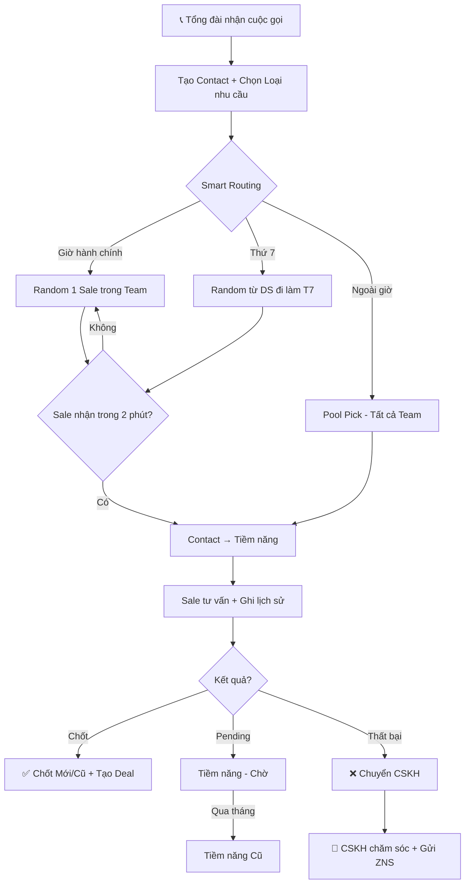
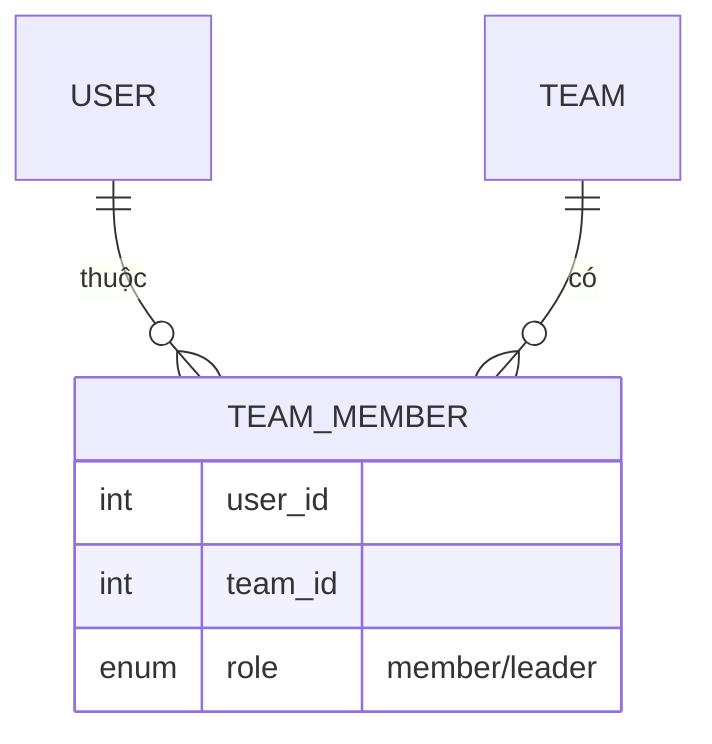
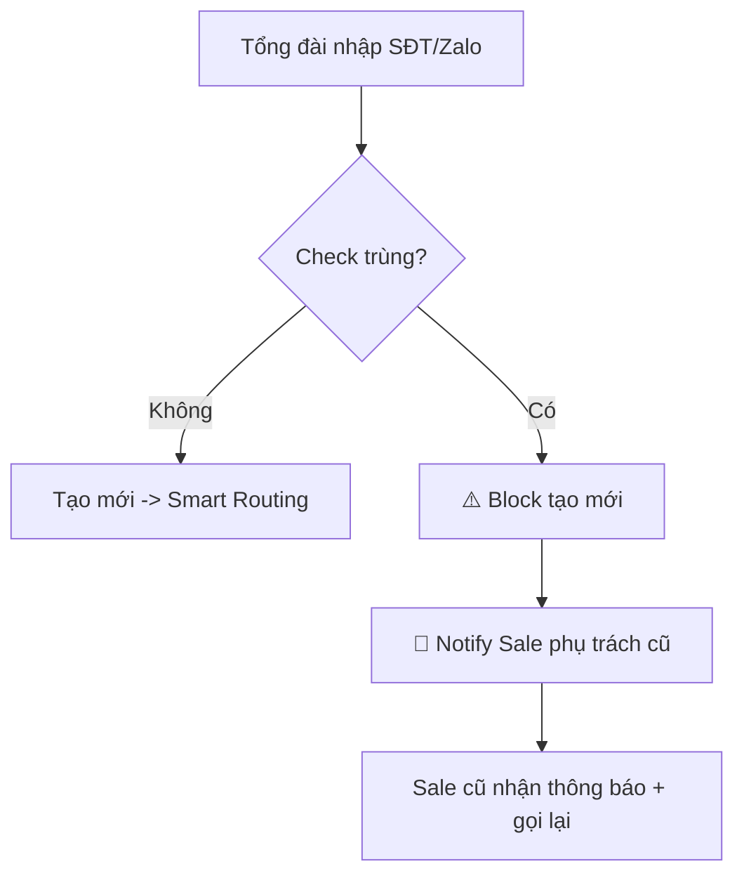
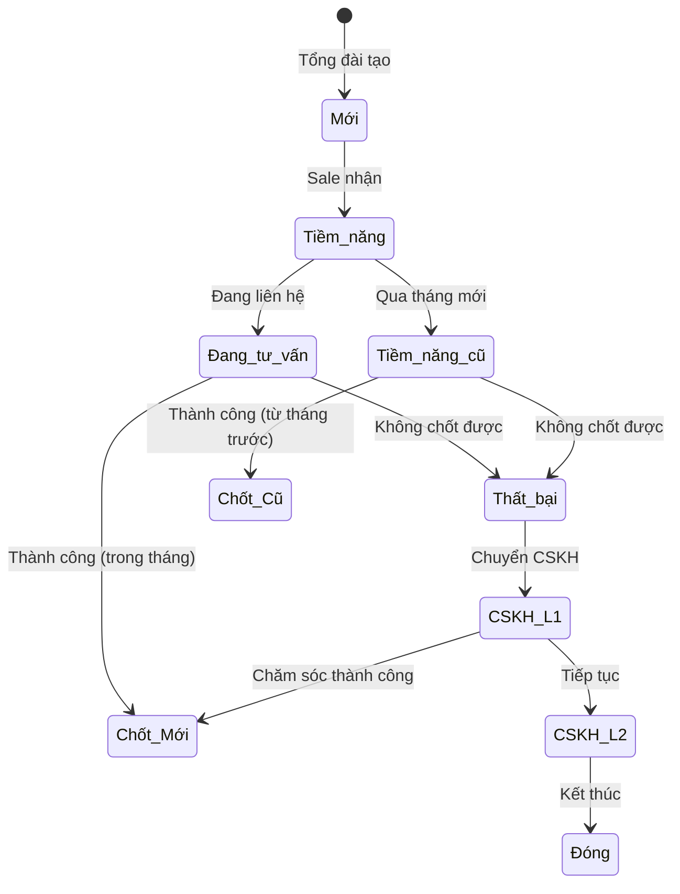
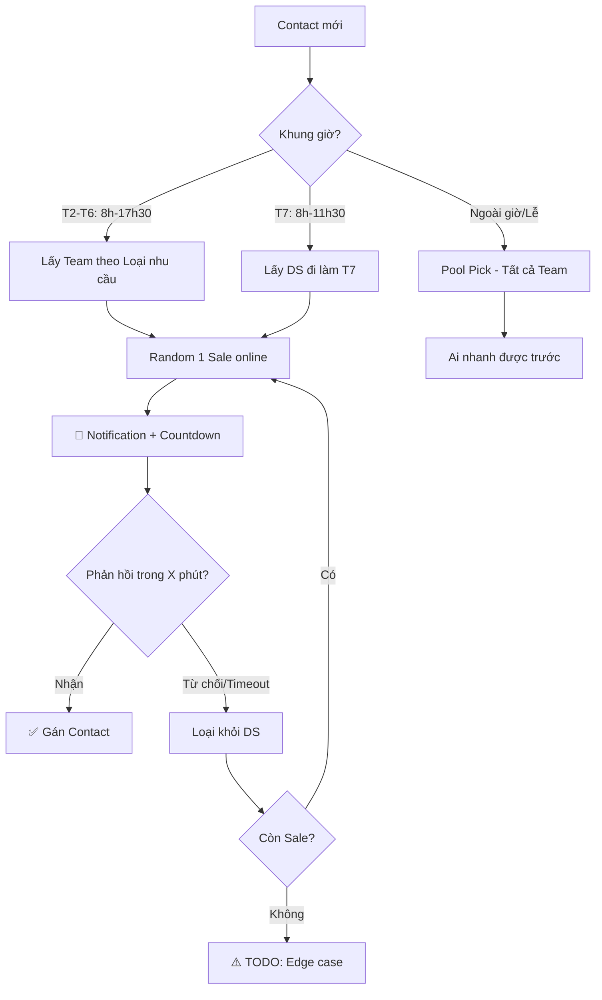
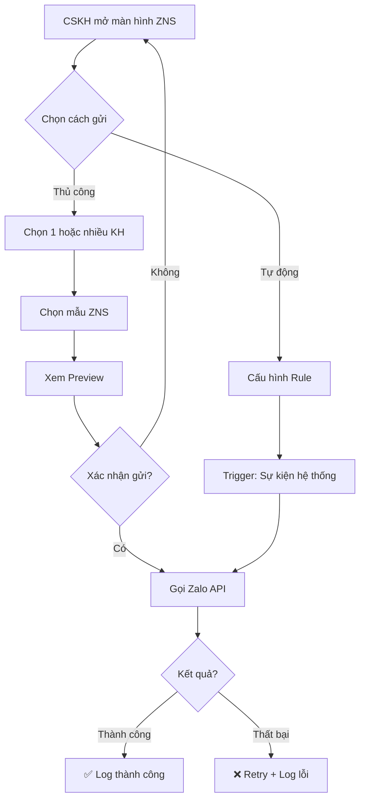
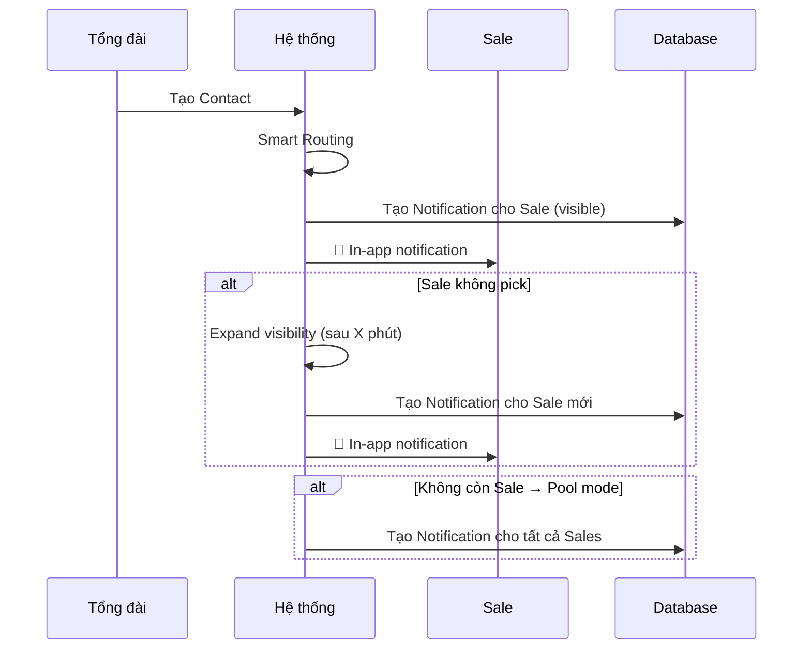

# AnKhangCRM - Đặc tả Yêu cầu Phần mềm (v3.0)

> **Phiên bản:** 3.0 | **Ngày:** 28/01/2026 | **Trạng thái:** Draft - Cập nhật Sale Role

---

## 1. Tổng quan

**Mục tiêu:** Hệ thống CRM quản lý khách hàng cho doanh nghiệp pháp lý, thay thế Google Sheets.

**Quy mô:** ~100 users (50-80 Sale, 5-10 Tổng đài, 5-10 CSKH, 2-3 Admin)

### Luồng Nghiệp vụ Chính



---

## 2. Roles & Quyền hạn

### 2.1 Bảng Quyền

| Quyền | Admin | Tổng đài | Sale | CSKH |
|-------|:-----:|:--------:|:----:|:----:|
| Quản lý Users/Teams/Roles | ✅ | ❌ | ❌ | ❌ |
| Quản lý Loại nhu cầu | ✅ | ❌ | ❌ | ❌ |
| Quản lý Sản phẩm | ✅ | ❌ | ❌ | ❌ |
| Quản lý Mẫu ZNS | ✅ | ❌ | ❌ | ❌ |
| Tạo Contact | ✅ | ✅ | ❌ | ❌ |
| Nhận Contact (Pick) | ❌ | ❌ | ✅ | ❌ |
| Cập nhật Contact | ✅ | ❌ | ✅ | ✅ |
| Ghi lịch sử tương tác | ✅ | ❌ | ✅ | ✅ |
| Tạo Deal | ❌ | ❌ | ✅ | ❌ |
| Gửi ZNS | ❌ | ❌ | ❌ | ✅ |
| Xem Dashboard/Báo cáo | ✅ | ❌ | ❌ | ❌ |
| Xem Activity Logs | ✅ | ❌ | ❌ | ❌ |
| Re-assign Contact | ✅ | ❌ | ❌ | ❌ |

### 2.2 Phân quyền động
- Admin tạo/sửa Roles tùy ý
- Mỗi Role = Tập hợp Permissions
- 1 User có thể có nhiều Roles
- Override permission cho từng User cụ thể

---

## 3. Module: Xác thực (Authentication)

| Chức năng | Mô tả |
|-----------|-------|
| Đăng nhập | Username/Password, Remember me (30 ngày) |
| Quên mật khẩu | Gửi link reset qua Email (hết hạn 1 giờ) |
| Đổi mật khẩu | Trong Settings cá nhân |
| Session timeout | Tự động logout sau 3 ngày không hoạt động |
| Bảo mật | Bcrypt (cost 12), min 8 ký tự, rate limit 5 lần/phút |

---

## 4. Module: Teams & Nhân viên

### 4.1 Cấu trúc Team



- **Many-to-Many:** 1 User thuộc nhiều Team
- **Leader:** Mỗi Team có nhiều Leader, mỗi User có 1 Leader/Team
- **Danh sách thứ 7:** Admin tạo DS nhân viên đi làm theo ngày cụ thể
- **Ngày nghỉ/Lễ:** Mặc định lịch VN, Admin chỉnh sửa được

### 4.2 Thông tin Nhân viên
| Trường | Bắt buộc | Mô tả |
|--------|:--------:|-------|
| Username | ✅ | Đăng nhập, không đổi được |
| Họ tên | ✅ | Tên hiển thị |
| Email | ✅ | Email công việc |
| SĐT | | Liên hệ |
| Team(s) | | Thuộc team nào |
| Role(s) | ✅ | Vai trò phân quyền |
| Trạng thái | ✅ | Hoạt động / Khóa |

---

## 5. Module: Contacts (Khách hàng)

### 5.1 Thông tin Contact
| Trường | Bắt buộc | Mô tả |
|--------|:--------:|-------|
| Mã liên hệ | Tự động | VD: KH2026-001 |
| Tên KH | ✅ | Thường là tên Zalo |
| SĐT | ⚠️ | Unique. Bắt buộc nếu không có Zalo ID/QR |
| Zalo ID | ⚠️ | ID Zalo. Bắt buộc nếu không có SĐT |
| Zalo Link | | Link profile Zalo |
| Zalo QR | ⚠️ | Upload/Paste ảnh QR. Bắt buộc nếu không có SĐT/Zalo ID |
| Email | | Email liên hệ |
| Loại nhu cầu | ✅ | Dropdown (Admin quản lý) |
| Nguồn | ✅ | Ladi Zalo/Hotline, FB, Google, Giới thiệu, Khác |
| Team | Tự động | Gán theo Loại nhu cầu |
| Người tư vấn | Tự động | Sale được gán |
| Lịch hẹn tiếp theo | | Nhắc trên Dashboard Sale |
| Trạng thái | Tự động | Xem sơ đồ bên dưới |

> **Quy tắc validation:** Contact phải có ÍT NHẤT 1 trong 3: SĐT, Zalo ID, hoặc Zalo QR

### 5.2 Xử lý Trùng Contact



### 5.3 Trạng thái Contact



**Giải thích:**
- **Chốt Mới:** KH được chốt trong cùng tháng nhận
- **Chốt Cũ:** KH từ tháng trước, chốt tháng này
- **Tiềm năng Cũ:** Cronjob chạy đầu tháng, chuyển từ Tiềm năng

### 5.3 Lịch sử Trao đổi (Interactions)

> **Mô tả:** Ghi lại tất cả hoạt động tương tác với khách hàng để theo dõi quá trình chăm sóc.

| Trường | Bắt buộc | Mô tả |
|--------|:--------:|-------|
| Ngày giờ | Tự động | Thời điểm tạo ghi chú |
| Nội dung | ✅ | Ghi chú cuộc gọi/tin nhắn |
| Phương thức | ✅ | Ghi chú / Gọi điện / Zalo / Email / Gặp mặt |
| Người tạo | Tự động | User tạo ghi chú |

**Quyền:**
- Sale/CSKH có thể thêm ghi chú cho Contact mình phụ trách
- Admin có thể thêm/xóa ghi chú cho tất cả Contact
- Tổng đài không có quyền ghi lịch sử tương tác

**UI:**
- Hiển thị dạng Timeline trên trang Chi tiết Contact
- Form thêm nhanh với icon chọn phương thức
- Real-time update với Turbo Stream (không cần reload)

### 5.4 Re-assign / Unassign Contact (Chuyển giao / Gỡ khách hàng)

> **Mô tả:** Admin có thể:
> - **Re-assign:** Chuyển Contact từ Sale A sang Sale B
> - **Unassign:** Gỡ Contact khỏi Sale A, đưa về pool để Sale khác nhận
>
> Cả 2 hành động đều cần được Team Lead của Sale A phê duyệt.

**Workflow:**

```
┌─────────────────────────────────────────────────────────────────────────────┐
│                           ADMIN TẠO YÊU CẦU                                  │
│                                                                              │
│  ┌──────────────┐                                                           │
│  │   Admin      │ ──► Chọn Contact ──► [Chọn Sale B hoặc bỏ trống] ──► Lý do│
│  └──────────────┘                                                           │
│                                                                              │
│  📌 Nếu chọn Sale B  →  RE-ASSIGN (chuyển cho người mới)                    │
│  📌 Nếu bỏ trống     →  UN-ASSIGN (gỡ khỏi Sale A, đưa về pool)             │
└─────────────────────────────────────────────────────────────────────────────┘
                                    │
                                    ▼
┌─────────────────────────────────────────────────────────────────────────────┐
│                         HỆ THỐNG GỬI THÔNG BÁO                               │
│                                                                              │
│    📧 Lead (Manager)          📧 Sale A (Owner hiện tại)                    │
│    "Có yêu cầu cần duyệt"     "Contact đang chờ duyệt chuyển"               │
└─────────────────────────────────────────────────────────────────────────────┘
                                    │
                    ┌───────────────┴───────────────┐
                    ▼                               ▼
        ┌───────────────────┐           ┌───────────────────┐
        │   ✅ APPROVE       │           │   ❌ REJECT        │
        │   (Lead)           │           │   (Lead)           │
        └───────────────────┘           └───────────────────┘
                │                               │
                ▼                               ▼
┌────────────────────────────┐      ┌────────────────────────────┐
│ RE-ASSIGN (có Sale B):     │      │ Yêu cầu bị hủy              │
│  → Contact chuyển Sale B   │      │                             │
│  → 📧 Sale B: "Nhận KH"    │      │ 📧 Admin: "Từ chối + Lý do" │
│                            │      │                             │
│ UN-ASSIGN (không có Sale B):│      │                             │
│  → Contact về pool (new)   │      │                             │
│  → Chạy Smart Routing lại  │      │                             │
│  → Sale khác có thể pick   │      │                             │
└────────────────────────────┘      └────────────────────────────┘
```

**Quy tắc:**

| Rule | Mô tả |
|------|-------|
| Ai có quyền tạo request? | Chỉ Admin |
| Ai phê duyệt? | Manager (Leader) của Team mà Sale A thuộc |
| Cùng Team vẫn cần approve? | ✅ Có |
| Khác Team cần 2 Lead approve? | ❌ Chỉ cần Lead của Sale A (người mất khách) |

**Database - ReassignRequest:**

| Trường | Type | Mô tả |
|--------|------|-------|
| id | bigint | PK |
| contact_id | bigint FK | Contact cần xử lý |
| from_user_id | bigint FK | Sale hiện tại (owner) |
| to_user_id | bigint FK | Sale mới - **NULLABLE** (NULL = unassign) |
| requested_by_id | bigint FK | Admin tạo request |
| approved_by_id | bigint FK | Lead phê duyệt (nullable) |
| request_type | enum | `reassign` / `unassign` |
| reason | text | Lý do yêu cầu (bắt buộc) |
| rejection_reason | text | Lý do từ chối (nullable) |
| status | enum | `pending` / `approved` / `rejected` |
| created_at | datetime | |
| updated_at | datetime | |

**Xử lý khi Approve:**

| Request Type | Hành động |
|--------------|-----------|
| `reassign` | `contact.assigned_user_id = to_user_id` |
| `unassign` | `contact.assigned_user_id = NULL`, `status = new_contact`, chạy Smart Routing |

**Activity Log:**
- Khi tạo request: `reassign_requested`
- Khi approve reassign: `reassign_approved`
- Khi approve unassign: `contact_unassigned`
- Khi reject: `reassign_rejected`


---

## 6. Module: Smart Routing

### 6.1 Luồng phân bổ



### 6.2 Config (Admin)
| Setting | Mặc định | Mô tả |
|---------|----------|-------|
| Thời gian chờ | 2 phút | Thời gian Sale phản hồi |
| Loại nhu cầu → Team | Mapping | Loại A → Team A |
| Ngày nghỉ | Lịch VN | Job đầu năm, Admin chỉnh |

## 7. Module: ZNS (Zalo Notification Service)

### 7.1 Luồng gửi ZNS



### 7.2 Chức năng

| Chức năng | Mô tả | Quyền |
|-----------|-------|-------|
| Gửi thủ công | Chọn 1/nhiều KH → Chọn mẫu → Preview → Gửi | CSKH |
| Gửi tự động | Trigger theo rule (VD: Sau X ngày không liên lạc) | Hệ thống |
| Quản lý mẫu | CRUD template ZNS (Tiêu đề, Nội dung, Biến động) | Admin |
| Lịch sử gửi | Xem log gửi ZNS theo KH/Thời gian | CSKH, Admin |

### 7.3 Mẫu ZNS (Template)

| Trường | Mô tả |
|--------|-------|
| Tên mẫu | Tên hiển thị để chọn |
| Mã Zalo | Template ID từ Zalo OA |
| Nội dung preview | Text mẫu để xem trước |
| Biến động | Các placeholder: `{ten_kh}`, `{so_dien_thoai}` |
| Trạng thái | Đang dùng / Ẩn |

### 7.4 TODO - Cần trao đổi

| # | Câu hỏi |
|---|--------|
| 1 | Danh sách rules tự động gửi ZNS? |
| 2 | Nội dung các mẫu ZNS cụ thể? |
| 3 | Giới hạn số tin/ngày/KH? |


---

## 8. Module: Notification

### 8.1 Kiến trúc



### 8.2 Database Schema

| Column | Type | Description |
|--------|------|-------------|
| `user_id` | FK | User nhận notification |
| `title` | string | Tiêu đề |
| `body` | text | Nội dung |
| `icon` | string | Icon (FontAwesome) |
| `category` | enum | contact, deal, system, team |
| `notification_type` | string | contact_created, contact_picked... |
| `notifiable_type/id` | polymorphic | Đối tượng liên quan |
| `action_url` | string | URL redirect khi click |
| `read` | boolean | Đã đọc |
| `read_at` | datetime | Thời điểm đọc |
| `seen` | boolean | Đã nhìn thấy |
| `metadata` | JSON | Dữ liệu bổ sung |

### 8.3 Notification Types

| Type | Khi nào | Icon | Màu |
|------|---------|------|-----|
| `contact_created` | Contact mới visible cho Sale | fa-user-plus | blue |
| `contact_picked` | Sale nhận contact | fa-check-circle | green |
| `contact_assigned` | Admin gán contact | fa-user-tag | purple |
| `reassign_requested` | Yêu cầu chuyển giao | fa-exchange-alt | yellow |
| `reassign_approved` | Phê duyệt chuyển giao | fa-check | green |
| `reassign_rejected` | Từ chối chuyển giao | fa-times | red |

### 8.4 UI Components

**Header Bell Icon:**
- Badge đỏ hiển thị số notification chưa đọc (max 9+)
- Dropdown hiển thị 10 notifications gần nhất
- Nút "Đánh dấu đã đọc" (luôn hiển thị)
- Link "Xem thêm X thông báo" nếu có nhiều hơn 10
- Link "Xem tất cả" → trang `/notifications`

**Notification Item:**
- Chưa đọc: `bg-blue-50` + chấm xanh indicator
- Đã đọc: background trắng
- Click → đánh dấu đã đọc → redirect tới `action_url`

**Full Page `/notifications`:**
- Danh sách đầy đủ với pagination
- Nút "Đánh dấu tất cả đã đọc"

### 8.5 Trigger Flow

| Sự kiện | Ai nhận | Service |
|---------|---------|---------|
| Contact tạo (trong giờ) | 1 Sale đầu tiên từ Smart Routing | `SmartRoutingService.apply_initial_visibility` |
| Expand visibility | Sale mới được thêm vào visibility | `SmartRoutingService.expand_visibility` |
| Contact tạo (ngoài giờ) | Tất cả Sales trong team | Pool mode |
| Switch to Pool | Các Sales chưa được notify | `SmartRoutingService.switch_to_pool_pick` |

### 8.6 Roadmap

- [x] **MVP**: In-app notifications (TASK-057)
- [ ] **Real-time**: WebSocket/Turbo Streams (TASK-055)
- [ ] **Web Push**: Service Worker + VAPID (TASK-056)
- [ ] **Rules Engine**: Configurable triggers (TASK-029)

---

## 9. Module: Activity Logs

Ghi log **tất cả** hành động: Đăng nhập/Đăng xuất, CRUD Contacts/Teams/Users, Thay đổi trạng thái, Gửi ZNS

**Mỗi log:** Thời gian, Người thực hiện, Hành động, Đối tượng, Dữ liệu trước/sau, IP

---

## 10. Module: Dashboard & Báo cáo

### Dashboard Sale
**Thiết kế:** 1 màn hình tập trung, tối ưu thao tác

| Khu vực | Nội dung |
|---------|----------|
| Notification | 🔔 Contact mới cần nhận (Countdown) |
| Lịch hẹn | DS hẹn trong 1 tuần tới |
| DS Khách | Sort: Chưa ai nhận → Mới nhất |
| Đua top | Bảng xếp hạng Sale |

### Sales Workspace (Trang mặc định Sale)

> **Quan trọng:** Khi Sale đăng nhập, hệ thống tự động chuyển đến `/sales/workspace` thay vì Dashboard.

**Cấu trúc Sidebar cho Sale:**
| STT | Menu Item | Đường dẫn | Mô tả |
|-----|-----------|-----------|-------|
| 1 | Workspace | `/sales/workspace` | Trang làm việc chính |
| 2 | Tổng quan | `/dashboard` | Dashboard tổng quan |
| 3 | Kanban | `/sales/kanban` | Bảng quản lý theo trạng thái |
| 4 | Khách hàng | `/contacts` | Danh sách KH được gán cho mình |

**Workspace Layout:**
- **Header KPI:** Số liệu nhanh (KH mới, đang xử lý, chốt tháng này)
- **Tab "Khách mới":** Hiển thị KH chưa có người nhận trong Team của mình
- **Tab "Cần cập nhật":** *(Tạm ẩn - TODO: Enable lại khi cần)*
  - KH đã nhận (assigned) nhưng cần bổ sung thông tin
  - **Điều kiện xuất hiện (thỏa 1 trong 3):**
    1. Thiếu email (`email IS NULL OR email = ''`)
    2. Thiếu ghi chú (`notes IS NULL OR notes = ''`)
    3. Không cập nhật >7 ngày (`updated_at < 7.days.ago`)
  - Scope: `Contact.needs_info_update`
- **Tab "Đang xử lý":** KH đang trong quá trình tư vấn

**Nút Nhận (Pick) - UX:**
- Vị trí: Cột Action trong danh sách Khách mới
- Icon: 💲 (dollar-sign) với animation bounce
- Màu: Brand Blue (#0B387A) với shadow
- Behavior: Click → Confirmation dialog → Redirect đến trang chi tiết KH
- Sau khi nhận: Trạng thái KH chuyển từ "Mới" → "Tiềm năng"

### Dashboard Tổng đài
- Form tạo Contact (tối ưu nhập nhanh)
- Thống kê số Contact đã tạo (filter ngày/tháng)

---

## 11. Yêu cầu Phi chức năng

| Hạng mục | Yêu cầu |
|----------|---------|
| Hiệu năng | < 2s thao tác, < 5s notification |
| Đồng thời | 100-200 users |
| Bảo mật | HTTPS, AES-256, Bcrypt |
| Uptime | 99.9% |

---

## 12. Phạm vi Phase 1

| ✅ Làm | ❌ Không làm (Phase sau) |
|--------|-------------------------|
| Smart Routing + Notification | Deals, Products |
| Dashboard Sale/Tổng đài | Coupon |
| ZNS (thủ công + mẫu) | Mobile App, AI |
| Teams (Many-to-Many) | Import Google Sheets |
| Lịch thứ 7, Ngày lễ | 2FA, Export PDF |
| Activity Logs, Contacts | |

---

## 13. TODO - Cần làm rõ

> Xem chi tiết: [customer_qa.md](./customer_qa.md)

| # | Hạng mục |
|---|----------|
| 1 | "Hoàn thành thông tin" theo Role |
| 2 | CSKH "Cướp khách" |
| 3 | Smart Routing - Hết người? |
| 4 | ZNS Rules tự động |
