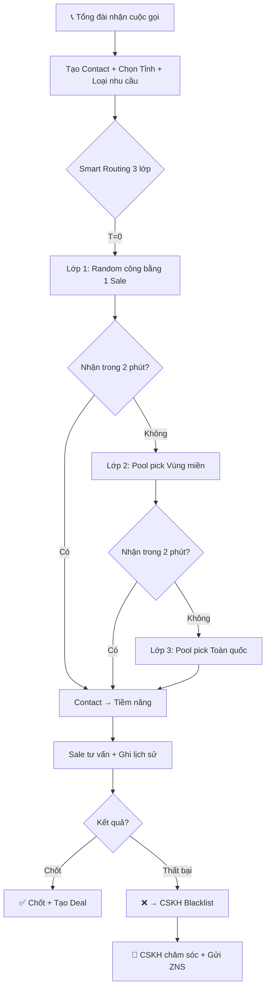
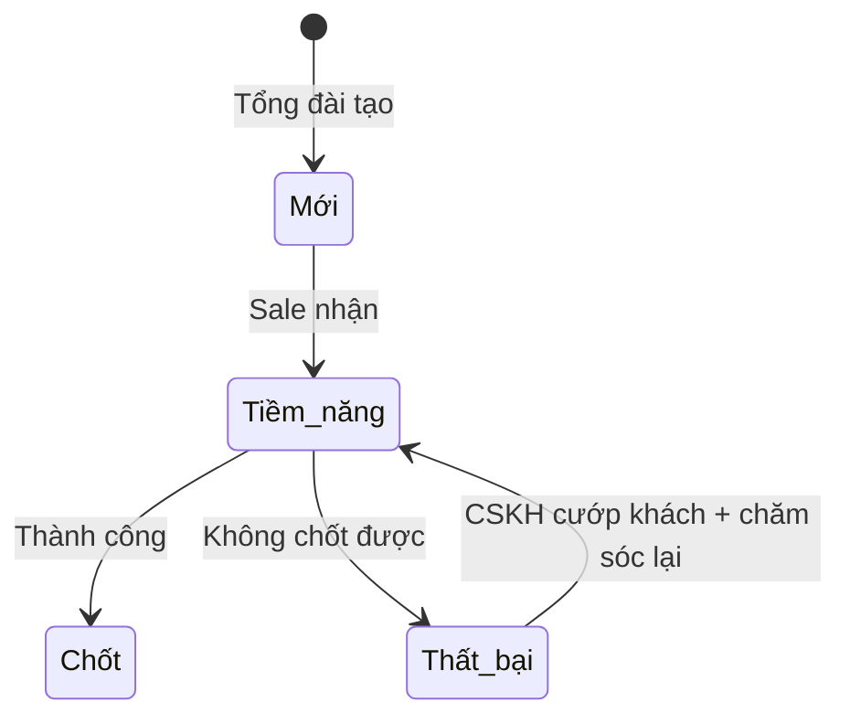
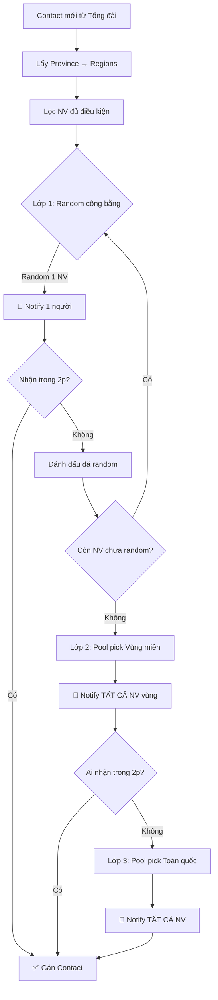

# AnKhangCRM - Đặc tả Yêu cầu Phần mềm (v4.0)

> **Phiên bản:** 4.0 | **Ngày:** 04/02/2026 | **Trạng thái:** Sprint 6 Planning
> 
> **Thay đổi từ v3:** Cuộc họp 04/02/2026 - Smart Routing 3 lớp, Province/Region, 4 trạng thái, CSKH workspace, ZNS

---

## 1. Tổng quan

**Mục tiêu:** Hệ thống CRM quản lý khách hàng cho doanh nghiệp pháp lý, thay thế Google Sheets.

**Quy mô:** ~100 users (50-80 Sale, 5-10 Tổng đài, 5-10 CSKH, 2-3 Admin)

### Luồng Nghiệp vụ Chính (Updated v4)



---

## 2. Roles & Quyền hạn

### 2.1 Bảng Quyền

| Quyền                     | Admin | Tổng đài | Sale  | CSKH  |
| ------------------------- | :---: | :------: | :---: | :---: |
| Quản lý Users/Teams/Roles |   ✅   |    ❌     |   ❌   |   ❌   |
| Quản lý Tỉnh/Vùng miền    |   ✅   |    ❌     |   ❌   |   ❌   |
| Quản lý Loại nhu cầu      |   ✅   |    ❌     |   ❌   |   ❌   |
| Quản lý Mẫu ZNS           |   ✅   |    ❌     |   ❌   |   ❌   |
| Tạo Contact               |   ✅   |    ✅     |   ❌   |   ❌   |
| Nhận Contact (Pick)       |   ❌   |    ❌     |   ✅   |   ❌   |
| Cập nhật Contact          |   ✅   |    ❌     |   ✅   |   ✅   |
| Xem Blacklist/Thanh tra   |   ✅   |    ❌     |   ❌   |   ✅   |
| "Cướp khách" từ Blacklist |   ❌   |    ❌     |   ❌   |   ✅   |
| Gửi ZNS                   |   ❌   |    ❌     |   ❌   |   ✅   |
| Xem Dashboard/Báo cáo     |   ✅   |    ❌     |   ❌   |   ❌   |

---

## 3. Module: Contacts (Khách hàng) - v4 Updated

### 3.1 Thông tin Contact

| Trường             | Bắt buộc | Mô tả                            | **v4 Changes**       |
| ------------------ | :------: | -------------------------------- | -------------------- |
| Mã liên hệ         | Tự động  | VD: KH2026-001                   |                      |
| Tên KH             |    ✅     | Thường là tên Zalo               |                      |
| SĐT                |    ⚠️     | Unique. Bắt buộc nếu ko có Zalo  |                      |
| Zalo ID/QR         |    ⚠️     | Bắt buộc nếu ko có SĐT           |                      |
| Email              |          | Email liên hệ                    |                      |
| **Tỉnh thành**     |          | Dropdown 63 tỉnh                 | ✨ **NEW**            |
| **Địa chỉ**        |          | Text tự do (optional)            | ✨ **NEW**            |
| Loại nhu cầu       |    ✅     | Dropdown (Admin quản lý)         |                      |
| Nguồn              |    ✅     | Ladi Zalo/Hotline, FB, Google... |                      |
| Team               | Tự động  | Gán theo Loại nhu cầu            |                      |
| Người tư vấn       | Tự động  | Sale được gán                    |                      |
| Lịch hẹn tiếp theo |          | Nhắc trên Dashboard Sale         |                      |
| Trạng thái         | Tự động  | **4 trạng thái đơn giản**        | ⚠️ **CHANGED** (10→4) |

### 3.2 Trạng thái Contact (v4 - Simplified)



**4 trạng thái:**

| Enum         | Hiển thị   | Mô tả                          |
| ------------ | ---------- | ------------------------------ |
| `new`        | Mới        | Tổng đài vừa tạo, chưa ai nhận |
| `potential`  | Tiềm năng  | Sale đã nhận, đang tư vấn      |
| `failed`     | Thất bại   | Không chốt được → CSKH         |
| `closed`     | Chốt       | Thành công                     |

> ⚠️ **Breaking Change:** Bỏ các trạng thái `in_progress`, `potential_old`, `closed_new`, `closed_old`, `cskh_l1`, `cskh_l2`

---

## 4. Module: Tỉnh thành & Vùng miền (NEW)

### 4.1 Province (63 tỉnh thành)

| Trường   | Bắt buộc | Mô tả                     |
| -------- | :------: | ------------------------- |
| name     |    ✅     | Tên tỉnh (VD: Hà Nội)     |
| code     |    ✅     | Mã tỉnh (VD: HN, HCM)     |
| position |          | Thứ tự hiển thị           |
| active   |          | Hoạt động/Ẩn              |

### 4.2 Region (Vùng miền)

| Trường | Bắt buộc | Mô tả                        |
| ------ | :------: | ---------------------------- |
| name   |    ✅     | Tên vùng (VD: Bắc, Trung, Nam) |
| code   |    ✅     | Mã vùng (VD: bac, trung, nam) |

### 4.3 Province ↔ Region (Many-to-Many)

Mỗi tỉnh có thể thuộc **nhiều vùng** (edge case: một số tỉnh giáp ranh).

```ruby
# Models
Province has_many :province_regions
Province has_many :regions, through: :province_regions

Region has_many :province_regions
Region has_many :provinces, through: :province_regions
```

### 4.4 Admin UI

- **Trang quản lý Tỉnh:** CRUD 63 tỉnh
- **Trang quản lý Vùng:** CRUD vùng + chọn danh sách tỉnh thuộc vùng

---

## 5. Module: Smart Routing (v4 - 3 Layers)

### 5.1 Cơ chế 3 lớp mới



### 5.2 Điều kiện Nhân viên trong Pool

| # | Điều kiện                                    | Kiểm tra                           |
|---|----------------------------------------------|-----------------------------------|
| 1 | Thuộc Team của loại nhu cầu                  | `user.teams.include?(service_type.team)` |
| 2 | Có cài đặt giới hạn > 0 cho loại nhu cầu     | `UserServiceTypeLimit.exists?`    |
| 3 | Chưa đạt giới hạn trong ngày                 | `today_picks < max_pick_per_day`  |
| 4 | Đã hết cooldown 5 phút từ lần pick trước     | `last_pick_at < 5.minutes.ago`    |

### 5.3 Config (v4 Updated)

| Setting                   | Mặc định | Mô tả                               | v4 Changes         |
| ------------------------- | -------- | ----------------------------------- | ------------------ |
| `PICK_COOLDOWN_MINUTES`   | 5        | Thời gian chờ giữa 2 lần pick       | ✨ ENV (fix cứng)   |
| `smart_routing_layer_timeout` | 2    | Phút chờ mỗi lớp routing            | ✨ NEW              |
| ~~max_pick_per_day~~      | ~~20~~   | ~~Giới hạn Pick/ngày cho mỗi Sale~~ | ❌ **REMOVED** từ ServiceType |

### 5.4 UserServiceTypeLimit (NEW)

Giới hạn pick theo từng nhân viên + từng loại nhu cầu:

| Trường          | Type    | Mô tả                          |
| --------------- | ------- | ------------------------------ |
| user_id         | FK      | Nhân viên                      |
| service_type_id | FK      | Loại nhu cầu                   |
| max_pick_per_day| integer | Số tối đa/ngày (required > 0)  |

**Quy tắc:**
- Nếu NV **không có** record cho 1 loại nhu cầu → **Không thể nhận** contact loại đó
- Admin cài đặt trong form chỉnh sửa nhân viên

---

## 6. Module: CSKH Workspace (NEW)

### 6.1 Tổng quan

**URL:** `/cskh/workspace`

**Mục đích:** Màn hình riêng cho role CSKH để theo dõi và chăm sóc khách hàng.

### 6.2 Tab Danh sách đen (Blacklist)

| Điều kiện               | Mô tả                                           |
| ----------------------- | ----------------------------------------------- |
| Contact thất bại        | `status = failed`                               |
| Không có update 24h     | Sale nhận nhưng không tạo lịch hẹn/trao đổi trong 24h |

**Hành động CSKH:**
- ✅ Xem danh sách
- ✅ **"Cướp khách"** - Nhận contact về cho CSKH chăm sóc

### 6.3 Tab Danh sách thanh tra

| Điều kiện           | Mô tả                                      |
| ------------------- | ------------------------------------------ |
| Lịch hẹn quá xa     | `next_appointment > X days` (X = Setting)  |

**Setting:** `max_appointment_days` (default: 30 ngày)

---

## 7. Module: ZNS (v4 Updated)

### 7.1 ZNS Tự động

| Trigger                | Hành động                      |
| ---------------------- | ------------------------------ |
| Contact tạo + 24h      | Gửi ZNS template mặc định      |

**Điều kiện:** Gửi cho **tất cả contact mới** (không phân biệt trạng thái)

### 7.2 ZNS Bán tự động (CSKH)

**Filter criteria:**
- Loại nhu cầu
- Vùng miền
- Trạng thái
- Thời gian tạo
- Thời gian cập nhật gần nhất

> **Note:** ZNS Integration chưa cần implement thật, làm mock trước

---

## 8. Breaking Changes Summary

| Thay đổi | Ảnh hưởng | Migration |
|----------|-----------|-----------|
| Bỏ `max_pick_per_day` từ ServiceType | SmartRoutingService, Admin UI | Remove column |
| Bỏ `pick_cooldown_minutes` từ ServiceType | SmartRoutingService | Remove column |
| Contact status 10 → 4 | State Machine, UI nhiều nơi | Data migration |
| Thêm Province, ProvinceRegion | New tables | Add tables |
| Thêm `province_id`, `address` vào Contact | Form tổng đài | Add columns |
| Thêm UserServiceTypeLimit | New table, Admin UI | Add table |

---

## 9. Sprint Roadmap

### Completed (Sprint 1-5)

| Sprint | Focus | Status |
|--------|-------|--------|
| Sprint 1 | Foundation | ✅ Done |
| Sprint 2 | Core Features Part 1 | ✅ Done |
| Sprint 3 | Core Features Part 2 | ✅ Done |
| Sprint 4 | Finish Features | ✅ Done |
| Sprint 5 | Verification & Deploy | ✅ Done |

### New Sprints (v4)

| Sprint | Focus | Priority |
|--------|-------|----------|
| **Sprint 6** | Smart Routing 3 lớp + Province | 🔴 Sale & Tổng đài |
| **Sprint 7** | CSKH Workspace + ZNS | 🟡 CSKH |

---

## 10. TODO - Phase 2

| Feature                      |
| ---------------------------- |
| Zalo OA + ZNS Real Integration |
| Deals, Products, Coupon      |
| Mobile App                   |
| AI Features                  |
| Import from Google Sheets    |
