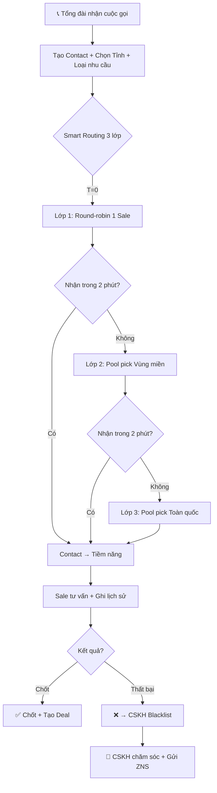
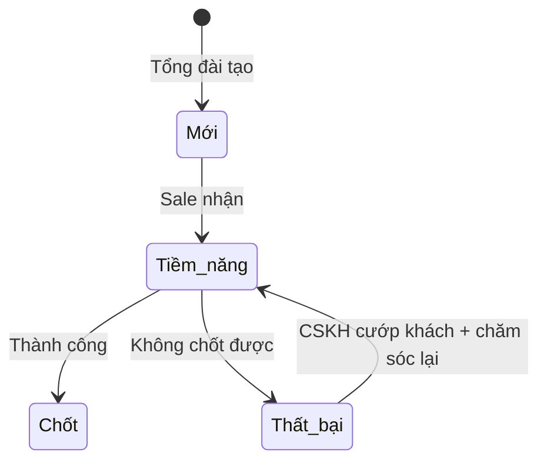

# AnKhangCRM - Đặc tả Yêu cầu Phần mềm (v5.0)

> **Phiên bản:** 5.0 | **Ngày:** 05/02/2026 | **Trạng thái:** Sprint 6 Complete
> 
> **Thay đổi từ v4:** Sync với code thực tế - Round-robin, Notification, Settings, CSKH scope

---

## 1. Tổng quan

**Mục tiêu:** Hệ thống CRM quản lý khách hàng cho doanh nghiệp pháp lý, thay thế Google Sheets.

**Quy mô:** ~100 users (50-80 Sale, 5-10 Tổng đài, 5-10 CSKH, 2-3 Admin)

### Luồng Nghiệp vụ Chính



---

## 2. Roles & Quyền hạn

### 2.1 Bảng Quyền

| Quyền                     | Admin | Tổng đài | Sale  | CSKH  |
| ------------------------- | :---: | :------: | :---: | :---: |
| Quản lý Users/Teams/Roles |   ✅   |    ❌     |   ❌   |   ❌   |
| Quản lý Tỉnh/Vùng miền    |   ✅   |    ❌     |   ❌   |   ❌   |
| Quản lý Loại nhu cầu      |   ✅   |    ❌     |   ❌   |   ❌   |
| Quản lý Mẫu ZNS           |   ✅   |    ❌     |   ❌   |   ❌   |
| Tạo Contact               |   ✅   |    ✅     |   ❌   |   ❌   |
| Nhận Contact (Pick)       |   ❌   |    ❌     |   ✅   |   ❌   |
| Cập nhật Contact          |   ✅   |    ❌     |   ✅   |   ✅   |
| Xem Blacklist/Thanh tra   |   ✅   |    ❌     |   ❌   |   ✅   |
| "Cướp khách" từ Blacklist |   ❌   |    ❌     |   ❌   |   ✅   |
| Gửi ZNS                   |   ❌   |    ❌     |   ❌   |   ✅   |
| Xem Dashboard/Báo cáo     |   ✅   |    ❌     |   ❌   |   ❌   |

---

## 3. Module: Contacts (Khách hàng)

### 3.1 Thông tin Contact

| Trường             | Bắt buộc | Mô tả                           | v5 Notes |
| ------------------ | :------: | ------------------------------- | -------- |
| Mã liên hệ         | Tự động  | VD: KH2026-00001                | 5 digits |
| Tên KH             |    ✅     | Thường là tên Zalo              |          |
| SĐT                |    ⚠️     | Unique. Bắt buộc nếu ko có Zalo |          |
| Zalo ID            |    ⚠️     | Unique. Bắt buộc nếu ko có SĐT  |          |
| Zalo QR            |    ⚠️     | File đính kèm (ActiveStorage)   |          |
| Email              |          | Email liên hệ                   |          |
| **Tỉnh thành**     |          | FK → `provinces` table          |          |
| **Địa chỉ**        |          | Text tự do (optional)           |          |
| Loại nhu cầu       |    ✅     | FK → `service_types` table      |          |
| **Nguồn**          |    ✅     | **FK → `sources` table**        | ⚠️ FIXED  |
| Team               | Tự động  | Gán từ ServiceType.team_id      |          |
| Người tư vấn       | Tự động  | Sale được gán                   |          |
| Lịch hẹn tiếp theo |          | Nhắc trên Dashboard Sale        |          |
| Trạng thái         | Tự động  | 4 trạng thái đơn giản           |          |

> ⚠️ **v5 Fix:** `source` là FK → `sources` table (lookup), KHÔNG phải enum integer

### 3.2 Trạng thái Contact (State Machine)



**4 trạng thái:**

| Enum          | Hiển thị  | Mô tả                          |
| ------------- | --------- | ------------------------------ |
| `new_contact` | Mới       | Tổng đài vừa tạo, chưa ai nhận |
| `potential`   | Tiềm năng | Sale đã nhận, đang tư vấn      |
| `failed`      | Thất bại  | Không chốt được → CSKH         |
| `closed`      | Chốt      | Thành công                     |

### 3.3 Routing Metadata (v5 NEW)

Các trường hỗ trợ Smart Routing:

| Trường                | Type     | Mô tả                                  |
| --------------------- | -------- | -------------------------------------- |
| `visible_to_user_ids` | JSON     | Array user IDs có thể thấy (Layer 1/2) |
| `routing_layer`       | integer  | 1, 2, hoặc 3 - layer hiện tại          |
| `last_expanded_at`    | datetime | Thời điểm mở rộng visibility gần nhất  |

---

## 4. Module: Tỉnh thành & Vùng miền

### 4.1 Province (63 tỉnh thành)

| Trường   | Bắt buộc | Mô tả                       |
| -------- | :------: | --------------------------- |
| name     |    ✅     | Tên tỉnh (VD: Hà Nội)       |
| code     |    ✅     | Mã tỉnh số (VD: "01", "79") |
| position |          | Thứ tự hiển thị             |
| active   |          | Hoạt động/Ẩn                |

> **Data Source:** `provinces.open-api.vn` - 63 tỉnh thành với mã chuẩn quốc gia

### 4.2 Region (Vùng miền)

| Trường | Bắt buộc | Mô tả                               |
| ------ | :------: | ----------------------------------- |
| name   |    ✅     | Tên vùng (VD: Bắc, Trung, Nam)      |
| code   |    ✅     | Mã vùng (auto-generated, lowercase) |

### 4.3 Province ↔ Region (Many-to-Many)

```ruby
# Models
Province has_many :province_regions
Province has_many :regions, through: :province_regions

Region has_many :province_regions
Region has_many :provinces, through: :province_regions
```

---

## 5. Module: Smart Routing (3 Layers)

### 5.1 Cơ chế 3 lớp

```mermaid
flowchart TD
    A[Contact mới từ Tổng đài] --> B[Kiểm tra giờ làm việc]
    B -->|Ngoài giờ| L3[Lớp 3: National Pool]
    B -->|Trong giờ| C[Tìm Sale có UserServiceTypeLimit]
    
    C -->|Không tìm thấy| L2[Lớp 2: Regional Pool]
    C -->|Tìm thấy| D{Lớp 1: Round-robin}
    
    D -->|Chọn 1 Sale| E[🔔 Notify + visible_to_user_ids = [user_id]]
    E --> F{Nhận trong routing_expand_minutes?}
    
    F -->|Có| G[✅ Gán Contact]
    F -->|Không| L2
    
    L2 --> H[🔔 Notify ALL Sale cùng Region]
    H --> I{Ai nhận trong routing_expand_minutes?}
    I -->|Có| G
    I -->|Không| L3
    
    L3 --> J[🔔 Notify ALL Sale - visible_to_user_ids = nil]
    J --> G
```

### 5.2 Điều kiện Sale trong Pool (v5 FIXED)

| #   | Điều kiện                                  | v5 Notes                         |
| --- | ------------------------------------------ | -------------------------------- |
| 1   | Có `UserServiceTypeLimit` cho loại nhu cầu | ⚠️ KHÔNG check Team               |
| 2   | `max_pick_per_day > 0`                     | Trong UserServiceTypeLimit       |
| 3   | Chưa đạt giới hạn trong ngày               | `today_picks < max_pick_per_day` |
| 4   | Đã hết cooldown 5 phút từ lần pick trước   | `last_pick_at < 5.minutes.ago`   |
| 5   | `status: :active`                          | User phải active                 |
| 6   | Có `region_id` (cho Layer 2)               | User.region_id                   |

> ⚠️ **v5 Fix:** Layer 1 KHÔNG filter by Team. Chỉ check `UserServiceTypeLimit.exists?`

### 5.3 Round-robin Logic (v5 NEW)

**Luân phiên công bằng** - mỗi Sale chỉ được chọn 1 lần trong 1 chu kỳ:

```ruby
# Cache key format
"smart_routing:round_robin:#{service_type_id}:#{Date.current}"

# Logic
1. Lấy danh sách đã gán hôm nay từ cache
2. Loại các user đã gán ra khỏi pool
3. RAND() chọn 1 từ pool còn lại
4. Thêm user vào cache, expires_in: 24.hours
5. Khi hết pool → Reset cache → Bắt đầu chu kỳ mới
```

| Contact | Cache State | Available Pool | Selected |
| ------- | ----------- | -------------- | -------- |
| KH1     | `[]`        | [A, B, C]      | B (rand) |
| KH2     | `[B]`       | [A, C]         | A (rand) |
| KH3     | `[B, A]`    | [C]            | C        |
| KH4     | `[B, A, C]` | `[]` → RESET   | A (rand) |

### 5.4 Config Settings

| Setting Key              | Default | Mô tả                         |
| ------------------------ | ------- | ----------------------------- |
| `routing_expand_minutes` | 2       | Phút chờ mỗi lớp routing      |
| `working_hours_start`    | "08:00" | Giờ bắt đầu làm việc (T2-T6)  |
| `working_hours_end`      | "17:30" | Giờ kết thúc làm việc (T2-T6) |
| `saturday_hours_end`     | "11:30" | Giờ kết thúc Thứ 7            |
| `timezone`               | "Hanoi" | Múi giờ hệ thống              |

> **ENV Override:** `ROUTING_EXPAND_MINUTES` có thể override database setting

### 5.5 UserServiceTypeLimit

Giới hạn pick theo từng nhân viên + từng loại nhu cầu:

| Trường           | Type    | Mô tả                         |
| ---------------- | ------- | ----------------------------- |
| user_id          | FK      | Nhân viên                     |
| service_type_id  | FK      | Loại nhu cầu                  |
| max_pick_per_day | integer | Số tối đa/ngày (required > 0) |

**Quy tắc:**
- Nếu NV **không có** record cho 1 loại nhu cầu → **Không thể nhận** contact loại đó
- Admin cài đặt trong form chỉnh sửa nhân viên

---

## 6. Module: Notifications (v5 NEW)

### 6.1 Notification Types

| Type                 | Trigger                   | Channel                 |
| -------------------- | ------------------------- | ----------------------- |
| `contact_created`    | Smart Routing gán contact | In-app, Web Push        |
| `contact_assigned`   | Manual assign bởi Admin   | In-app, Web Push, Email |
| `contact_reassigned` | Reassign Request approved | In-app, Web Push, Email |

### 6.2 Delivery Channels

| Channel  | Implementation               | Toggle Setting                |
| -------- | ---------------------------- | ----------------------------- |
| In-app   | `Notification` model         | Always on                     |
| Web Push | `WebPushService`             | User opt-in                   |
| Email    | `ActionMailer` + Solid Queue | `email_notifications_enabled` |

### 6.3 Real-time Updates (Turbo Streams)

- Badge đỏ cập nhật số notifications chưa đọc
- Contact list tự động refresh khi có lead mới
- KPI cards cập nhật real-time

---

## 7. Module: CSKH Workspace (Sprint 7 - TBD)

### 7.1 Tổng quan

**URL:** `/cskh/workspace`

**Mục đích:** Màn hình riêng cho role CSKH để theo dõi và chăm sóc khách hàng.

### 7.2 Tab Danh sách đen (Blacklist) - TBD

| Điều kiện           | Mô tả                                                 |
| ------------------- | ----------------------------------------------------- |
| Contact thất bại    | `status = failed`                                     |
| Không có update 24h | Sale nhận nhưng không tạo lịch hẹn/trao đổi trong 24h |

### 7.3 Tab Danh sách thanh tra - TBD

| Điều kiện       | Mô tả                                     |
| --------------- | ----------------------------------------- |
| Lịch hẹn quá xa | `next_appointment > X days` (X = Setting) |

**Setting:** `max_appointment_days` (TBD - chưa implement)

---

## 8. Module: ZNS (Sprint 7 - TBD)

> ⚠️ **Phase 2:** ZNS Integration chưa implement, làm mock trước

### 8.1 ZNS Tự động

| Trigger           | Hành động                 |
| ----------------- | ------------------------- |
| Contact tạo + 24h | Gửi ZNS template mặc định |

### 8.2 ZNS Bán tự động (CSKH)

**Filter criteria:**
- Loại nhu cầu
- Vùng miền
- Trạng thái
- Thời gian tạo
- Thời gian cập nhật gần nhất

---

## 9. System Settings (v5 NEW)

### 9.1 Full Settings List

| Key                           | Default | Mô tả                             |
| ----------------------------- | ------- | --------------------------------- |
| `working_hours_start`         | "08:00" | Giờ bắt đầu làm việc (T2-T6)      |
| `working_hours_end`           | "17:30" | Giờ kết thúc làm việc (T2-T6)     |
| `saturday_hours_end`          | "11:30" | Giờ kết thúc Thứ 7                |
| `timezone`                    | "Hanoi" | Múi giờ hệ thống                  |
| `call_center_daily_target`    | 50      | Chỉ tiêu liên hệ hàng ngày        |
| `email_notifications_enabled` | false   | Bật/tắt gửi email thông báo       |
| `dashboard_trend_days`        | 7       | Số ngày hiển thị trend            |
| `dashboard_top_limit`         | 5       | Số top performers hiển thị        |
| `kanban_column_limit`         | 20      | Giới hạn contacts mỗi cột Kanban  |
| `notification_dropdown_limit` | 20      | Số notifications trong dropdown   |
| `monitoring_window_hours`     | 24      | Khoảng thời gian monitoring (giờ) |
| `stale_contact_days`          | 7       | Số ngày contact bị coi là cũ      |
| `routing_expand_minutes`      | 2       | Thời gian mở rộng pool (phút)     |

---

## 10. Sprint Roadmap

### Completed (Sprint 1-6)

| Sprint       | Focus                              | Status     |
| ------------ | ---------------------------------- | ---------- |
| Sprint 1     | Foundation                         | ✅ Done     |
| Sprint 2     | Core Features Part 1               | ✅ Done     |
| Sprint 3     | Core Features Part 2               | ✅ Done     |
| Sprint 4     | Finish Features                    | ✅ Done     |
| Sprint 5     | Verification & Deploy              | ✅ Done     |
| **Sprint 6** | **Smart Routing 3 lớp + Province** | ✅ **Done** |

### Current & Upcoming

| Sprint       | Focus                     | Priority |
| ------------ | ------------------------- | -------- |
| **Sprint 7** | CSKH Workspace + ZNS Mock | 🟡 CSKH   |

---

## 11. TODO - Phase 2

| Feature                        |
| ------------------------------ |
| Zalo OA + ZNS Real Integration |
| Deals, Products, Coupon        |
| Mobile App                     |
| AI Features                    |
| Import from Google Sheets      |

---

## Appendix: Breaking Changes from v4

| Thay đổi          | v4                            | v5                                     |
| ----------------- | ----------------------------- | -------------------------------------- |
| Config key name   | `smart_routing_layer_timeout` | `routing_expand_minutes`               |
| Layer 1 điều kiện | Check Team membership         | Check `UserServiceTypeLimit` only      |
| Source field      | enum integer                  | FK → `sources` table                   |
| Routing metadata  | Not documented                | `routing_layer`, `visible_to_user_ids` |
