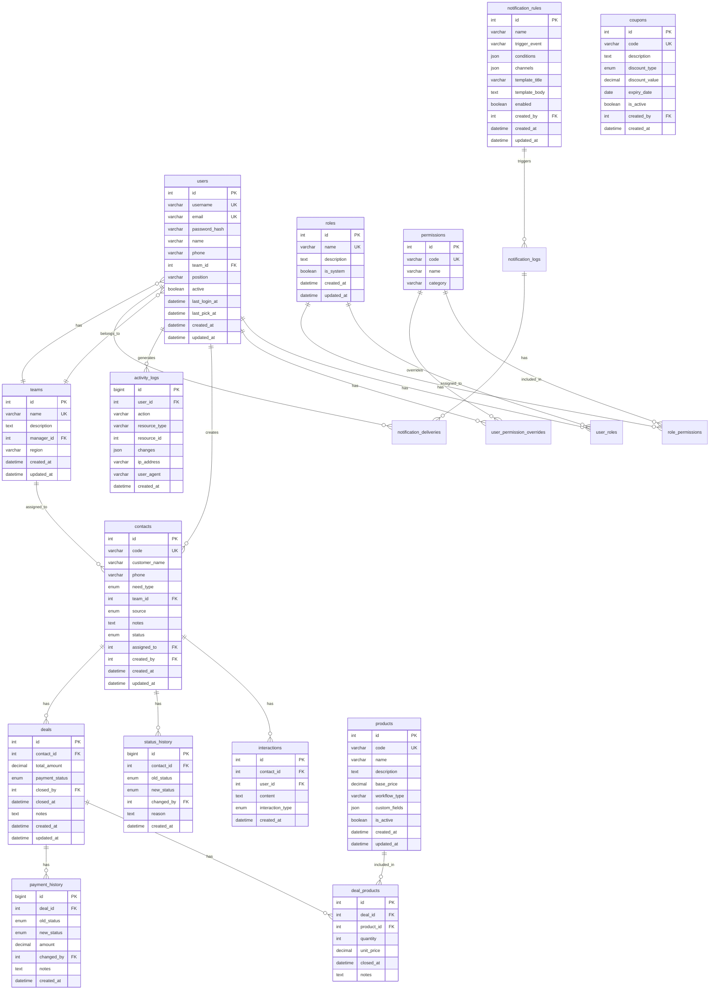

# 🗄️ Database Schema

> **Database**: MySQL 8+  
> **ORM**: ActiveRecord (Rails)

---

## 1. Entity Relationship Diagram



---

## 2. New Tables (Phase 1)

### 2.1 teams

```sql
CREATE TABLE teams (
    id INT AUTO_INCREMENT PRIMARY KEY,
    name VARCHAR(100) NOT NULL UNIQUE,
    description TEXT,
    manager_id INT,
    region VARCHAR(100),
    created_at DATETIME NOT NULL,
    updated_at DATETIME NOT NULL,
    
    FOREIGN KEY (manager_id) REFERENCES users(id) ON DELETE SET NULL
) ENGINE=InnoDB DEFAULT CHARSET=utf8mb4 COLLATE=utf8mb4_unicode_ci;
```

### 2.2 users (Updated)

```sql
CREATE TABLE users (
    id INT AUTO_INCREMENT PRIMARY KEY,
    username VARCHAR(50) NOT NULL UNIQUE,
    email VARCHAR(255) NOT NULL UNIQUE,
    password_hash VARCHAR(255) NOT NULL,
    name VARCHAR(255) NOT NULL,
    phone VARCHAR(20),
    team_id INT,
    position VARCHAR(100),
    active BOOLEAN NOT NULL DEFAULT TRUE,
    last_login_at DATETIME,
    last_pick_at DATETIME,
    created_at DATETIME NOT NULL,
    updated_at DATETIME NOT NULL,
    
    INDEX idx_users_active (active),
    INDEX idx_users_team (team_id),
    FOREIGN KEY (team_id) REFERENCES teams(id) ON DELETE SET NULL
) ENGINE=InnoDB DEFAULT CHARSET=utf8mb4 COLLATE=utf8mb4_unicode_ci;
```

### 2.3 contacts (Replaced customers)

```sql
CREATE TABLE contacts (
    id INT AUTO_INCREMENT PRIMARY KEY,
    code VARCHAR(20) NOT NULL UNIQUE,
    customer_name VARCHAR(255) NOT NULL,
    phone VARCHAR(20) NOT NULL,
    need_type ENUM('tldn_new', 'info_change', 'sub_license', 'accounting', 'fdi', 'ip', 'other') NOT NULL,
    team_id INT,
    source ENUM('ladi_zalo', 'ladi_hotline', 'fb_mess', 'fb_hotline', 'google', 'referral', 'other') NOT NULL,
    notes TEXT,
    status ENUM('new', 'picked', 'tiem_nang', 'chot', 'fail', 'caring_l1', 'caring_l2', 'closed') NOT NULL DEFAULT 'new',
    assigned_to INT,
    created_by INT NOT NULL,
    created_at DATETIME NOT NULL,
    updated_at DATETIME NOT NULL,
    
    INDEX idx_contacts_status (status),
    INDEX idx_contacts_source (source),
    INDEX idx_contacts_team (team_id),
    INDEX idx_contacts_assigned (assigned_to),
    INDEX idx_contacts_created_by (created_by),
    FULLTEXT INDEX idx_contacts_search (customer_name, phone),
    FOREIGN KEY (team_id) REFERENCES teams(id) ON DELETE SET NULL,
    FOREIGN KEY (assigned_to) REFERENCES users(id) ON DELETE SET NULL,
    FOREIGN KEY (created_by) REFERENCES users(id)
) ENGINE=InnoDB DEFAULT CHARSET=utf8mb4 COLLATE=utf8mb4_unicode_ci;
```

### 2.4 interactions

```sql
CREATE TABLE interactions (
    id INT AUTO_INCREMENT PRIMARY KEY,
    contact_id INT NOT NULL,
    user_id INT NOT NULL,
    content TEXT NOT NULL,
    interaction_type ENUM('call', 'zalo', 'email', 'meeting', 'other') NOT NULL,
    created_at DATETIME NOT NULL,
    
    INDEX idx_interactions_contact (contact_id),
    INDEX idx_interactions_user (user_id),
    FOREIGN KEY (contact_id) REFERENCES contacts(id) ON DELETE CASCADE,
    FOREIGN KEY (user_id) REFERENCES users(id)
) ENGINE=InnoDB DEFAULT CHARSET=utf8mb4 COLLATE=utf8mb4_unicode_ci;
```

### 2.5 status_history

```sql
CREATE TABLE status_history (
    id BIGINT AUTO_INCREMENT PRIMARY KEY,
    contact_id INT NOT NULL,
    old_status ENUM('new', 'picked', 'tiem_nang', 'chot', 'fail', 'caring_l1', 'caring_l2', 'closed'),
    new_status ENUM('new', 'picked', 'tiem_nang', 'chot', 'fail', 'caring_l1', 'caring_l2', 'closed') NOT NULL,
    changed_by INT NOT NULL,
    reason TEXT,
    created_at DATETIME NOT NULL,
    
    INDEX idx_status_history_contact (contact_id),
    INDEX idx_status_history_created (created_at),
    FOREIGN KEY (contact_id) REFERENCES contacts(id) ON DELETE CASCADE,
    FOREIGN KEY (changed_by) REFERENCES users(id)
) ENGINE=InnoDB DEFAULT CHARSET=utf8mb4 COLLATE=utf8mb4_unicode_ci;
```

### 2.6 products

```sql
CREATE TABLE products (
    id INT AUTO_INCREMENT PRIMARY KEY,
    code VARCHAR(20) NOT NULL UNIQUE,
    name VARCHAR(255) NOT NULL,
    description TEXT,
    base_price DECIMAL(15,2),
    workflow_type VARCHAR(100),
    custom_fields JSON,
    is_active BOOLEAN NOT NULL DEFAULT TRUE,
    created_at DATETIME NOT NULL,
    updated_at DATETIME NOT NULL,
    
    INDEX idx_products_code (code),
    INDEX idx_products_active (is_active)
) ENGINE=InnoDB DEFAULT CHARSET=utf8mb4 COLLATE=utf8mb4_unicode_ci;
```

### 2.7 coupons

```sql
CREATE TABLE coupons (
    id INT AUTO_INCREMENT PRIMARY KEY,
    code VARCHAR(50) NOT NULL UNIQUE,
    description TEXT,
    discount_type ENUM('percent', 'fixed') NOT NULL,
    discount_value DECIMAL(15,2) NOT NULL,
    expiry_date DATE,
    is_active BOOLEAN NOT NULL DEFAULT TRUE,
    created_by INT NOT NULL,
    created_at DATETIME NOT NULL,
    
    INDEX idx_coupons_code (code),
    INDEX idx_coupons_active (is_active),
    FOREIGN KEY (created_by) REFERENCES users(id)
) ENGINE=InnoDB DEFAULT CHARSET=utf8mb4 COLLATE=utf8mb4_unicode_ci;
```

### 2.8 deals

```sql
CREATE TABLE deals (
    id INT AUTO_INCREMENT PRIMARY KEY,
    contact_id INT NOT NULL,
    total_amount DECIMAL(15,2) NOT NULL DEFAULT 0,
    payment_status ENUM('pending', 'partial', 'paid', 'refunded') NOT NULL DEFAULT 'pending',
    closed_by INT NOT NULL,
    closed_at DATETIME NOT NULL,
    notes TEXT,
    created_at DATETIME NOT NULL,
    updated_at DATETIME NOT NULL,
    
    INDEX idx_deals_contact (contact_id),
    INDEX idx_deals_payment (payment_status),
    INDEX idx_deals_closed_by (closed_by),
    FOREIGN KEY (contact_id) REFERENCES contacts(id),
    FOREIGN KEY (closed_by) REFERENCES users(id)
) ENGINE=InnoDB DEFAULT CHARSET=utf8mb4 COLLATE=utf8mb4_unicode_ci;
```

### 2.9 deal_products

```sql
CREATE TABLE deal_products (
    id INT AUTO_INCREMENT PRIMARY KEY,
    deal_id INT NOT NULL,
    product_id INT NOT NULL,
    quantity INT NOT NULL DEFAULT 1,
    unit_price DECIMAL(15,2) NOT NULL,
    closed_at DATETIME NOT NULL,
    notes TEXT,
    
    INDEX idx_deal_products_deal (deal_id),
    INDEX idx_deal_products_product (product_id),
    FOREIGN KEY (deal_id) REFERENCES deals(id) ON DELETE CASCADE,
    FOREIGN KEY (product_id) REFERENCES products(id)
) ENGINE=InnoDB DEFAULT CHARSET=utf8mb4 COLLATE=utf8mb4_unicode_ci;
```

### 2.10 payment_history

```sql
CREATE TABLE payment_history (
    id BIGINT AUTO_INCREMENT PRIMARY KEY,
    deal_id INT NOT NULL,
    old_status ENUM('pending', 'partial', 'paid', 'refunded'),
    new_status ENUM('pending', 'partial', 'paid', 'refunded') NOT NULL,
    amount DECIMAL(15,2),
    changed_by INT NOT NULL,
    notes TEXT,
    created_at DATETIME NOT NULL,
    
    INDEX idx_payment_history_deal (deal_id),
    INDEX idx_payment_history_created (created_at),
    FOREIGN KEY (deal_id) REFERENCES deals(id) ON DELETE CASCADE,
    FOREIGN KEY (changed_by) REFERENCES users(id)
) ENGINE=InnoDB DEFAULT CHARSET=utf8mb4 COLLATE=utf8mb4_unicode_ci;
```

---

## 3. Seed Data

### 3.1 Default Teams

```sql
INSERT INTO teams (name, description, region) VALUES
('Team Hà Nội', 'Nhân viên khu vực Hà Nội', 'North'),
('Team HCM', 'Nhân viên khu vực HCM', 'South'),
('Team Thực Tập', 'Nhân viên thực tập', NULL);
```

### 3.2 Default Roles

```sql
INSERT INTO roles (name, description, is_system) VALUES
('Super Admin', 'Quản trị toàn bộ hệ thống', TRUE),
('Tổng Đài', 'Tạo contacts, nhận điện thoại', FALSE),
('Sale', 'Pick contact, tư vấn, chốt deal', FALSE),
('CSKH', 'Chăm sóc contacts fail', FALSE);
```

### 3.3 Sample Products

```sql
INSERT INTO products (code, name, base_price, is_active) VALUES
('TLDN-7', 'TLDN Gói Nâng Cao', 5000000, TRUE),
('TLDN-6', 'Gói Kỳ Lân 2026', 8000000, TRUE),
('TLDN-5', 'Gói VIP 2026', 15000000, TRUE),
('DVK-25', 'Dịch vụ khác', 0, TRUE),
('KTDN', 'Kế toán lẻ', 2000000, TRUE);
```

---

## 4. Tables Summary

| # | Table | Description | New? |
|---|-------|-------------|------|
| 1 | teams | Quản lý teams | 🆕 |
| 2 | users | Nhân viên (updated) | ✏️ |
| 3 | roles | Roles | ✅ |
| 4 | permissions | Permissions | ✅ |
| 5 | role_permissions | Role-Permission mapping | ✅ |
| 6 | user_roles | User-Role mapping | ✅ |
| 7 | user_permission_overrides | Override permissions | ✅ |
| 8 | contacts | Contacts/Leads (replaced customers) | 🔄 |
| 9 | interactions | Lịch sử trao đổi | 🆕 |
| 10 | status_history | Lịch sử chuyển status | 🆕 |
| 11 | products | Sản phẩm/Dịch vụ | 🆕 |
| 12 | coupons | Coupons | 🆕 |
| 13 | deals | Deals khi chốt | 🆕 |
| 14 | deal_products | SP trong deal | 🆕 |
| 15 | payment_history | Lịch sử thanh toán | 🆕 |
| 16 | activity_logs | Audit logs | ✅ |
| 17 | notification_rules | Notification rules | ✅ |
| 18 | notification_logs | Notification logs | ✅ |
| 19 | notification_deliveries | Notification deliveries | ✅ |

---

> **Related**: 
> - Module-specific details in respective docs
> - [giai-doan](../giai-doan/) - Migration timeline
