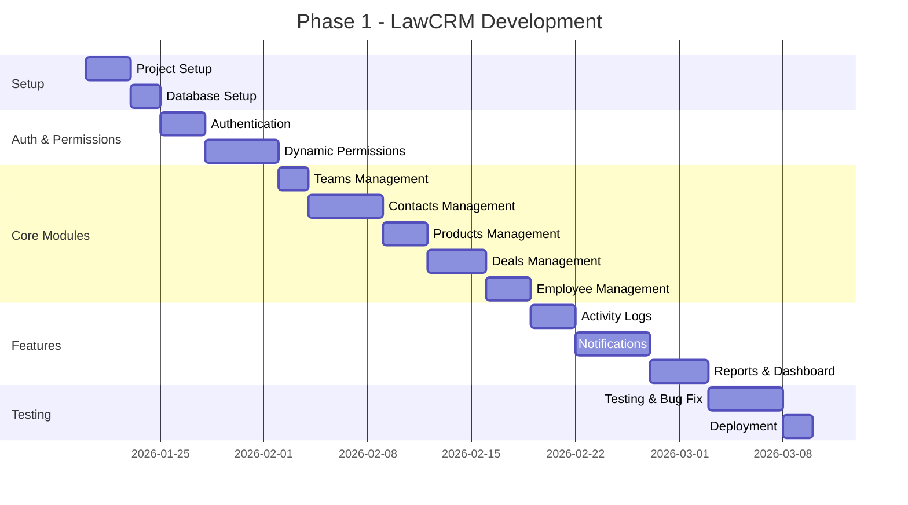

# 📅 Phases & Timeline

> **Last Updated**: 2026-01-19

---

## 1. Overview

| Phase | Tên | Duration | Status |
|-------|-----|----------|--------|
| 1 | Core Features (MVP+) | **10 tuần** | ⏳ Planning |
| 2 | Enhancements | 4-6 tuần | 📋 Backlog |

---

## 2. Phase 1: Core Features

### 2.1 Timeline

### 2.2 Milestones

| Week | Milestone | Deliverables |
|------|-----------|-------------|
| 1 | **Project Setup** | Rails app, DB schema, CI/CD |
| 2 | **Authentication** | Login, logout, forgot password (3 ngày session) |
| 3-4 | **Permissions** | Roles, permissions, override |
| 5 | **Contacts** | CRUD, Pick mechanism (5-min cooldown), Team auto-assign ✅ |
| 6 | **Products/Coupons/Deals** | SP, Coupon assignment, Deal multi-product ✅ |
| 7 | **Teams/Employees** | CRUD, Activity logs |
| 8 | **Notifications + AI** | Web Push, Email, Zalo, OpenAI Sentiment ✅ |
| 9 | **Dashboard** | Stats, charts, PDF export |
| 10 | **Testing & Deploy** | QA, bug fixes, production |

### 2.3 Detailed Tasks

#### Week 1-2: Foundation

| Task | Estimate | Owner |
|------|----------|-------|
| Rails 7 project setup | 2h | Dev |
| Docker + Docker Compose | 2h | Dev |
| MySQL setup | 1h | Dev |
| Redis setup | 1h | Dev |
| Run migrations | 1h | Dev |
| Seed permissions data | 1h | Dev |
| Login/Logout API | 4h | Dev |
| Login UI | 3h | Dev |
| Forgot password | 3h | Dev |
| Session management | 2h | Dev |

#### Week 3-4: Permissions

| Task | Estimate | Owner |
|------|----------|-------|
| Roles CRUD API | 4h | Dev |
| Roles UI | 4h | Dev |
| Permissions assignment | 3h | Dev |
| Permission matrix UI | 4h | Dev |
| User role assignment | 3h | Dev |
| Permission override | 4h | Dev |
| Authorization middleware | 3h | Dev |
| Permission check helpers | 2h | Dev |

#### Week 5: Contacts Management (REVISED)

| Task | Estimate | Owner | Notes |
|------|----------|-------|-------|
| Contacts CRUD API | 4h | Dev | |
| Contacts search/filter | 3h | Dev | Multi-field search |
| **Pick mechanism** | 4h | Dev | 5-min cooldown, race condition ✅ NEW |
| **Team auto-assign on pick** | 2h | Dev | Option D logic ✅ NEW |
| Contacts UI (List) | 4h | Dev | |
| Contact Detail UI | 3h | Dev | |
| Interaction History | 3h | Dev | |

#### Week 6: Products, Coupons & Deals

| Task | Estimate | Owner | Notes |
|------|----------|-------|-------|
| Products CRUD | 4h | Dev | |
| Products UI | 3h | Dev | |
| Coupons CRUD | 3h | Dev | |
| **Coupon Assignment** | 3h | Dev | Admin → Sale cụ thể ✅ NEW |
| Coupons UI | 3h | Dev | |
| Deals CRUD | 4h | Dev | Multi-product per deal |
| Deal Products (line items) | 3h | Dev | |
| Deals UI | 4h | Dev | |

#### Week 7: Teams & Employees

| Task | Estimate | Owner | Notes |
|------|----------|-------|-------|
| Teams CRUD | 3h | Dev | |
| Teams UI | 3h | Dev | |
| Employees CRUD | 4h | Dev | |
| Employee UI | 4h | Dev | |
| Activity log concern | 3h | Dev | |
| Log viewer UI | 4h | Dev | |

#### Week 8: Notifications & AI

| Task | Estimate | Owner | Notes |
|------|----------|-------|-------|
| Email adapter | 3h | Dev | SendGrid |
| Web Push adapter | 4h | Dev | |
| Zalo adapter | 4h | Dev | Priority channel ✅ |
| Rule engine | 6h | Dev | |
| Rule builder UI | 4h | Dev | |
| **OpenAI Sentiment** | 4h | Dev | Basic integration ✅ NEW |
| Background job processing | 3h | Dev | Sidekiq |

#### Week 9: Dashboard & Wrap-up

| Task | Estimate | Owner | Notes |
|------|----------|-------|-------|
| Dashboard API | 4h | Dev | |
| Charts (ApexCharts) | 4h | Dev | |
| Stats calculations | 3h | Dev | |
| Reports Export (PDF) | 3h | Dev | ✅ Confirmed |
| QA testing | 8h | QA | |
| Bug fixes | 8h | Dev | |

#### Week 10: Testing & Deployment

| Task | Estimate | Owner | Notes |
|------|----------|-------|-------|
| Integration testing | 4h | QA | |
| Performance testing | 4h | Dev | |
| Security review | 4h | Dev | |
| Production deploy | 4h | Dev | |

---

## 3. Phase 2: Enhancements (Future)

| Feature | Priority | Estimate |
|---------|----------|----------|
| Import từ Google Sheets | Cao | 1 tuần |
| 2FA Authentication | Trung | 3 ngày |
| Real-time WebSocket | Trung | 1 tuần |
| Export reports Excel | Trung | 2 ngày |
| Scheduled reports | Thấp | 2 ngày |
| Advanced search (Elasticsearch) | Thấp | 1 tuần |
| **Facebook adapter** | Thấp | 3h | ⬆️ Moved from Phase 1 |
| **Slack adapter** | Thấp | 2h | ⬆️ Moved from Phase 1 |

---

## 4. Definition of Done

### Feature Level

- [ ] Code complete và reviewed
- [ ] Unit tests written (>80% coverage)
- [ ] API documentation updated
- [ ] UI responsive (desktop + tablet)
- [ ] No console errors
- [ ] Activity log tracked

### Phase Level

- [ ] All features complete
- [ ] Integration tests pass
- [ ] Performance tested (100 concurrent users)
- [ ] Security review done
- [ ] Documentation complete
- [ ] Deployed to staging
- [ ] UAT passed
- [ ] Deployed to production

---

## 5. Risks & Mitigation

| Risk | Impact | Likelihood | Mitigation |
|------|--------|------------|------------|
| Zalo/FB API approval delay | Medium | Medium | Start process early, have fallback |
| Complex permission logic | High | Low | Clear specs, thorough testing |
| Performance issues with logs | Medium | Medium | Partitioning, archival strategy |
| Scope creep | High | High | Strict phase boundaries |

---

## 6. Resources Required

### Team

| Role | Count | Responsibility |
|------|-------|----------------|
| Backend Developer | 1 | Rails API, DB, integrations |
| Frontend Developer | 1 | UI/UX implementation |
| QA | 0.5 | Testing (part-time) |
| DevOps | 0.25 | Infrastructure (part-time) |

### Infrastructure

| Resource | Spec | Cost/month |
|----------|------|------------|
| VPS/AWS EC2 | 2 vCPU, 4GB RAM | ~$30-50 |
| MySQL (RDS) | db.t3.micro | ~$15 |
| Redis (ElastiCache) | cache.t3.micro | ~$15 |
| SendGrid | Free tier (100/day) | $0 |
| Domain + SSL | | ~$15/year |

---

## 7. Dependencies

### External Services

| Service | Required For | Setup Time |
|---------|--------------|------------|
| SMTP / SendGrid | Email notifications | 1 hour |
| Slack Workspace | Slack notifications | 30 min |
| Zalo OA | Zalo notifications | 1-2 weeks (approval) |
| Facebook Page | FB notifications | 1-2 weeks (approval) |

### Development Tools

- Ruby 3.2+
- Rails 7.1+
- MySQL 8.0+
- Redis 7+
- Node.js 18+ (for frontend build)

---

## 8. Next Steps

1. **Approve requirements** → Hiện tại
2. **Create implementation_plan.md** → Sau khi approve
3. **Setup project** → Week 1
4. **Start development** → Week 1

---

> **Related**: 
> - [00-overview.md](./00-overview.md) - Project overview
> - [08-database.md](./08-database.md) - Database schema
